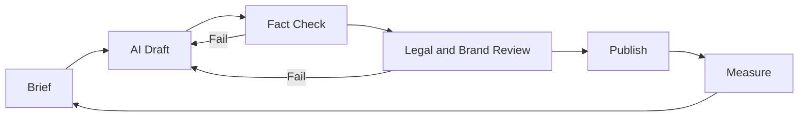

# AI Workflows · Risks

Marketing is one of the business areas where generative AI is used most widely. McKinsey's State of AI survey (2025-03) named marketing and sales as the function where organizations most often use generative AI. On the other hand, the IAB's State of Data 2025 (2025-03) reported that only 30% of agencies, brands, and publishers have fully integrated AI across the media campaign lifecycle. In other words, adoption is broad but depth still varies. What matters is **where you use it and where a person checks it**.

## Map of Uses

| Work | Example AI use | What a person must do |
|---|---|---|
| Research | Summarizing interview transcripts, classifying reviews and inquiries | Check the originals, check for bias |
| Positioning and messaging | Generating phrasing options, summarizing competitor messages | Choose and own the decision, verify evidence |
| Content | Drafts, translation, summaries, variations | Fact-check, add unique experience |
| Creative | Variations of ad images and videos | Check rights, check disclosure duties |
| Paid | Automated bidding, targeting, and creative combinations (built into platforms) | Conversion definitions, budget caps, brand safety |
| Lifecycle | Personalizing copy per segment | Scope of consent, frequency limits |
| Analysis | Writing queries, summarizing data, detecting anomalies | Verify calculations, interpret causality |
| Customer support | FAQ answers, conversation summaries | Accountability for wrong answers, a path to a human |

## Recommended Workflow



### What the Brief Must Contain

```text
Goal: whom should it get to do what
Segment and situation:
Positioning summary and banned expressions:
Facts and numbers that may be used (with sources):
Format, length, tone:
Reviewer:
```

Do not let AI **create** facts; **give** it verified facts and let it handle only the wording.

## Key Risks

NIST's Generative AI Profile (NIST AI 600-1, 2024-07-26) lists risks unique to generative AI, including confabulation (plausible wrong answers), harmful content, privacy, information security, and intellectual property. In marketing they often look like this.

| Risk | How it shows up in marketing | Response |
|---|---|---|
| Confabulation | Nonexistent features, wrong numbers, fabricated quotes | Provide a fact list, cross-check sources |
| Privacy | Entering customer data into external tools | Define data that must not be entered, check contracts and settings |
| Rights infringement | Output resembling others' works, likenesses, or trademarks | Confirm usage rights, check similarity |
| Deceptive expression | AI people who look real, fake reviews | Follow disclosure duties, no fake reviews (document 09) |
| Homogenization | Everyone writes similar copy with the same tools | Add unique data and experience |
| Search quality | Mass auto-generated pages | May violate Google spam policies (document 04) |
| Over-trusting automation | Scaling platform AI campaigns without validation | Incrementality tests (document 06) |

## Bad Example / Good Example

Bad example:

> Ask "Write 10 strengths of our product and 5 customer reviews" and publish the result as is.

Good example:

> Provide real customer interview summaries and an approved feature list, and get five landing page copy options. A marketer picks two, the product team checks the feature descriptions, numbers are cross-checked against the source data, and the result is validated with an A/B test. Reviews use only original text from real customers who gave consent.

## Adoption Checklist

- Is there a policy on which data may be entered into AI tools
- Have you checked the tool's data retention and training-use terms
- Is someone responsible for fact-checking before publication
- Do you know when AI-generated content must be labeled (document 09)
- Do you measure the effectiveness of outputs by the same standard as human-made work

## Common Mistakes

- Reporting increased output volume as results
- Showing AI answers to customers without fact-checking
- Skipping legal and brand review "because AI wrote it"
- Not recording prompts and outputs, making problems untraceable

## References

- [The state of AI: How organizations are rewiring to capture value — McKinsey](https://www.mckinsey.com/capabilities/quantumblack/our-insights/the-state-of-ai-how-organizations-are-rewiring-to-capture-value) (2025-03, accessed 2026-09-28)
- [AI Risk Management Framework: Generative AI Profile (NIST AI 600-1) — NIST](https://www.nist.gov/publications/artificial-intelligence-risk-management-framework-generative-artificial-intelligence) (2024-07-26, accessed 2026-09-28)
- [Google Search's Guidance on Generative AI Content on Your Website — Google Search Central](https://developers.google.com/search/docs/fundamentals/using-gen-ai-content) (accessed 2026-09-28)
- [Meta Advantage+ Creative — Meta for Business](https://www.facebook.com/business/ads/meta-advantage-plus/creative) (accessed 2026-09-28)
- [State of Data 2025: The Now, The Near, and The Next Evolution of AI for Media Campaigns — IAB](https://www.iab.com/insights/2025-state-of-data-report/) (2025-03, accessed 2026-09-28)
