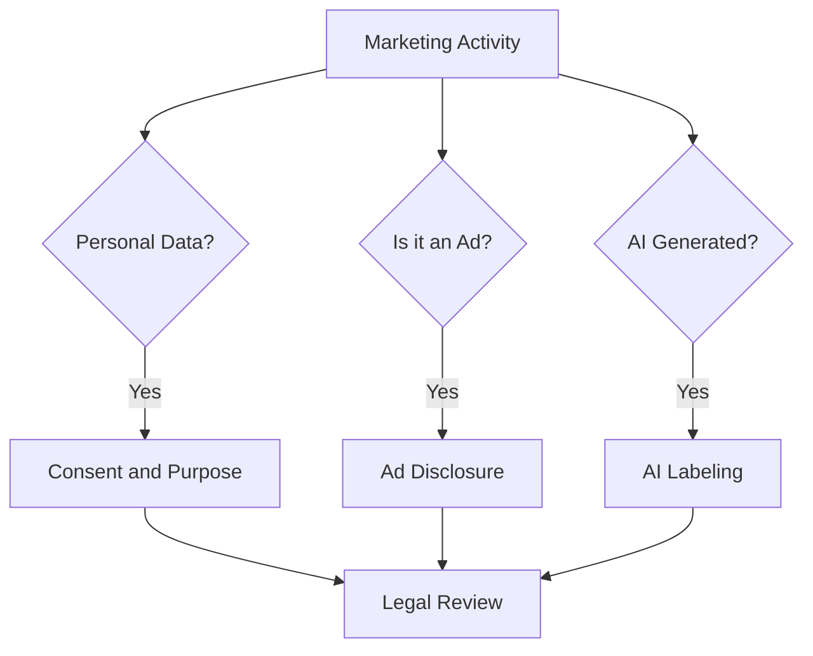

# Law · Ethics · Ad Disclosure

This document is not legal advice. It is **a map to help developers and POs notice "this needs checking"**. Confirm actual application through legal review and the latest original texts.

## Three Questions

1. **Do you use personal data?** → Consent for collection and use, purpose limitation, consent for targeted advertising
2. **Is it an ad?** → Ad labeling, disclosure of material connections, opt-in consent to receive
3. **Is it AI-generated?** → Labeling of AI-generated content and virtual people

## Korea: Sending Advertising Information (Network Act)

Article 50 of Korea's Act on Promotion of Information and Communications Network Utilization and Information Protection (Network Act) and its Enforcement Decree set the rules for sending commercial advertising information through electronic transmission media (text messages, email, app push, etc.).

| Requirement | Content |
|---|---|
| Prior opt-in consent | In principle, the recipient's explicit prior consent is required |
| Night-time sending | From 9 p.m. to 8 a.m. the next day, separate prior consent is required |
| Labeling duty | An "(Ad)" label where the advertising information begins, the sender's name and contact, and opt-out instructions |
| Refusal and withdrawal | No sending after the recipient refuses or withdraws consent |
| Consent reconfirmation | Reconfirm consent every two years from the date it was given (Enforcement Decree Article 62-3) |

Bad example:

> Bundle marketing consent into the mandatory signup terms and send an event push at 10 p.m.

Good example:

> Separate marketing consent as an optional item and send night-time messages only to those who gave separate consent. Put "(Ad)" at the start of every message and include an opt-out path.

## Korea: Personal Data and Targeted Advertising (PIPA)

- Article 22 of the Personal Information Protection Act requires that, when obtaining consent to process personal data for promoting goods or services or soliciting sales, you **inform data subjects so they can clearly recognize it** before obtaining consent. You may not refuse service because someone declined an optional consent.
- In 2022-09 the Personal Information Protection Commission (PIPC) fined Google (KRW 69.2 billion) and Meta (KRW 30.8 billion) for collecting and using third-party behavioral data without user consent, and on 2025-01-23 the Seoul Administrative Court upheld the sanctions.
- In 2024-01 the PIPC announced a policy plan for protecting online behavioral data used in targeted advertising and signaled a revision of its guidelines. Whether the revised guidelines were finalized, and their content, must be checked in the original sources.

## Korea: Endorsements and AI Virtual People (Korea Fair Trade Commission)

- The KFTC's guidelines on endorsements and testimonials in labeling and advertising require that **material connections such as payments, discounts, or sponsorship be disclosed so consumers can easily notice them** in influencer posts, reviews, and similar content. Disclosure should be in an easily seen place such as the title or the beginning; hiding it mid-text, in comments, or behind "more" is not considered adequate.
- After an administrative notice in 2026-04, the KFTC put the amended guidelines into force on 2026-06-01. Ads in which **a virtual person created with generative AI or similar technology endorses a product must clearly state that it is a "virtual person"**.

## Korea: AI Basic Act

- Korea's Framework Act on the Development of Artificial Intelligence and Establishment of Trust took effect on 2026-01-22.
- It includes a duty to label generative AI output, and deepfake output must be labeled more clearly.
- The Ministry of Science and ICT said it would run a grace period of at least one year for administrative fines. Check the original sources for the exact period and approach.

## EU

- **Consent**: To keep using Google ad measurement and personalization features for EEA users, you must obtain consent and pass Consent Mode signals (since 2024-03).
- **AI Act Article 50**: Transparency obligations apply from 2026-08-02. Deployers who publish deepfakes must disclose this clearly at the latest at the time of first exposure. The European Commission FAQ mentions a limited grace period until 2026-12-02, only for the marking obligation for AI-generated content from systems placed on the market before 2026-08-02.

## United States

- In 2023-06 the FTC revised its Endorsement Guides, updating the rules for endorsements in social media and review environments.
- The FTC's Consumer Reviews and Testimonials Rule took effect on 2024-10-21 and prohibits creating or selling reviews attributed to people who do not exist (including AI-generated fake reviews) or to people with no actual experience.

## Practical Checklist

- Is marketing consent separated from mandatory service consent
- Are consent records (time, scope, channel) kept
- Do ad message templates include "(Ad)", the sender, and opt-out by default
- Do influencer and affiliate contracts state the disclosure duty
- Are there rules for using AI-generated people, images, and reviews
- If you target users abroad, have you checked that country's rules

## Ethics: Lines to Hold Before the Law

- Do not use data in ways customers would find offensive if they knew
- Do not make cancelling or opting out harder than signing up (dark patterns)
- Do not use numbers or comparisons that cannot be verified
- Do not pressure vulnerable users (such as minors)

## References

- [Network Act Article 50 — Korea National Law Information Center](https://www.law.go.kr/%EB%B2%95%EB%A0%B9/%EC%A0%95%EB%B3%B4%ED%86%B5%EC%8B%A0%EB%A7%9D%EC%9D%B4%EC%9A%A9%EC%B4%89%EC%A7%84%EB%B0%8F%EC%A0%95%EB%B3%B4%EB%B3%B4%ED%98%B8%EB%93%B1%EC%97%90%EA%B4%80%ED%95%9C%EB%B2%95%EB%A5%A0/%EC%A0%9C50%EC%A1%B0) (accessed 2026-09-28)
- [Network Act Enforcement Decree Article 62-3 — Korea National Law Information Center](https://www.law.go.kr/%EB%B2%95%EB%A0%B9/%EC%A0%95%EB%B3%B4%ED%86%B5%EC%8B%A0%EB%A7%9D%EC%9D%B4%EC%9A%A9%EC%B4%89%EC%A7%84%EB%B0%8F%EC%A0%95%EB%B3%B4%EB%B3%B4%ED%98%B8%EB%93%B1%EC%97%90%EA%B4%80%ED%95%9C%EB%B2%95%EB%A5%A0%EC%8B%9C%ED%96%89%EB%A0%B9/%EC%A0%9C62%EC%A1%B0%EC%9D%983) (accessed 2026-09-28)
- [Personal Information Protection Act Article 22 — Korea National Law Information Center](https://www.law.go.kr/%EB%B2%95%EB%A0%B9/%EA%B0%9C%EC%9D%B8%EC%A0%95%EB%B3%B4%EB%B3%B4%ED%98%B8%EB%B2%95/%EC%A0%9C22%EC%A1%B0) (accessed 2026-09-28)
- [PIPC fines Google and Meta for unlawful collection of behavioral data — Korea.kr](https://m.korea.kr/news/policyNewsView.do?newsId=148905887) (2022-09, accessed 2026-09-28)
- [PIPC wins administrative lawsuit by Google and Meta — Korea.kr](https://www.korea.kr/briefing/pressReleaseView.do?newsId=156671852) (2025-01, accessed 2026-09-28)
- [PIPC briefing on online behavioral advertising policy — Korea.kr](https://www.korea.kr/briefing/policyBriefingView.do?newsId=156613321) (2024-01, accessed 2026-09-28)
- [KFTC amended guidelines on endorsements and testimonials take effect — KFTC](https://www.ftc.go.kr/www/selectBbsNttView.do?pageUnit=10&pageIndex=1&searchCnd=all&key=12&bordCd=3&searchCtgry=01%2C02&nttSn=47547) (2026, accessed 2026-09-28)
- [AI Basic Act takes effect with labeling duty for generative AI output — Korea.kr](https://www.korea.kr/news/policyNewsView.do?newsId=148958380) (2026-01, accessed 2026-09-28)
- [Updates to consent mode for traffic in the EEA — Google Ads Help](https://support.google.com/google-ads/answer/13695607?hl=en) (accessed 2026-09-28)
- [Transparency obligations under Article 50 of the AI Act — European Commission](https://digital-strategy.ec.europa.eu/en/faqs/transparency-obligations-under-article-50-ai-act) (accessed 2026-09-28)
- [FTC Announces Updated Advertising Guides to Combat Deceptive Reviews and Endorsements — FTC](https://www.ftc.gov/news-events/news/press-releases/2023/06/federal-trade-commission-announces-updated-advertising-guides-combat-deceptive-reviews-endorsements) (2023-06, accessed 2026-09-28)
- [FTC Announces Final Rule Banning Fake Reviews and Testimonials — FTC](https://www.ftc.gov/news-events/news/press-releases/2024/08/federal-trade-commission-announces-final-rule-banning-fake-reviews-testimonials) (2024-08, accessed 2026-09-28)
- [The Consumer Reviews and Testimonials Rule: Questions and Answers — FTC](https://www.ftc.gov/business-guidance/resources/consumer-reviews-testimonials-rule-questions-answers) (accessed 2026-09-28)
