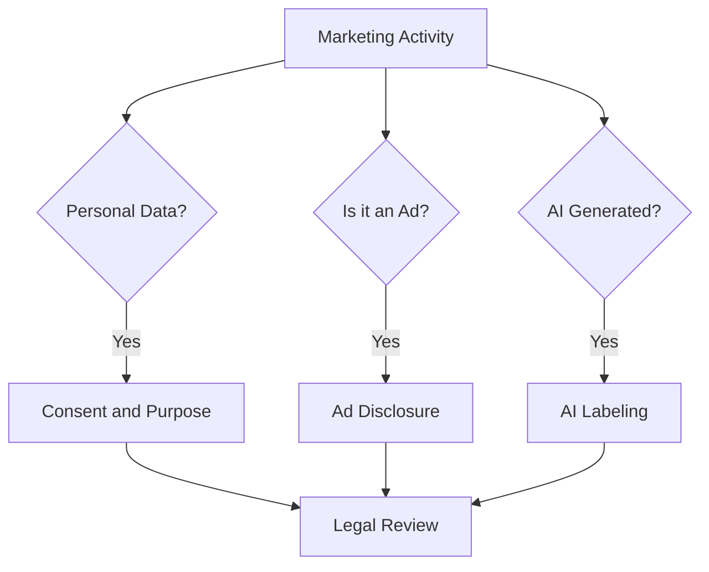

# Law · Ethics · Ad Disclosure

This document is not legal advice. It is **a map to help developers and POs notice "this needs checking"**. Confirm actual application through legal review and the latest original texts.

## Three Questions

1. **Do you use personal data?** → Consent for collection and use, purpose limitation, consent for targeted advertising
2. **Is it an ad?** → Ad labeling, disclosure of material connections, opt-in consent to receive, truthfulness and substantiation of claims
3. **Is it AI-generated?** → Labeling of AI-generated content and virtual people

If you are building checkout, cancellation, or pricing screens, add one more: **does the screen design distort the consumer's choice?** → Korea's E-Commerce Act dark-pattern rules.

## Korea: Sending Advertising Information (Network Act)

Article 50 of Korea's Act on Promotion of Information and Communications Network Utilization and Information Protection (Network Act) and its Enforcement Decree set the rules for sending commercial advertising information through electronic transmission media (text messages, email, app push, etc.).

| Requirement | Content |
|---|---|
| Prior opt-in consent | In principle, the recipient's explicit prior consent is required |
| Night-time sending | From 9 p.m. to 8 a.m. the next day, separate prior consent is required (email excepted, under the proviso to Article 50(3) and the Enforcement Decree) |
| Labeling duty | An "(Ad)" label where the advertising information begins, the sender's name and contact, and opt-out instructions |
| Refusal and withdrawal | No sending after the recipient refuses or withdraws consent |
| Consent reconfirmation | Reconfirm consent every two years from the date it was given (Enforcement Decree Article 62-3) |

Bad example:

> Bundle marketing consent into the mandatory signup terms and send an event push at 10 p.m.

Good example:

> Separate marketing consent as an optional item and send night-time messages only to those who gave separate consent. Put "(Ad)" at the start of every message and include an opt-out path.

## Korea: Personal Data and Targeted Advertising (PIPA)

- Article 22 of the Personal Information Protection Act requires that, when obtaining consent to process personal data for promoting goods or services or soliciting sales, you **inform data subjects so they can clearly recognize it** before obtaining consent. You may not refuse service because someone declined an optional consent.
- In 2022-09 the Personal Information Protection Commission (PIPC) fined Google (KRW 69.2 billion) and Meta (KRW 30.8 billion) for collecting and using third-party behavioral data without user consent, and on 2025-01-23 the Seoul Administrative Court upheld the sanctions.
- In 2024-01 the PIPC announced a policy plan for protecting online behavioral data used in targeted advertising and signaled a revision of its guidelines. Whether the revised guidelines were finalized, and their content, must be checked in the original sources.

## Korea: Labeling and Advertising Act (Unfair Labeling and Advertising)

Article 3(1) of Korea's Act on Fair Labeling and Advertising prohibits four kinds of labeling or advertising that are likely to deceive or mislead consumers and to harm fair trade.

| Type | Meaning | Easy-to-trip claims for the example product |
|---|---|---|
| False or exaggerated | Stating things contrary to fact, or overstating facts | Advertising an integration still in beta as "fully supported" |
| Deceptive | Concealing or downplaying facts | Advertising a "free plan" while hiding its 7-day retention limit |
| Unfairly comparative | Comparing without stating what is compared and on what basis, or claiming superiority without objective grounds | "3x faster than competitors" with no conditions |
| Disparaging | Belittling another business or product without objective grounds, or advertising only unfavorable facts about it | "Company A's tool goes dark during incidents" |

Article 5 sets a **duty to substantiate**. A business must be able to substantiate the factual claims in its labeling and advertising, and must submit substantiating material within 15 days when the KFTC requests it. In practice, to say "first", "No. 1", or "N times", you need the evidence before the ad runs.

Bad example:

> Korea's first and industry-leading incident analysis tool

Good example:

> In-house benchmark as of 2026-06: with 100,000 log lines and 20 deploys, finding candidate causes was 1.8x faster than manual searching. (Method published)

The number in the good example is an assumption for illustration. The point is to state **the date, conditions, comparison baseline, and measurement method** together and to keep the evidence. AI-generated ad copy and images are held to the same standard.

## Korea: E-Commerce Act Dark-Pattern Rules (in Force Since 2025-02-14)

Since 2025-02-14 the amended E-Commerce Act regulates six types of online dark patterns: hidden renewal, drip pricing, preselected options, false hierarchy, obstructing cancellation or withdrawal, and nagging. The article for each type and what it means for a subscription SaaS are in "Terms · Privacy · E-Commerce".

**Rule for paid conversions and price increases**: when a subscription price increases or a free service converts to paid, the business must obtain the consumer's consent **within the 30 days before** the increase or conversion, and must tell the consumer the conditions and methods for withdrawing that consent (Enforcement Decree).

- **Subscriptions billed through app stores**: since 2025-02-14, for subscriptions paid through the App Store or Google Play, the platform itself asks Korean users to consent to the first paid charge before a free trial or discounted price ends, and automatically cancels the subscription if the user does not consent. Google Play temporarily let developers who collect consent in their own app opt out of this flow, but stopped accepting opt-outs from 2026-02-03. For app subscriptions, forecast conversion and churn assuming the platform flow, not your own consent screen.

Bad example:

> When the 14-day free trial ends, charge the card automatically without notice, and accept cancellations only by email to support.

Good example:

> Within the 30 days before conversion, tell the user the conversion date, amount, and how to cancel, and get explicit consent. Without consent, the account stays on the free plan. Cancellation happens in the same settings screen as signup, in the same number of steps.

## Korea: Endorsements and AI Virtual People (Korea Fair Trade Commission)

- The KFTC's guidelines on endorsements and testimonials in labeling and advertising require that **material connections such as payments, discounts, or sponsorship be disclosed so consumers can easily notice them** in influencer posts, reviews, and similar content. Disclosure should be in an easily seen place such as the title or the beginning; hiding it mid-text, in comments, or behind "more" is not considered adequate.
- After an administrative notice in 2026-04, the KFTC put the amended guidelines into force on 2026-06-01. Ads in which **a virtual person created with generative AI or similar technology endorses a product must clearly state that it is a "virtual person"**.
- For creators, where and how to disclose sponsorships and affiliate links is covered canonically in "Disclosure, Copyright and Tax".

## Korea: AI Basic Act

- Korea's Framework Act on the Development of Artificial Intelligence and Establishment of Trust took effect on 2026-01-22.
- The transparency duties in Article 31 consist of advance notice, labeling of generative AI output, and clear notice and labeling of deepfake output.
- **The duty-holder is the AI business operator** (one who develops AI or provides AI products or services). The Ministry of Science and ICT's AI transparency guideline (2026-01) treats someone who merely uses AI as a tool to produce their own work or content as a **user**, who is not subject to these duties.
- The Ministry of Science and ICT said it would run a grace period of at least one year for administrative fines. Check the original sources for the exact period and approach.

In marketing practice, split the cases like this.

| Situation | Rules to check first |
|---|---|
| You make ad images, copy, or virtual models with AI tools (a user) | Virtual-person disclosure under the KFTC endorsement guidelines; the Labeling and Advertising Act's ban on unfair ads |
| Your product provides a generative AI feature (e.g., it shows customers incident-cause summaries written by generative AI) | As an AI business operator, advance notice and output labeling under AI Basic Act Article 31 |

Even when you are a user with no AI Basic Act duty, AI output used in ads still carries the disclosure duties of other laws.

## EU

- **Consent**: To keep using Google ad measurement and personalization features for EEA users, you must obtain consent and pass Consent Mode signals (since 2024-03).
- **AI Act Article 50**: Transparency obligations apply from 2026-08-02. Deployers who publish deepfakes must disclose this clearly at the latest at the time of first exposure. The European Commission FAQ mentions a limited grace period until 2026-12-02, only for the marking obligation for AI-generated content from systems placed on the market before 2026-08-02 (per the EC FAQ; later Digital Omnibus discussions may change this).

## United States

- In 2023-06 the FTC revised its Endorsement Guides, updating the rules for endorsements in social media and review environments.
- The FTC's Consumer Reviews and Testimonials Rule took effect on 2024-10-21 and prohibits creating or selling reviews attributed to people who do not exist (including AI-generated fake reviews) or to people with no actual experience.

## Practical Checklist

- Is marketing consent separated from mandatory service consent
- Are consent records (time, scope, channel) kept
- Do ad message templates include "(Ad)", the sender, and opt-out by default
- Does every factual claim in ads ("first", "No. 1", "N times") have substantiating evidence with its date and conditions
- Do checkout, cancellation, and pricing screens avoid the six dark-pattern types
- Is there a consent and notice step within the 30 days before a paid conversion or price increase
- Do influencer and affiliate contracts state the disclosure duty
- Are there rules for using AI-generated people, images, and reviews
- If you target users abroad, have you checked that country's rules

## Ethics: Lines to Hold Before the Law

- Do not use data in ways customers would find offensive if they knew
- Even when a design does not fit one of the six statutory dark-pattern types exactly, do not make cancelling or opting out harder than signing up
- Even where the duty to substantiate does not reach, do not create impressions that cannot be verified
- Do not pressure vulnerable users (such as minors)

## References

- [Network Act Article 50 — Korea National Law Information Center](https://www.law.go.kr/%EB%B2%95%EB%A0%B9/%EC%A0%95%EB%B3%B4%ED%86%B5%EC%8B%A0%EB%A7%9D%EC%9D%B4%EC%9A%A9%EC%B4%89%EC%A7%84%EB%B0%8F%EC%A0%95%EB%B3%B4%EB%B3%B4%ED%98%B8%EB%93%B1%EC%97%90%EA%B4%80%ED%95%9C%EB%B2%95%EB%A5%A0/%EC%A0%9C50%EC%A1%B0) (accessed 2026-09-28)
- [Network Act Enforcement Decree Article 62-3 — Korea National Law Information Center](https://www.law.go.kr/%EB%B2%95%EB%A0%B9/%EC%A0%95%EB%B3%B4%ED%86%B5%EC%8B%A0%EB%A7%9D%EC%9D%B4%EC%9A%A9%EC%B4%89%EC%A7%84%EB%B0%8F%EC%A0%95%EB%B3%B4%EB%B3%B4%ED%98%B8%EB%93%B1%EC%97%90%EA%B4%80%ED%95%9C%EB%B2%95%EB%A5%A0%EC%8B%9C%ED%96%89%EB%A0%B9/%EC%A0%9C62%EC%A1%B0%EC%9D%983) (accessed 2026-09-28)
- [Act on Fair Labeling and Advertising — Korea National Law Information Center](https://www.law.go.kr/%EB%B2%95%EB%A0%B9/%ED%91%9C%EC%8B%9C%EA%B4%91%EA%B3%A0%EC%9D%98%EA%B3%B5%EC%A0%95%ED%99%94%EC%97%90%EA%B4%80%ED%95%9C%EB%B2%95%EB%A5%A0) (accessed 2026-09-28)
- [Types of unfair labeling and advertising under the Act — Consumer24 (in Korean)](https://www.consumer.go.kr/user/bbs/consumer/380/940/bbsDataView/2813.do) (accessed 2026-09-28)
- [Amended E-Commerce Act rules on dark patterns take effect, with KFTC Q&A — Kim & Chang (in Korean)](https://www.kimchang.com/ko/insights/detail.kc?sch_section=4&idx=31411) (2025-02, accessed 2026-09-28)
- [KFTC distributes Q&A on six types of online dark patterns — Seoul Metropolitan Government (in Korean)](https://news.seoul.go.kr/economy/archives/566114) (2025-02, accessed 2026-09-28)
- [KFTC distributes Q&A on six types of online dark patterns — Korea.kr (in Korean)](https://www.korea.kr/briefing/pressReleaseView.do?newsId=156674112) (2025-02-13, accessed 2026-09-28)
- [Consumer consent required within 30 days before a subscription price increase or paid conversion — Korea.kr (in Korean)](https://www.korea.kr/news/policyNewsView.do?newsId=148939436) (2025-02, accessed 2026-09-28)
- [Upcoming changes to offers and trials for subscriptions in South Korea — Apple Developer](https://developer.apple.com/news/?id=bo1b122z) (accessed 2026-09-28)
- [Changes to Google Play's subscription functionality in South Korea — Play Console Help](https://support.google.com/googleplay/android-developer/answer/15722617?hl=en) (accessed 2026-09-28)
- [South Korea Subscriptions Developer Opt-Out Period Ending — Play Console Help](https://support.google.com/googleplay/android-developer/answer/16514827?hl=en) (accessed 2026-09-28)
- [Personal Information Protection Act Article 22 — Korea National Law Information Center](https://www.law.go.kr/%EB%B2%95%EB%A0%B9/%EA%B0%9C%EC%9D%B8%EC%A0%95%EB%B3%B4%EB%B3%B4%ED%98%B8%EB%B2%95/%EC%A0%9C22%EC%A1%B0) (accessed 2026-09-28)
- [PIPC fines Google and Meta for unlawful collection of behavioral data — Korea.kr](https://m.korea.kr/news/policyNewsView.do?newsId=148905887) (2022-09, accessed 2026-09-28)
- [PIPC wins administrative lawsuit by Google and Meta — Korea.kr](https://www.korea.kr/briefing/pressReleaseView.do?newsId=156671852) (2025-01, accessed 2026-09-28)
- [PIPC briefing on online behavioral advertising policy — Korea.kr](https://www.korea.kr/briefing/policyBriefingView.do?newsId=156613321) (2024-01, accessed 2026-09-28)
- [KFTC amended guidelines on endorsements and testimonials take effect — KFTC](https://www.ftc.go.kr/www/selectBbsNttView.do?pageUnit=10&pageIndex=1&searchCnd=all&key=12&bordCd=3&searchCtgry=01%2C02&nttSn=47547) (2026, accessed 2026-09-28)
- [AI Basic Act takes effect with labeling duty for generative AI output — Korea.kr](https://www.korea.kr/news/policyNewsView.do?newsId=148958380) (2026-01, accessed 2026-09-28)
- [The AI Basic Act and the content industry: transparency duties — Law Times (in Korean)](https://www.lawtimes.co.kr/news/articleView.html?idxno=217123) (2026, accessed 2026-09-28)
- [MSIT publishes AI transparency guideline — KDI Economic Information and Education Center (in Korean)](https://eiec.kdi.re.kr/policy/materialView.do?num=276195) (2026-01, accessed 2026-09-28)
- [Updates to consent mode for traffic in the EEA — Google Ads Help](https://support.google.com/google-ads/answer/13695607?hl=en) (accessed 2026-09-28)
- [Transparency obligations under Article 50 of the AI Act — European Commission](https://digital-strategy.ec.europa.eu/en/faqs/transparency-obligations-under-article-50-ai-act) (accessed 2026-09-28)
- [FTC Announces Updated Advertising Guides to Combat Deceptive Reviews and Endorsements — FTC](https://www.ftc.gov/news-events/news/press-releases/2023/06/federal-trade-commission-announces-updated-advertising-guides-combat-deceptive-reviews-endorsements) (2023-06, accessed 2026-09-28)
- [FTC Announces Final Rule Banning Fake Reviews and Testimonials — FTC](https://www.ftc.gov/news-events/news/press-releases/2024/08/federal-trade-commission-announces-final-rule-banning-fake-reviews-testimonials) (2024-08, accessed 2026-09-28)
- [The Consumer Reviews and Testimonials Rule: Questions and Answers — FTC](https://www.ftc.gov/business-guidance/resources/consumer-reviews-testimonials-rule-questions-answers) (accessed 2026-09-28)
