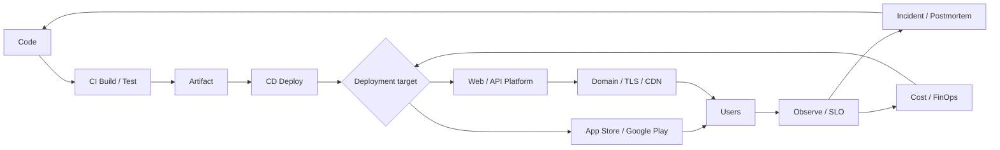

# Platform Deployment & Services Overview

As of: 2026-09-28

There is a long distance between "finishing" code and users **relying on it every day**. This track maps the decisions that make up that distance.

> Deployment is the act of putting code into a runtime environment; a Service is the ongoing work of delivering that result at a promised level of quality.

## Questions This Track Answers

1. Where will it run? (Static, PaaS, Container, Serverless, Cloud)
2. How will it get there automatically? (CI/CD)
3. How do we ship while reducing risk? (Canary, Feature Flag, Rollback)
4. How does a mobile app pass store review and policy?
5. By what address and path do users reach it? (Domain, DNS, TLS, CDN)
6. How do we know it is working? (SLO, Observability, Incident)
7. Can we prove what is inside and who built it? (Supply Chain)
8. Who watches the cost, and who reduces it? (FinOps)
9. How do many teams deploy along the same path? (Platform Engineering)

## The Whole Flow



The key point is that the arrows return to Code. Deployment is not a one-time event but a **loop of observing and improving**.

## Documents in This Track

| # | Document | Core question |
|---|---|---|
| 01 | Choosing a Deployment Target | Which fits: Static, Edge, PaaS, or Serverless? |
| 02 | Cloud and Kubernetes | AWS / Google Cloud / Azure / Korean clouds and running containers |
| 03 | CI/CD Pipeline | What do we automate from commit to production? |
| 04 | Release Strategies | Rolling, Blue-Green, Canary, Feature Flag, Rollback |
| 05 | Mobile Store Distribution | App Store and Google Play review, testing tracks, 2026 policies |
| 06 | Domain · DNS · TLS · CDN | A safe, fast path for users to reach you |
| 07 | Observability and Incidents | SLI/SLO, error budget, on-call, postmortem |
| 08 | Security and Supply Chain | Secrets, SBOM, SLSA, dependencies, regulation |
| 09 | FinOps and Platform Engineering | Cost accountability and internal developer platforms |
| 10 | Practical Guide for Small Teams | The minimum setup for solo developers and small teams |

## Seen as Layers

```text
User experience    Store review, domain, response time, outage notices
Operational quality  SLO, monitoring, on-call, postmortem
Delivery flow      CI/CD, release strategy, rollback
Runtime            Static / PaaS / Container / Serverless / Cloud
Trust foundation   Secrets, SBOM, provenance, cost control
```

If a lower layer is shaky, effort in the upper layers collapses easily. Conversely, if the top layer (user experience) does not set goals, the lower layers tend to be over-engineered.

## Reading Order by Role

| Role | Suggested order |
|---|---|
| Developer | 01 → 03 → 04 → 07 → 08 |
| PO / PM | 00 → 04 → 05 → 07 → 09 |
| Solo developer | 10 → 01 → 06 → 05 |
| Operations / Platform owner | 02 → 07 → 08 → 09 |

## How This Track Is Written

- Time-sensitive information (policy deadlines, versions, pricing models) is written together with **the date checked and the source**.
- Exact prices change often, so they are left out; only **the shape of the pricing model** is described.
- **Decision criteria** come before tool names. Tools change; the questions remain.
- The references at the end of each document favor official documentation and official blogs checked on 2026-09-28.

## Bad Example / Good Example

```text
Bad:  "Let's just go with Kubernetes. We'll need it eventually anyway."
Good: "At our current traffic and team size we start on a PaaS,
       but we build a container image so migrating later stays cheap."
```

```text
Bad:  "Deploy everything at once on Friday evening."
Good: "Small changes, often, to some users first, after checking how to roll back."
```

## One-Sentence Summary

A good deployment system creates **a state where shipping often is not scary**. Speed and stability do not take from each other; both come from the same habits (small changes, automation, observation, fast recovery).

## References

- [DORA's software delivery performance metrics](https://dora.dev/guides/dora-metrics/) — DORA, accessed 2026-09-28
- [Service Level Objectives (Site Reliability Engineering)](https://sre.google/sre-book/service-level-objectives/) — Google SRE Book, accessed 2026-09-28
- [CNCF Platforms White Paper](https://tag-app-delivery.cncf.io/whitepapers/platforms/) — CNCF TAG App Delivery, published 2023-04, accessed 2026-09-28
