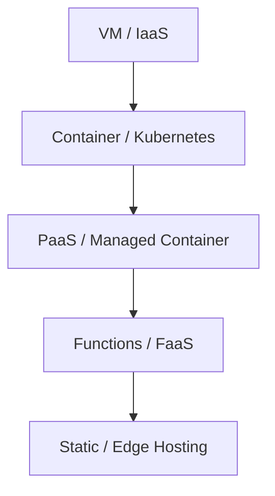
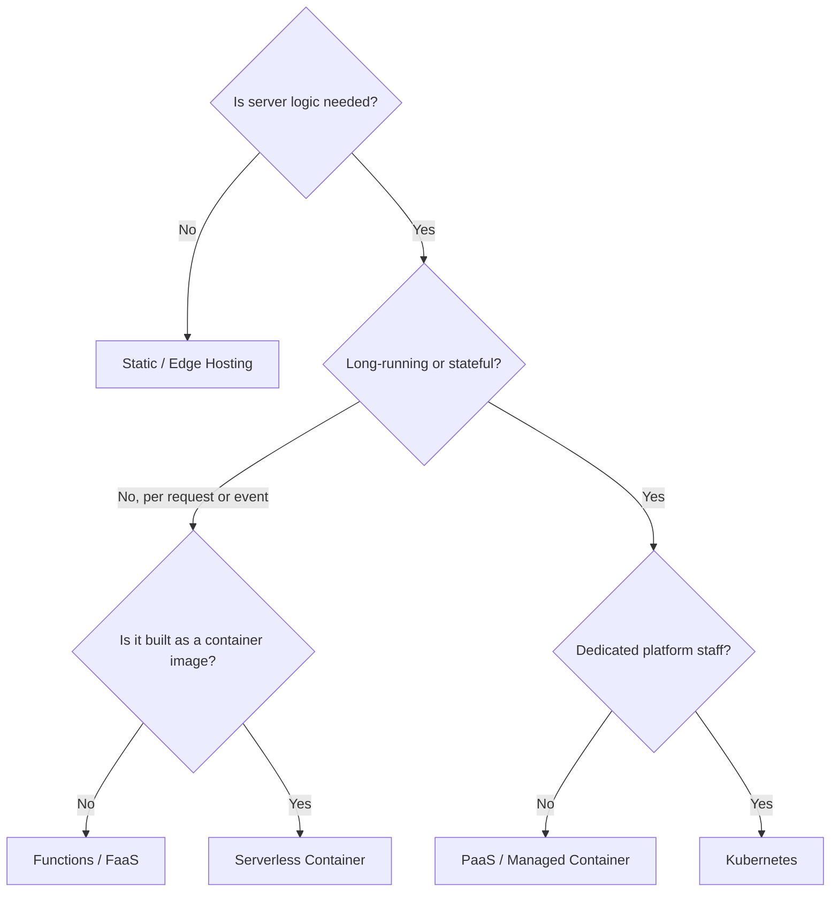

# Choosing a Deployment Target: From Static to Serverless

"Where should we run it?" is not a matter of technical taste; it is a decision about **who carries the operational burden**.

## The Abstraction Ladder



- The further down you go, the less you **manage yourself** (OS, patching, scaling, load balancers).
- In exchange, **constraints** grow (execution time, languages, networking, how state is stored).
- A good choice is not "the most powerful option" but **the lowest rung that meets the requirements**.

## Comparison by Type

| Type | Examples | Good fit | Watch out for |
|---|---|---|---|
| Static / Edge | GitHub Pages, Cloudflare Workers Static Assets, Netlify, Vercel | Docs, landing pages, SPAs | No server logic, or limited to edge functions |
| PaaS | Heroku, Azure App Service | Standard web apps, fast start | Tied to the provider's roadmap |
| Managed / Serverless Container | Google Cloud Run, Azure Container Apps, Amazon ECS Express Mode | APIs that already have a container image | Cold starts, request time limits |
| Functions (FaaS) | AWS Lambda, Cloud Run functions, Azure Functions | Event handling, short tasks | Time and memory limits, stateless |
| Kubernetes | Amazon EKS, GKE, AKS, Korean NKS | Many services, dedicated operators | High learning and operating cost |
| VM | Amazon EC2, Compute Engine, Azure VM | Special software, full control | Patching and incidents are all yours |

## Decision Flow



## Major Hosting Platforms Today (checked 2026-09-28)

| Platform | Verified facts |
|---|---|
| GitHub Pages | Published site up to 1 GB, 100 GB/month soft bandwidth limit, soft limit of 10 builds per hour (the build limit does not apply when publishing with a custom GitHub Actions workflow) |
| Vercel | The Hobby plan is for personal, non-commercial use only and cannot buy usage beyond its caps. Pro includes a credit plus pay-as-you-go overage. Functions use Fluid compute Active CPU pricing (billed only while code actually uses CPU; memory billed separately) |
| Netlify | New accounts since 2025-09-04 use credit-based plans. Production deploys, compute, bandwidth, web requests and more consume credits. Earlier accounts may stay on legacy plans |
| Cloudflare | New projects are advised to use Workers instead of Pages (Pages keeps working, but new features focus on Workers). Workers bills requests + CPU time, no egress charges, and static asset requests are free and unlimited |
| Heroku | On 2026-02-06 Salesforce announced a move to a "sustaining engineering" model. Security and stability work continues, but new feature development and new Enterprise contracts stopped |
| AWS App Runner | Closed to new customers from 2026-04-30. Existing customers can keep using it, with no new features planned. AWS recommends Amazon ECS Express Mode as the alternative |

> Lesson: platforms have **lifecycles** too. Alongside "is it convenient now?", ask "will this platform still be growing in three years?"

## The Shape of Serverless Pricing

Unit prices change, but **what you pay for** rarely does.

| Service | Billing unit | Notes |
|---|---|---|
| AWS Lambda | Requests + duration (allocated memory × time, GB-seconds) | Billed per 1 ms since 2020-12 |
| Google Cloud Run | Request-based (default) or instance-based | Request-based is recommended for spiky traffic, instance-based for steady traffic. Scales to zero with no requests |
| Azure Container Apps | Resources used while running | KEDA-based autoscaling, most apps can scale to zero, no usage charges at zero |
| Vercel Functions | Active CPU + provisioned memory | CPU billing pauses while waiting on I/O |
| Cloudflare Workers | Requests + CPU time | Time spent waiting on outbound calls does not count as CPU time |

Scale to zero lowers cost, but the first request may wait for an instance to start: a **cold start**. For latency-sensitive APIs, compare this with the cost of keeping a minimum number of instances.

## Bad Example / Good Example

```text
Bad:  Spin up a VM for an internal docs site and manage Nginx, certificates and OS patches by hand.
Good: Put the docs site on static hosting and spend operating time on product features.
```

```text
Bad:  Run a commercial service on a free non-commercial plan without reading the terms.
Good: Before revenue starts, check plan terms, caps and how overage is billed.
```

## Selection Checklist

- [ ] Does the plan allow commercial use?
- [ ] Which billing unit (requests, CPU time, bandwidth, credits) grows with my traffic?
- [ ] Has the provider announced a feature freeze or a stop to new customers?
- [ ] Have we kept a **migration path** via a container image or standard build output?
- [ ] Is there a region or edge location near our users and data?
- [ ] Is there a status page and a support channel for outages?

## References

- [GitHub Pages limits](https://docs.github.com/en/pages/getting-started-with-github-pages/github-pages-limits) — GitHub Docs, accessed 2026-09-28
- [Vercel Hobby Plan](https://vercel.com/docs/plans/hobby) — Vercel Docs, accessed 2026-09-28
- [Fluid compute pricing](https://vercel.com/docs/functions/usage-and-pricing) — Vercel Docs, accessed 2026-09-28
- [Netlify pricing update: Introducing credit-based plans](https://www.netlify.com/changelog/netlify-pricing-update-introducing-credit-based-plans/) — Netlify Changelog, 2025-09, accessed 2026-09-28
- [Migrate from Pages to Workers](https://developers.cloudflare.com/workers/static-assets/migration-guides/migrate-from-pages/) — Cloudflare Docs, accessed 2026-09-28
- [Cloudflare Workers Pricing](https://developers.cloudflare.com/workers/platform/pricing/) — Cloudflare Docs, accessed 2026-09-28
- [Salesforce Freezes Heroku Feature Development](https://devops.com/salesforce-freezes-heroku-feature-development-signals-long-term-shift/) — DevOps.com, 2026-02, accessed 2026-09-28
- [AWS App Runner availability change](https://docs.aws.amazon.com/apprunner/latest/dg/apprunner-availability-change.html) — AWS Docs, accessed 2026-09-28
- [Announcing Amazon ECS Express Mode](https://aws.amazon.com/about-aws/whats-new/2025/11/announcing-amazon-ecs-express-mode/) — AWS, 2025-11, accessed 2026-09-28
- [AWS Lambda Pricing](https://aws.amazon.com/lambda/pricing/) — AWS, accessed 2026-09-28
- [New for AWS Lambda – 1ms Billing Granularity](https://aws.amazon.com/blogs/aws/new-for-aws-lambda-1ms-billing-granularity-adds-cost-savings/) — AWS News Blog, 2020-12, accessed 2026-09-28
- [Cloud Run billing settings for services](https://docs.cloud.google.com/run/docs/configuring/billing-settings) — Google Cloud Docs, accessed 2026-09-28
- [Scaling in Azure Container Apps](https://learn.microsoft.com/en-us/azure/container-apps/scale-app) — Microsoft Learn, accessed 2026-09-28
