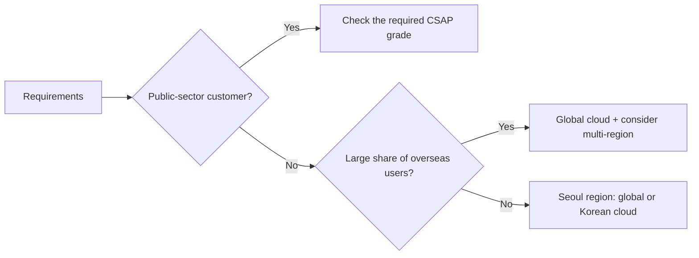

# Cloud and Kubernetes: AWS · Google Cloud · Azure · Korean Clouds

The three major clouds use different service names, but they offer **parts of the same shape that solve the same problems**. Learn the mapping before memorizing names.

## Big Three Mapping

| Area | AWS | Google Cloud | Azure |
|---|---|---|---|
| VM | Amazon EC2 | Compute Engine | Azure Virtual Machines |
| Managed Kubernetes | Amazon EKS | GKE | AKS |
| Serverless Container | Amazon ECS (Express Mode, Fargate) | Cloud Run | Azure Container Apps |
| Functions | AWS Lambda | Cloud Run functions | Azure Functions |
| Object Storage | Amazon S3 | Cloud Storage | Azure Blob Storage |
| Seoul region | ap-northeast-2 | asia-northeast3 | Korea Central |

- Google Cloud Functions was renamed **Cloud Run functions** and unified onto Cloud Run.
- All three clouds operate a Seoul region. For users in Korea, consider it first for latency and data location.

## Design Criteria: Well-Architected

The AWS Well-Architected Framework reviews a design against six pillars.

| Pillar | Question |
|---|---|
| Operational Excellence | Can we run, observe and improve it? |
| Security | Does it protect information, systems and assets? |
| Reliability | Does it recover from failures and handle changing demand? |
| Performance Efficiency | Does it use resources efficiently? |
| Cost Optimization | Is value per cost maximized? |
| Sustainability | Does it reduce energy and resource use? |

The pillars involve **trade-offs**. Multi-region, for example, raises reliability but also raises cost and operational complexity. Google Cloud and Azure provide similar architecture frameworks.

## Korean Clouds and the Public Sector

| Provider | Verified facts |
|---|---|
| NAVER Cloud | Ncloud Kubernetes Service. CI/CD can be built with SourceCommit · SourceBuild · SourceDeploy · SourcePipeline |
| NHN Cloud | NHN Kubernetes Service (NKS) and a Deploy service. NHN Cloud for public institutions obtained CSAP certification in 2022-12 (per the company) |
| KT Cloud | Reported, together with NAVER Cloud and NHN Cloud, as a major player in the Korean public cloud market |

**CSAP (Cloud Security Assurance Program)** is a Korean certification, based on the Act on the Development of Cloud Computing and Protection of its Users, that certifies whether clouds supplied to public institutions meet information security criteria.

- Grading (high · medium · low) introduced in 2023-01: evaluation criteria differ by the using institution and the importance of the system
- Low grade: used for systems such as those handling public data without personal information
- According to press reports, Microsoft (2024-12), Google Cloud (2025-02) and AWS (2025-04) obtained the low grade



## Containers: Build Once, Deploy Many Times

A container image is an **immutable artifact** that bundles the runtime environment. Promoting the same image from Dev → Staging → Production reduces "it worked on my machine" problems.

```dockerfile
FROM node:22-slim
WORKDIR /app
COPY package*.json ./
RUN npm ci --omit=dev
COPY . .
USER node
CMD ["node", "server.js"]
```

- Do not ship development dependencies in the production image.
- Run as a non-root user.
- Deploying by **digest** (sha256) rather than tag prevents "same name, different content" accidents.

## Core Kubernetes Concepts

| Concept | Role |
|---|---|
| Pod | The unit that runs containers |
| Deployment | Manages desired Pod count, version and rolling updates |
| Service | Gives a group of Pods a stable internal address |
| Ingress / Gateway API | Connects external HTTP traffic to Services |
| ConfigMap / Secret | Injects configuration and sensitive data |
| HorizontalPodAutoscaler | Adjusts Pod count with load |

## Kubernetes Versions and Lifespan (as of 2026-09-28)

- The latest minor is **v1.37** (released 2026-08-26). The project maintains release branches for the three most recent minors (1.37, 1.36, 1.35).
- Each minor receives patch support for **about 14 months**. In other words, **upgrading at least once a year** is part of the operating cost.
- Managed Kubernetes (EKS, GKE, AKS, NKS) publishes its own support calendar, so check the provider's documentation.

### Ingress NGINX Retirement

In 2025-11 the Kubernetes project announced the retirement of the widely used **Ingress NGINX** controller. Best-effort maintenance ran until 2026-03; after that there are no releases, bug fixes or security fixes. The recommended path is migrating to the **Gateway API** or another ingress controller, and the conversion tool Ingress2Gateway 1.0 was released in 2026-03.

## Bad Example / Good Example

```text
Bad:  Two services and three developers, yet we build our own Kubernetes cluster
      and run the same version for two years with no upgrade plan.
Good: Start on serverless containers, and move to managed Kubernetes when services,
      traffic and team size grow enough to need shared operations.
```

## Signals That You Need Kubernetes

- Many independently deployed services need shared networking and security policies.
- Workloads such as batch, GPU or stateful services often exceed serverless limits.
- You have **dedicated staff** for cluster upgrades and incident response.

## References

- [The pillars of the framework - AWS Well-Architected Framework](https://docs.aws.amazon.com/wellarchitected/latest/framework/the-pillars-of-the-framework.html) — AWS Docs, accessed 2026-09-28
- [Google Cloud Functions is now Cloud Run functions](https://cloud.google.com/blog/products/serverless/google-cloud-functions-is-now-cloud-run-functions) — Google Cloud Blog, accessed 2026-09-28
- [AWS Regions and Availability Zones](https://docs.aws.amazon.com/global-infrastructure/latest/regions/aws-regions.html) — AWS Docs, accessed 2026-09-28
- [Kubernetes Service - NAVER Cloud Platform](https://www.ncloud.com/product/containers/nks) — NAVER Cloud, accessed 2026-09-28
- [SourceDeploy: Create and manage deployment scenarios](https://guide.ncloud-docs.com/docs/en/sourcedeploy-use-scenario) — NAVER Cloud Docs, accessed 2026-09-28
- [NHN Kubernetes Service (NKS) User Guide](https://docs.nhncloud.com/ko/Container/NKS/ko/user-guide/) — NHN Cloud Docs, accessed 2026-09-28
- [NHN Cloud Certifications](https://www.nhncloud.com/kr/certification?lang=ko) — NHN Cloud, accessed 2026-09-28
- [Cloud Service Security Assurance Program (CSAP)](https://www.kisa.or.kr/1050603) — KISA, accessed 2026-09-28
- [After Google and MS, AWS also obtains CSAP low grade](https://zdnet.co.kr/view/?no=20250401173707) — ZDNet Korea, 2025-04-01, accessed 2026-09-28
- [Releases](https://kubernetes.io/releases/) — Kubernetes, accessed 2026-09-28
- [Kubernetes v1.37 release](https://kubernetes.io/blog/2026/08/26/kubernetes-v1-37-release/) — Kubernetes Blog, 2026-08-26, accessed 2026-09-28
- [Ingress NGINX Retirement: What You Need to Know](https://kubernetes.io/blog/2025/11/11/ingress-nginx-retirement/) — Kubernetes Blog, 2025-11-11, accessed 2026-09-28
- [Announcing Ingress2Gateway 1.0](https://kubernetes.io/blog/2026/03/20/ingress2gateway-1-0-release/) — Kubernetes Blog, 2026-03-20, accessed 2026-09-28
