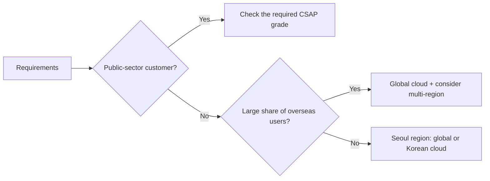

# Cloud and Kubernetes: AWS · Google Cloud · Azure · Korean Clouds

The three major clouds use different service names, but they offer **parts of the same shape that solve the same problems**. Learn the mapping before memorizing names.

## Big Three Mapping

| Area | AWS | Google Cloud | Azure |
|---|---|---|---|
| VM | Amazon EC2 | Compute Engine | Azure Virtual Machines |
| Managed Kubernetes | Amazon EKS | GKE | AKS |
| Serverless Container | Amazon ECS (Express Mode, Fargate) | Cloud Run | Azure Container Apps |
| Functions | AWS Lambda | Cloud Run functions | Azure Functions |
| Object Storage | Amazon S3 | Cloud Storage | Azure Blob Storage |
| Seoul region | ap-northeast-2 | asia-northeast3 | Korea Central |

- Google Cloud Functions was renamed **Cloud Run functions** and unified onto Cloud Run.
- All three clouds operate a Seoul region. For users in Korea, consider it first for latency and data location.

### How to Choose

- **Team skills**: a cloud your team has already operated is the biggest discount. Relearning IAM, networking and the billing model costs more than it looks.
- **Required managed services**: list the databases, queues, analytics and AI services you plan to use, and check which cloud offers them as managed services, including in the Seoul region.
- **Startup credits**: AWS Activate, the Google for Startups Cloud Program and Microsoft for Startups offer credits. Terms and amounts change often, so check them when you apply, and decide based on **the bill after the credits run out**.
- **Region and compliance**: check for a Seoul region, the certifications you need (CSAP for the Korean public sector, separate rules for finance), and conditions on transferring data abroad.
- **Egress and lock-in**: data transfer out (egress) can become a large share of the bill depending on the architecture. The more single-cloud features you use, the higher the cost of moving, so keep portable layers such as containers, IaC and OpenTelemetry.

## Design Criteria: Well-Architected

The AWS Well-Architected Framework reviews a design against six pillars.

| Pillar | Question |
|---|---|
| Operational Excellence | Can we run, observe and improve it? |
| Security | Does it protect information, systems and assets? |
| Reliability | Does it recover from failures and handle changing demand? |
| Performance Efficiency | Does it use resources efficiently? |
| Cost Optimization | Is value per cost maximized? |
| Sustainability | Does it reduce energy and resource use? |

The pillars involve **trade-offs**. Multi-region, for example, raises reliability but also raises cost and operational complexity. Google Cloud and Azure provide similar architecture frameworks.

## Korean Clouds and the Public Sector

| Provider | Verified facts |
|---|---|
| NAVER Cloud | Ncloud Kubernetes Service. CI/CD can be built with SourceCommit · SourceBuild · SourceDeploy · SourcePipeline |
| NHN Cloud | NHN Kubernetes Service (NKS) and a Deploy service. NHN Cloud for public institutions obtained CSAP certification in 2022-12 (per the company) |
| KT Cloud | Reported (2024-02) as one of the "big three" in the Korean public cloud market with NAVER Cloud and NHN Cloud. In 2026-03 it was reported to have obtained CSAP certification for its in-house "kt cloud PLATFORM" (OpenStack rebuilt on Kubernetes) |
| KakaoCloud | Run by Kakao Enterprise. Offers Kubernetes Engine, a managed Kubernetes service. Its predecessor, Kakao i Cloud, was reported in 2022-06 to have passed a CSAP follow-up audit with Kubernetes-based IaaS |

**CSAP (Cloud Security Assurance Program)** is a Korean certification, based on the Act on the Development of Cloud Computing and Protection of its Users, that certifies whether clouds supplied to public institutions meet information security criteria.

- Grading (high · medium · low) introduced in 2023-01: evaluation criteria differ by the using institution and the importance of the system
- Low grade: used for systems such as those handling public data without personal information
- According to press reports, Microsoft (2024-12), Google Cloud (2025-02) and AWS (2025-04) obtained the low grade
- On 2026-04-20 the Ministry of Science and ICT and the National Intelligence Service announced a reform that **unifies public-cloud security verification under the NIS** and abolishes CSAP. Press reports put the start at 2027-07. For public-sector deals, confirm with the buyer which rules apply at contract time.



## Containers: Build Once, Deploy Many Times

A container image is an **immutable artifact** that bundles the runtime environment. Promoting the same image from Dev → Staging → Production reduces "it worked on my machine" problems.

```dockerfile
FROM node:22-slim
WORKDIR /app
COPY package*.json ./
RUN npm ci --omit=dev
COPY . .
USER node
CMD ["node", "server.js"]
```

- Do not ship development dependencies in the production image.
- Run as a non-root user.
- Deploying by **digest** (sha256) rather than tag prevents "same name, different content" accidents.

Put a `.dockerignore` next to the Dockerfile.

```text
node_modules
.env
.git
```

`COPY . .` copies the whole build context into the image. Without `.dockerignore`, a local `node_modules` overwrites the result of `npm ci` so the production image ships different dependencies, and secrets from `.env` and the `.git` history stay in an image layer. A smaller build context also builds faster.

## Core Kubernetes Concepts

| Concept | Role |
|---|---|
| Pod | The unit that runs containers |
| Deployment | Manages desired Pod count, version and rolling updates |
| Service | Gives a group of Pods a stable internal address |
| Ingress / Gateway API | Connects external HTTP traffic to Services |
| ConfigMap / Secret | Injects configuration and sensitive data |
| HorizontalPodAutoscaler | Adjusts Pod count with load |

### Minimal Manifest: Deployment + Service

```yaml
apiVersion: apps/v1
kind: Deployment
metadata:
  name: web
spec:
  replicas: 2
  selector:
    matchLabels:
      app: web
  template:
    metadata:
      labels:
        app: web
    spec:
      containers:
        - name: web
          image: registry.example.com/web@sha256:<digest>
          ports:
            - containerPort: 8080
          readinessProbe:
            httpGet:
              path: /healthz/ready
              port: 8080
            periodSeconds: 5
          livenessProbe:
            httpGet:
              path: /healthz/live
              port: 8080
            initialDelaySeconds: 10
            periodSeconds: 10
          resources:
            requests:
              cpu: 250m
              memory: 256Mi
            limits:
              memory: 512Mi
---
apiVersion: v1
kind: Service
metadata:
  name: web
spec:
  selector:
    app: web
  ports:
    - port: 80
      targetPort: 8080
```

- **readinessProbe**: the Service sends traffic to the Pod only after it passes. Check readiness (database connection, warmed cache).
- **livenessProbe**: the container is restarted when it fails. Check only whether the process is stuck. If it also checks an external database, every Pod restarts together during a database outage.
- **resources.requests**: the scheduler uses these values to pick a node for the Pod.

| Missing | What happens |
|---|---|
| No readinessProbe | The container counts as Ready as soon as it starts. Traffic reaches Pods that are still initializing, so errors spike on every rolling update |
| No resources.requests | The scheduler packs Pods onto one node without knowing what they need. When the node runs short, Pods using more than they requested are evicted first, and Pods that requested nothing (BestEffort) are first in line |
| replicas: 1 | Whenever that Pod restarts, is evicted or its node is drained, nothing is left to serve traffic. A rollout also depends on a single new Pod's readiness, so an inaccurate probe means an outage |

## Kubernetes Versions and Lifespan (as of 2026-09-28)

- The latest minor is **v1.37** (released 2026-08-26). The project maintains release branches for the three most recent minors (1.37, 1.36, 1.35).
- Each minor receives patch support for **about 14 months**. In other words, **upgrading at least once a year** is part of the operating cost.
- Managed Kubernetes (EKS, GKE, AKS, NKS) publishes its own support calendar, so check the provider's documentation.

### Ingress NGINX Retirement

In 2025-11 the Kubernetes project announced the retirement of the widely used **Ingress NGINX** controller. Best-effort maintenance ran until 2026-03; after that there are no releases, bug fixes or security fixes. The recommended path is migrating to the **Gateway API** or another ingress controller, and the conversion tool Ingress2Gateway 1.0 was released in 2026-03.

## Bad Example / Good Example

```text
Bad:  Two services and three developers, yet we build our own Kubernetes cluster
      and run the same version for two years with no upgrade plan.
Good: Start on serverless containers, and move to managed Kubernetes when services,
      traffic and team size grow enough to need shared operations.
```

## Signals That You Need Kubernetes

- Many independently deployed services need shared networking and security policies.
- Workloads such as batch, GPU or stateful services often exceed serverless limits.
- You have **dedicated staff** for cluster upgrades and incident response.

## References

- [The pillars of the framework - AWS Well-Architected Framework](https://docs.aws.amazon.com/wellarchitected/latest/framework/the-pillars-of-the-framework.html) — AWS Docs, accessed 2026-09-28
- [Google Cloud Functions is now Cloud Run functions](https://cloud.google.com/blog/products/serverless/google-cloud-functions-is-now-cloud-run-functions) — Google Cloud Blog, accessed 2026-09-28
- [AWS Regions and Availability Zones](https://docs.aws.amazon.com/global-infrastructure/latest/regions/aws-regions.html) — AWS Docs, accessed 2026-09-28
- [Kubernetes Service - NAVER Cloud Platform](https://www.ncloud.com/product/containers/nks) — NAVER Cloud, accessed 2026-09-28
- [SourceDeploy: Create and manage deployment scenarios](https://guide.ncloud-docs.com/docs/en/sourcedeploy-use-scenario) — NAVER Cloud Docs, accessed 2026-09-28
- [NHN Kubernetes Service (NKS) User Guide](https://docs.nhncloud.com/ko/Container/NKS/ko/user-guide/) — NHN Cloud Docs, accessed 2026-09-28
- [NHN Cloud Certifications](https://www.nhncloud.com/kr/certification?lang=ko) — NHN Cloud, accessed 2026-09-28
- [Cloud Service Security Assurance Program (CSAP)](https://www.kisa.or.kr/1050603) — KISA, accessed 2026-09-28
- [After Google and MS, AWS also obtains CSAP low grade](https://zdnet.co.kr/view/?no=20250401173707) — ZDNet Korea, 2025-04-01, accessed 2026-09-28
- [Releases](https://kubernetes.io/releases/) — Kubernetes, accessed 2026-09-28
- [Kubernetes v1.37 release](https://kubernetes.io/blog/2026/08/26/kubernetes-v1-37-release/) — Kubernetes Blog, 2026-08-26, accessed 2026-09-28
- [Ingress NGINX Retirement: What You Need to Know](https://kubernetes.io/blog/2025/11/11/ingress-nginx-retirement/) — Kubernetes Blog, 2025-11-11, accessed 2026-09-28
- [Announcing Ingress2Gateway 1.0](https://kubernetes.io/blog/2026/03/20/ingress2gateway-1-0-release/) — Kubernetes Blog, 2026-03-20, accessed 2026-09-28
- [Configure Liveness, Readiness and Startup Probes](https://kubernetes.io/docs/tasks/configure-pod-container/configure-liveness-readiness-startup-probes/) — Kubernetes Docs, accessed 2026-09-28
- [Resource Management for Pods and Containers](https://kubernetes.io/docs/concepts/configuration/manage-resources-containers/) — Kubernetes Docs, accessed 2026-09-28
- [Node-pressure Eviction](https://kubernetes.io/docs/concepts/scheduling-eviction/node-pressure-eviction/) — Kubernetes Docs, accessed 2026-09-28
- [Build context: .dockerignore files](https://docs.docker.com/build/concepts/context/#dockerignore-files) — Docker Docs, accessed 2026-09-28
- [AWS Activate Credits](https://aws.amazon.com/startups/lp/aws-activate-credits) — AWS, accessed 2026-09-28
- [Google for Startups Cloud Program](https://cloud.google.com/startup) — Google Cloud, accessed 2026-09-28
- [Microsoft for Startups](https://www.microsoft.com/en-us/startups) — Microsoft, accessed 2026-09-28
- [KT, NAVER and NHN in a heated race for public cloud](https://zdnet.co.kr/view/?no=20240219151548) — ZDNet Korea, 2024-02-19, accessed 2026-09-28
- [KT Cloud obtains CSAP for its own platform, targets the public market](https://view.asiae.co.kr/article/2026033010085798928) — Asia Business Daily, 2026-03-30, accessed 2026-09-28
- [Kakao Enterprise obtains CSAP with Kubernetes-based cloud](https://zdnet.co.kr/view/?no=20220630091430) — ZDNet Korea, 2022-06-30, accessed 2026-09-28
- [Kubernetes Engine](https://docs.kakaocloud.com/en/service/container-pack/k8se) — KakaoCloud Docs, accessed 2026-09-28
- [Public cloud certification unified under the NIS; CSAP dismantled after 10 years](https://zdnet.co.kr/view/?no=20260420130424) — ZDNet Korea, 2026-04-20, accessed 2026-09-28
