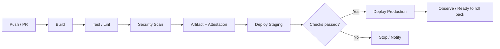

# CI/CD Pipeline: From Commit to Production

CI/CD is not "a script that deploys automatically"; it is **the quality gates a change passes on its way to production, written as code**.

## Terms

| Term | Meaning |
|---|---|
| CI (Continuous Integration) | Merge changes often and run build and tests automatically on every merge |
| Continuous Delivery | Keep the system always releasable to production. A human may approve the final deploy |
| Continuous Deployment | Changes that pass the gates reach production without human intervention |
| Artifact | The build output: a container image, an app bundle, a set of static files, and so on |
| Environment | A place where artifacts run, such as Dev, Staging, Production |

## The Standard Flow



The core principle is **promoting an artifact built once through every environment**. Rebuilding per environment means what you verified in staging may differ from what reached production.

## Configuration Lives Outside the Code

The Twelve-Factor App recommends keeping values that differ per deploy (database addresses, credentials for external services, hostnames) **in the environment, not in the code**. The same artifact should run in many places by changing only the environment. Mounting secrets as volumes is now discussed as well.

## GitHub Actions Example

```yaml
name: deploy
on:
  push:
    branches: [main]
permissions:
  contents: read
  id-token: write
jobs:
  build-deploy:
    runs-on: ubuntu-latest
    environment: production
    steps:
      - uses: actions/checkout@<commit-sha>
      - run: npm ci && npm test
      - run: npm run build
      - run: ./scripts/deploy.sh
```

- Declare minimal `permissions`. `id-token: write` is only needed when authenticating to a cloud via OIDC.
- `environment: production` lets you attach protection rules (approvers, wait timers).
- Pin third-party actions **to a commit SHA** instead of a tag (see the incident below).

## OIDC Instead of Long-Lived Secrets

With GitHub Actions OpenID Connect, each workflow run obtains a **short-lived token** from the cloud provider. AWS, Azure, Google Cloud, HashiCorp Vault and others support it.

```text
Bad:  Store a cloud access key as a repository secret and never rotate it for years.
Good: Narrow the OIDC trust to "this repository's main branch, production environment"
      and use only tokens that expire when the job ends.
```

## Incident: CI Is an Attack Surface Too

- In 2025-03 the widely used `tj-actions/changed-files` action was tampered with so that secrets could be exposed in workflow logs (CVE-2025-30066). CISA advised checking affected repositories and **rotating every secret that may have been exposed**.
- In 2025-08 GitHub began supporting **enforced SHA pinning and blocking specific actions** in Actions policies.

## GitOps: Pull-Based Deployment

The OpenGitOps principles are four.

1. **Declarative**: express the desired state declaratively.
2. **Versioned and Immutable**: store the desired state where versions and full history are kept.
3. **Pulled Automatically**: agents pull the desired state automatically.
4. **Continuously Reconciled**: agents keep observing the actual state and bring it to the desired state.

Instead of CI pushing directly to a cluster, an agent inside the cluster watches Git and follows it, so **drift** (settings someone changed by hand) surfaces automatically.

## Measuring Results: DORA Metrics

| Metric | Meaning |
|---|---|
| Deployment Frequency | How often you deploy to production successfully |
| Change Lead Time | Time from commit to a successful production deployment |
| Failed Deployment Recovery Time | Time to recover from a failure caused by a deployment |
| Change Fail Rate | Share of deployments needing immediate intervention such as a rollback or hotfix |
| Deployment Rework Rate | Share of deployments that are unplanned (bug-fix) work |

DORA uses Change Fail Rate and Deployment Rework Rate as the two measures of **instability**; Deployment Rework Rate was added as the fifth metric in 2024. Use the metrics not as a leaderboard between teams but as **signals that show where to improve**.

## Designing Staged Checks

```text
PR Check     Fast lint and unit tests (within minutes)
Main Merge   Integration tests, image build, staging deploy
Release      Smoke tests, approval, production deploy
Nightly      Heavy E2E, performance, dependency scans
```

Running every check on every PR is slow; running nothing is dangerous. Put **fast checks first and heavy ones later**.

## References

- [Store config in the environment](https://12factor.net/config) — The Twelve-Factor App, accessed 2026-09-28
- [OpenID Connect](https://docs.github.com/en/actions/concepts/security/openid-connect) — GitHub Docs, accessed 2026-09-28
- [Secure use reference](https://docs.github.com/en/actions/reference/security/secure-use) — GitHub Docs, accessed 2026-09-28
- [Supply Chain Compromise of Third-Party tj-actions/changed-files (CVE-2025-30066)](https://www.cisa.gov/news-events/alerts/2025/03/18/supply-chain-compromise-third-party-tj-actionschanged-files-cve-2025-30066-and-reviewdogaction) — CISA, 2025-03-18, accessed 2026-09-28
- [GitHub Actions policy now supports blocking and SHA pinning actions](https://github.blog/changelog/2025-08-15-github-actions-policy-now-supports-blocking-and-sha-pinning-actions/) — GitHub Changelog, 2025-08-15, accessed 2026-09-28
- [OpenGitOps Principles](https://github.com/open-gitops/documents/blob/main/PRINCIPLES.md) — OpenGitOps, accessed 2026-09-28
- [DORA's software delivery performance metrics](https://dora.dev/guides/dora-metrics/) — DORA, accessed 2026-09-28
- [A history of DORA's software delivery metrics](https://dora.dev/insights/dora-metrics-history/) — DORA, accessed 2026-09-28
