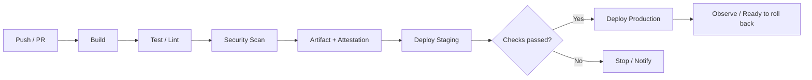
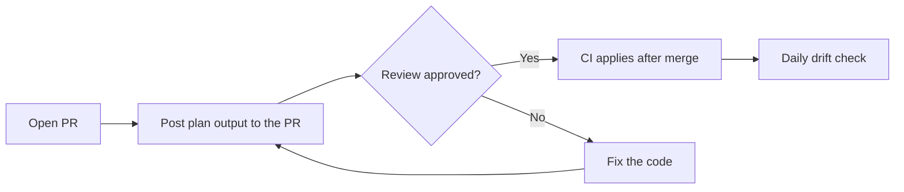

# CI/CD Pipeline: From Commit to Production

CI/CD is not "a script that deploys automatically"; it is **the quality gates a change passes on its way to production, written as code**.

## Deep dives on this topic

This document is the hub for the whole CI/CD flow and for OIDC, GitOps and IaC. Each stage is covered in depth below.

| Document | What it covers |
|---|---|
| "CI Fundamentals and Test Strategy" | Integrating often, pipeline stages, test levels and placement, flaky tests, speed, required checks and merge queues |
| "GitHub Actions in Practice" | Workflow anatomy, reusable workflows, caching, environment approvals, permissions, security, cost |
| "Deployment Automation and Versioning" | Automated deploys by target, preview deploys, database migrations, versions, changelogs and releases |
| "CI/CD in the AI Era" | AI code review, the limits for agents that fix CI, prompt-injection defence, quality gates for AI code |

## Terms

| Term | Meaning |
|---|---|
| CI (Continuous Integration) | Merge changes often and run build and tests automatically on every merge |
| Continuous Delivery | Keep the system always releasable to production. A human may approve the final deploy |
| Continuous Deployment | Changes that pass the gates reach production without human intervention |
| Artifact | The build output: a container image, an app bundle, a set of static files, and so on |
| Environment | A place where artifacts run, such as Dev, Staging, Production |

## The Standard Flow



The core principle is **promoting an artifact built once through every environment**. Rebuilding per environment means what you verified in staging may differ from what reached production.

## Configuration Lives Outside the Code

The Twelve-Factor App recommends keeping values that differ per deploy (database addresses, credentials for external services, hostnames) **in the environment, not in the code**. The same artifact should run in many places by changing only the environment. Mounting secrets as volumes is now discussed as well.

## Environment Design

| Item | Preview (per PR) | Staging | Production |
|---|---|---|---|
| Purpose | See and review the change | Verify the deploy procedure, migrations and integrations | Real users |
| Data | Seed or fake data | Synthetic data or an anonymized subset | Real data |
| Who deploys | Automatic when a PR opens | Automatic on merge to main | CI only, after approval |
| Protection rules | Short-lived, deleted when the PR closes, payments / email / push go to sandboxes | Internal access only, no production secrets | Required reviewers, wait timer, restricted deployment branches |

### Per-Environment Configuration and Secrets

- Inject only different environment variables into the same artifact. Do not add code branches on the environment name (`if (env === "staging")`).
- Keep secrets separate per environment. A GitHub environment secret can be read only by jobs that reference that environment, and if the environment requires approval, not before a reviewer approves.
- Separate cloud accounts or projects when you can, so a staging mistake cannot touch production resources.
- Depending on your GitHub plan, protection rules such as required reviewers and wait timers may not be available for private repositories. Check what your plan includes first.

### The Trap of Production-Like Data

- Do not copy the production database as is. Personal data ends up in an environment with weaker protection. If you need it, use the minimum, anonymized or pseudonymized.
- If copied data still holds real email addresses or phone numbers, a notification test in staging reaches real customers. Route outbound messages to sandbox accounts.

### When a Small Team Can Skip Staging

You can go straight from preview to production when **all** of these are true.

1. Every PR gets a preview with the same artifact and configuration structure as production.
2. Database migrations stay backward compatible via expand → contract (document 04).
3. You can roll back within minutes and have actually done it.
4. Risky features are exposed through feature flags.

If any one is false, keep staging. It is essential if you often ship irreversible migrations or changes to payments, authentication or external integrations.

## GitHub Actions Example

```yaml
name: deploy
on:
  push:
    branches: [main]
permissions:
  contents: read
  id-token: write
jobs:
  build-deploy:
    runs-on: ubuntu-latest
    environment: production
    steps:
      - uses: actions/checkout@<commit-sha>
      - run: npm ci && npm test
      - run: npm run build
      - run: ./scripts/deploy.sh
```

- Declare minimal `permissions`. `id-token: write` is only needed when authenticating to a cloud via OIDC.
- `environment: production` lets you attach protection rules (approvers, wait timers).
- Pin third-party actions **to a commit SHA** instead of a tag (see the incident below).

## OIDC Instead of Long-Lived Secrets

With GitHub Actions OpenID Connect, each workflow run obtains a **short-lived token** from the cloud provider. AWS, Azure, Google Cloud, HashiCorp Vault and others support it.

```text
Bad:  Store a cloud access key as a repository secret and never rotate it for years.
Good: Narrow the OIDC trust to "this repository's main branch, production environment"
      and use only tokens that expire when the job ends.
```

An AWS example. The workflow holds only `id-token: write` and a role; there is no access key.

```yaml
permissions:
  id-token: write
  contents: read
jobs:
  deploy:
    runs-on: ubuntu-latest
    environment: production
    steps:
      - uses: aws-actions/configure-aws-credentials@<commit-sha>
        with:
          role-to-assume: arn:aws:iam::123456789012:role/deploy-production
          aws-region: ap-northeast-2
      - run: aws sts get-caller-identity
```

The IAM role's trust policy narrows **which workflows may assume the role** through the `sub` claim.

```json
{
  "Version": "2012-10-17",
  "Statement": [
    {
      "Effect": "Allow",
      "Principal": {
        "Federated": "arn:aws:iam::123456789012:oidc-provider/token.actions.githubusercontent.com"
      },
      "Action": "sts:AssumeRoleWithWebIdentity",
      "Condition": {
        "StringEquals": {
          "token.actions.githubusercontent.com:aud": "sts.amazonaws.com",
          "token.actions.githubusercontent.com:sub": "repo:ORG/REPO:environment:production"
        }
      }
    }
  ]
}
```

- A `sub` of the form `environment:production` is issued only when the job declares `environment: production`, so the token is available only after the environment protection rules (approval, deployment branch restrictions) pass.
- **Failure mode**: if `sub` is opened with `StringLike` and a wildcard such as `repo:ORG/*` or `repo:ORG/REPO:*`, a workflow in any repository of that organization, or on any branch, receives the production role. Anyone with push access can create a new branch and bypass code review, branch protection and environment approval. With no `sub` condition at all, **any repository on GitHub** can request the role.
- Repositories created, renamed or transferred after 2026-07-15 get immutable owner and repository IDs in the default `sub` (in the form `repo:ORG@<owner-id>/REPO@<repo-id>:...`). Check the actual `sub` of a token before writing the trust policy.

## Incident: CI Is an Attack Surface Too

- In 2025-03 the widely used `tj-actions/changed-files` action was tampered with so that secrets could be exposed in workflow logs (CVE-2025-30066). CISA advised checking affected repositories and **rotating every secret that may have been exposed**.
- In 2025-08 GitHub began supporting **enforced SHA pinning and blocking specific actions** in Actions policies.

## GitOps: Pull-Based Deployment

The OpenGitOps principles are four.

1. **Declarative**: express the desired state declaratively.
2. **Versioned and Immutable**: store the desired state where versions and full history are kept.
3. **Pulled Automatically**: agents pull the desired state automatically.
4. **Continuously Reconciled**: agents keep observing the actual state and bring it to the desired state.

Instead of CI pushing directly to a cluster, an agent inside the cluster watches Git and follows it, so **drift** (settings someone changed by hand) surfaces automatically.

## Infrastructure as Code Too

Infrastructure created by hand in a console (click-ops) leaves no record of who changed what and why, and the same environment cannot be recreated. **IaC (Infrastructure as Code)** lets you review, version and reproduce infrastructure like application code.

| Manage with IaC | Fine to leave as click-ops |
|---|---|
| Networking (VPC, subnets), DNS records, databases · queues · buckets, IAM roles and policies, per-environment service settings, alerts and dashboards | One-time bootstrap (state storage, management account), billing and organization settings, emergency fixes during an incident (then reflect them in code), personal exploration sandboxes |

### Tools in One Line Each

- **Terraform**: declarative HCL with the broadest provider ecosystem. In 2023-08 its license changed from MPL 2.0 to the BSL (Business Source License).
- **OpenTofu**: an open-source fork of Terraform from before the license change. It is hosted by the Linux Foundation and became a CNCF Sandbox project in 2025-04. It uses the same HCL and providers.
- **Pulumi**: write infrastructure in general-purpose languages such as TypeScript, Python and Go.
- **AWS CDK**: write in TypeScript, Python and others, then synthesize a CloudFormation template. AWS only.

### Remote State and Locking

State maps code to real resources. Kept on a laptop, teammates overwrite each other, and secrets held in resource attributes can sit there in plain text. Keep it in a **remote backend**, encrypted, with restricted access. Two people running `apply` at once corrupt the state, so also take a **lock**. Terraform's S3 backend introduced S3-native locking (`use_lockfile`) in 1.10; when it became generally available in 1.11, DynamoDB-based locking was deprecated.

- Turn on **bucket versioning** for the state bucket. HashiCorp highly recommends it; it is how you restore a previous version when the state is accidentally deleted or overwritten.

```hcl
terraform {
  backend "s3" {
    bucket       = "acme-tfstate"
    key          = "prod/network.tfstate"
    region       = "ap-northeast-2"
    encrypt      = true
    use_lockfile = true
  }
}

resource "aws_s3_bucket" "assets" {
  bucket = "acme-prod-assets"
}
```

### plan as a PR Check



Run `plan` on every PR and attach "what will be created, changed and destroyed" to the review. Stop if you see a `destroy`. Only CI runs `apply`, after merge, using the role obtained through OIDC (section above).

```yaml
      - run: terraform init -input=false
      - run: terraform plan -input=false -out=tfplan
```

### Drift Detection

Main should hold no unapplied code, so run `terraform plan -detailed-exitcode` on main every day. Exit code 0 means no changes, 1 an error, 2 differences present. A 2 means someone changed something in the console: reflect it in code or revert it. Giving people read-only production console access reduces drift in the first place.

## Measuring Results: DORA Metrics

| Metric | Meaning |
|---|---|
| Deployment Frequency | How often you deploy to production successfully |
| Change Lead Time | Time from commit to a successful production deployment |
| Failed Deployment Recovery Time | Time to recover from a failure caused by a deployment |
| Change Fail Rate | Share of deployments needing immediate intervention such as a rollback or hotfix |
| Deployment Rework Rate | Share of deployments that are unplanned (bug-fix) work |

DORA uses Change Fail Rate and Deployment Rework Rate as the two measures of **instability**; Deployment Rework Rate was added as the fifth metric in 2024. Use the metrics not as a leaderboard between teams but as **signals that show where to improve**.

## Designing Staged Checks

```text
PR Check     Fast lint and unit tests (within minutes)
Main Merge   Integration tests, image build, staging deploy
Release      Smoke tests, approval, production deploy
Nightly      Heavy E2E, performance, dependency scans
```

Running every check on every PR is slow; running nothing is dangerous. Put **fast checks first and heavy ones later**.

## References

- [Store config in the environment](https://12factor.net/config) — The Twelve-Factor App, accessed 2026-09-28
- [OpenID Connect](https://docs.github.com/en/actions/concepts/security/openid-connect) — GitHub Docs, accessed 2026-09-28
- [Secure use reference](https://docs.github.com/en/actions/reference/security/secure-use) — GitHub Docs, accessed 2026-09-28
- [Supply Chain Compromise of Third-Party tj-actions/changed-files (CVE-2025-30066)](https://www.cisa.gov/news-events/alerts/2025/03/18/supply-chain-compromise-third-party-tj-actionschanged-files-cve-2025-30066-and-reviewdogaction) — CISA, 2025-03-18, accessed 2026-09-28
- [GitHub Actions policy now supports blocking and SHA pinning actions](https://github.blog/changelog/2025-08-15-github-actions-policy-now-supports-blocking-and-sha-pinning-actions/) — GitHub Changelog, 2025-08-15, accessed 2026-09-28
- [OpenGitOps Principles](https://github.com/open-gitops/documents/blob/main/PRINCIPLES.md) — OpenGitOps, accessed 2026-09-28
- [DORA's software delivery performance metrics](https://dora.dev/guides/dora-metrics/) — DORA, accessed 2026-09-28
- [A history of DORA's software delivery metrics](https://dora.dev/insights/dora-metrics-history/) — DORA, accessed 2026-09-28
- [Deployments and environments](https://docs.github.com/en/actions/reference/workflows-and-actions/deployments-and-environments) — GitHub Docs, accessed 2026-09-28
- [Configuring OpenID Connect in Amazon Web Services](https://docs.github.com/actions/deployment/security-hardening-your-deployments/configuring-openid-connect-in-amazon-web-services) — GitHub Docs, accessed 2026-09-28
- [Avoiding mistakes with AWS OIDC integration conditions](https://www.wiz.io/blog/avoiding-mistakes-with-aws-oidc-integration-conditions) — Wiz Blog, accessed 2026-09-28
- [Immutable subject claims for GitHub Actions OIDC tokens](https://github.blog/changelog/2026-04-23-immutable-subject-claims-for-github-actions-oidc-tokens/) — GitHub Changelog, 2026-04-23, accessed 2026-09-28
- [Backend Type: s3](https://developer.hashicorp.com/terraform/language/backend/s3) — HashiCorp Developer, accessed 2026-09-28
- [terraform plan command](https://developer.hashicorp.com/terraform/cli/commands/plan) — HashiCorp Developer, accessed 2026-09-28
- [HashiCorp adopts Business Source License](https://www.hashicorp.com/blog/hashicorp-adopts-business-source-license) — HashiCorp Blog, 2023-08-10, accessed 2026-09-28
- [Linux Foundation Launches OpenTofu](https://www.linuxfoundation.org/press/announcing-opentofu) — Linux Foundation, 2023-09-20, accessed 2026-09-28
- [OpenTofu](https://www.cncf.io/projects/opentofu/) — CNCF, accessed 2026-09-28
- [Pulumi Docs](https://www.pulumi.com/docs/) — Pulumi, accessed 2026-09-28
- [What is the AWS CDK?](https://docs.aws.amazon.com/cdk/v2/guide/home.html) — AWS Docs, accessed 2026-09-28
