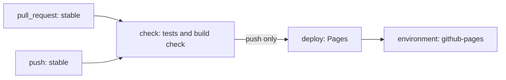

# GitHub Actions in Practice: Workflow Anatomy · Permissions · Caching · Cost

Triggers and basic syntax are covered in "GitHub Actions · Hooks · Cron", and the overall flow and OIDC in "CI/CD · OIDC · GitOps". This document is the next step: **running workflows safely, cheaply and fast**. It covers job dependencies, reuse, caching, deployment approvals, least privilege, action pinning, untrusted input, runners, pricing and debugging, and ends by designing the workflow this site would need if it added CI. Every fact is as of 2026-09. Pricing and plan coverage change often, so re-check the sources in the references before you adopt anything.

## Workflow Anatomy

Read a workflow as **Event → Job → Step**. Jobs run in parallel by default; `needs` adds ordering and passes values along. The diagram below is the example design at the end of this document.



| Key | What it does | Common mistake |
|---|---|---|
| `on` | Events to run on, with branch and path filters | Setting both `push` and `pull_request` without filters, so the same change is checked twice |
| `needs` | Runs only after the earlier job succeeds; passes values through `needs.<id>.outputs` | Forgetting `if: failure()` or `always()` on a notify or cleanup job that must run after a failure |
| `strategy.matrix` | Copies one job for each OS and version combination | Combinations multiply and per-minute cost explodes |
| `if` | Condition for a job or step | Using `"` for strings inside an expression. Only `'` works |

A **context** is a group of values you read in expressions. Common ones are `github` (event, ref, actor), `env`, `vars`, `secrets`, `matrix`, `needs`, `runner` and `inputs`. The status functions `success()` (the default), `failure()`, `always()` and `cancelled()` let you build failure notifications and cleanup jobs. Give every job a `timeout-minutes`. With the default of 360 minutes, a stuck job burns minutes for six hours.

## Reuse: Reusable Workflows and Composite Actions

| Aspect | Reusable workflow (`workflow_call`) | Composite action (`action.yml`) |
|---|---|---|
| Unit and call site | A workflow with several jobs. Called by a job-level `uses:` | A bundle of steps. Called by a step-level `uses:` |
| Runner | Each of its jobs picks its own | Runs on the calling job's runner |
| Secrets | Receives `secrets:` or `secrets: inherit` | Cannot use them directly. Pass them as inputs |
| Logs and nesting | Separate logs per job and step, up to 10 levels | Logged as one step, up to 10 nested |

The rule of thumb: **anything that needs jobs and environments, such as a deployment procedure, is a reusable workflow; a few repeated steps such as "setup + install + cache" are a composite action**. Call a reusable workflow from another repository by SHA too, as in `owner/repo/.github/workflows/deploy.yml@<commit-sha>`.

## Caching and Artifacts

| Aspect | Cache | Artifact |
|---|---|---|
| Purpose | Make the next run **faster** (dependencies, intermediate build output) | **Hand results** to other jobs or to people (build output, test reports) |
| Lifetime | Deleted after 7 days without access; above the default 10 GB per repository, the oldest go first | 90 days by default; shorten with `retention-days` |
| Scope | Restores only caches from the current branch, the default branch and the PR's base branch | Downloaded by other jobs in the same run, or through the UI and API |

```yaml
      - uses: actions/setup-node@820762786026740c76f36085b0efc47a31fe5020 # v7.0.0
        with: { node-version: 22, cache: npm }
      - uses: actions/cache@55cc8345863c7cc4c66a329aec7e433d2d1c52a9 # v6.1.0
        with:
          path: .build-cache
          key: build-${{ runner.os }}-${{ hashFiles('package-lock.json') }}
```

Use the built-in cache of the `setup-*` actions first, and `actions/cache` only for other paths. Never put secrets in a cache: anyone with read access can reach its contents through a pull request. **Cache poisoning defence**: events that outsiders can trigger, such as `pull_request_target`, `issue_comment` and `workflow_run`, can only read caches in the default branch's scope. Let a trusted workflow that runs on `push` keep the default-branch cache up to date.

## Environments and Deployment Protection Rules

When a job names an `environment:`, it starts only after the environment's protection rules pass, and only then can it read the environment's secrets (the "Environment Design" section of "CI/CD · OIDC · GitOps"). **Plan limits**: on Free, Pro and Team, required reviewers, wait timers, custom protection rules and the admin-bypass setting work **only in public repositories**, and Free private repositories cannot use environment secrets at all. If a private repository needs an approval gate, consider an Enterprise plan, or use protected branches and a manual `workflow_dispatch` instead.

| Rule | What it does |
|---|---|
| Required reviewers | Up to 6 people or teams; one approval lets the job proceed. You can stop the person who started the deployment from approving it |
| Wait timer | Waits 1–43,200 minutes (30 days). The wait is not billed |
| Deployment branches and tags | Only protected branches, or only branches and tags matching name patterns, can deploy |
| Custom protection rules | A GitHub App approves or rejects based on an outside system (observability, change management). Admin bypass can be turned off |

## concurrency: Tidying Overlapping Runs

Within one `concurrency.group` only one run is active, and by default only the newest pending run is kept. PR checks use `cancel-in-progress` to cancel the previous run, while **deployment jobs use `cancel-in-progress: false`** so a deployment in progress finishes. A deployment cut off halfway leaves a half-changed state. The example design below shows both settings together. The 2026-09 docs also have `queue: max`, which queues up to 100 pending runs (it cannot be combined with `cancel-in-progress: true`).

## Permissions: A Least-Privilege GITHUB_TOKEN

`GITHUB_TOKEN` is a repository-scoped token issued for each job and expired when the job ends. Its default permissions come from enterprise, organization and repository settings; organizations and personal repositories created after 2023-02 default to read-only. Do not rely on the settings; write the permissions into the workflow.

- Close everything at the top with `permissions: {}` and open only what each job needs (for example `permissions: { contents: read, pull-requests: write }`). Give `id-token: write` only to jobs that need OIDC. Changes pushed with `GITHUB_TOKEN` do not start new workflow runs (except `workflow_dispatch` and `repository_dispatch`); this prevents endless loops. Runs for pull requests opened by Dependabot are treated like forks: they get a read-only token and cannot read secrets.
- **Secrets and variables**: `secrets.NAME` is masked in logs; `vars.NAME` is shown as is. Put keys in secrets and regions or public URLs in variables, each at the narrowest of organization, repository or environment level. Do not store cloud credentials; get them through OIDC ("CI/CD · OIDC · GitOps").

## Pinning Third-Party Actions and Dependabot

A tag (`@v7`) can be moved to another commit by its owner or by an attacker. That was the path of the 2025-03 `tj-actions/changed-files` incident ("Secrets · SBOM · SLSA"). **Pin to the full 40-character commit SHA and add the version as a comment.** Since 2025-08 an organization policy can enforce SHA pinning. Get the SHA with `git ls-remote https://github.com/actions/checkout refs/tags/v7.0.1 'refs/tags/v7.0.1^{}'`. Two lines of output mean an annotated tag, and the SHA on the `^{}` line is the real commit. Also check that the SHA matches the commit on the repository's release page. Dependabot keeps pinned SHAs current with PRs that update the SHA and the version comment together.

```yaml
version: 2
updates:
  - package-ecosystem: github-actions
    directory: /
    schedule: { interval: weekly }
    cooldown: { default-days: 7 }
```

`cooldown` waits a number of days after a new version appears before opening a PR, so you do not pull a freshly tampered release right away. Per the 2026-09 docs, version updates get a 3-day cooldown by default even when you do not set one. In 2026-03 GitHub announced workflow-level dependency locking on its roadmap. It was not yet in the workflow syntax docs checked on 2026-09-30, so until then SHA pinning plus Dependabot is the baseline.

## Untrusted Input: Injection and pull_request_target

`${{ }}` is substituted as text **before** the shell runs. If a value written by outsiders, such as a PR title, branch name or issue body, goes straight into `run:`, that value becomes a command.

```yaml
      # Bad: quotes and a command in the title are executed as is
      - run: echo "PR title is ${{ github.event.pull_request.title }}"
      # Good: pass it as an environment variable and read the shell variable in quotes
      - env:
          TITLE: ${{ github.event.pull_request.title }}
        run: echo "PR title is $TITLE"
```

| Event | What runs, with which permissions | Rule |
|---|---|---|
| `pull_request` | The PR's merge commit. Fork PRs get a read-only token and no secrets | Build and test here |
| `pull_request_target` | The default branch's workflow, with a write-capable token and secrets | Never check out or run PR code |
| `workflow_run` | Default-branch context after an earlier workflow finishes | Do not trust the earlier run's artifacts |

Since 2025-12-08, `pull_request_target` **always runs the workflow file from the default branch**, whatever the base branch. `actions/checkout` v7 refuses by default to check out fork PR code under this event and `workflow_run`. Prompt injection when an AI agent in CI reads PR or issue content is covered in "CI/CD in the AI Era".

## Choosing Runners

| Runner | Traits | Cost (2026-09) | Where not to use it |
|---|---|---|---|
| Standard GitHub-hosted | A fresh VM per job. `ubuntu-latest` is Ubuntu 24.04 | Free for public; private uses included minutes, then is billed | Jobs that need your internal network |
| Larger runner | More CPU and RAM, static IP, GPU. Team and Enterprise Cloud only | **Always billed**, even for public, and included minutes do not apply | Jobs a standard runner handles fine |
| Self-hosted | Your servers or cluster, internal network. No isolation between jobs, so make them ephemeral | No GitHub charge; the infrastructure is your cost | **Public repositories**. Anyone can run code on your runner through a PR |

## Cost: As of 2026-09

Standard runners in public repositories, GitHub Pages and Dependabot runs are free. Private repositories use the account plan's included amounts and are billed beyond them.

| Plan | Included minutes (per month) | Artifact storage | Cache (per repository) |
|---|---|---|---|
| Free (personal · organization) | 2,000 | 500 MB | 10 GB |
| Pro / Team | 3,000 | 1 GB / 2 GB | 10 GB |
| Enterprise Cloud | 50,000 | 50 GB | 10 GB |

| Standard runner | Linux 1-core | Linux 2-core x64 / arm64 | Windows 2-core | macOS 3 · 4-core |
|---|---|---|---|---|
| USD per minute | $0.002 | $0.006 / $0.005 | $0.010 | $0.062 |

- **2026-01-01 cut**: GitHub-hosted prices fell depending on the machine (for example, Linux 2-core $0.008 → $0.006, a 25% cut). The changelog headline's "up to 39%" was confirmed via search results only.
- **Self-hosted charge on hold**: in its 2025-12-16 changelog GitHub announced a $0.002 per-minute charge for self-hosted use in private repositories from 2026-03-01, then postponed it on 2025-12-17. The pricing docs checked on 2026-09-30 still say self-hosted use is free. It may come back, so watch the changelog.
- Each job is **rounded up** to the whole minute, and time spent on failed runs and re-runs counts too. Storage overage is $0.25 per GB-month for artifacts and Packages and $0.07 for cache, accrued hourly. The old OS multipliers (Windows 2x, macOS 10x) are gone from the current pricing docs, replaced by per-machine minute rates. Check the billing page to see how included minutes are drawn down on Windows and macOS. Without a payment method, runs are blocked once the included amount is used up. With one, set a **budget** as a cap. Copilot code review in private repositories also uses Actions minutes.

## Debugging

| Situation | What to do |
|---|---|
| You do not know why it fails | Secret or variable `ACTIONS_STEP_DEBUG=true` (runner diagnostics: `ACTIONS_RUNNER_DEBUG`). For one run only, re-run with "Enable debug logging" or `gh run rerun RUN_ID --debug` |
| Only some jobs failed | "Re-run failed jobs" or `gh run rerun RUN_ID --failed`. Within 30 days, at most 50 times |
| Trying it without a push | Run it locally in Docker with `act` (nektos/act). `act -l` lists jobs; `act pull_request -j check` runs one |

A re-run uses the original event's `GITHUB_SHA` and **the permissions of whoever started the first run**. If you changed the code, you need a new push, and never cover intermittent failures with re-runs ("CI Fundamentals and Test Strategy"). `act`'s images are not the same as GitHub-hosted runners, so a local pass only shows the syntax and flow are right. Pass secrets with `--secret-file`, but never production values.

## Example Design: If This Site Added CI

This site is a static site served by GitHub Pages from the `stable` branch, and as of 2026-09-30 it has **no CI**. Tests run with `node --test tests/*.cjs`, and `node tools/build-site.mjs --check` checks that the generated pages are up to date. Below is a **design example** that has not been added to the repository; the SHAs were checked with `git ls-remote` on 2026-09-30.

```yaml
name: site
on:
  pull_request:
    branches: [stable]
  push:
    branches: [stable]
permissions: {}
concurrency:
  group: site-${{ github.ref }}
  cancel-in-progress: ${{ github.event_name == 'pull_request' }}
jobs:
  check:
    runs-on: ubuntu-latest
    timeout-minutes: 10
    permissions: { contents: read }
    steps:
      - uses: actions/checkout@3d3c42e5aac5ba805825da76410c181273ba90b1 # v7.0.1
        with: { persist-credentials: false }
      - uses: actions/setup-node@820762786026740c76f36085b0efc47a31fe5020 # v7.0.0
        with: { node-version: 22 }
      - run: node --test tests/*.cjs
      - run: node tools/build-site.mjs --check
  deploy:
    needs: check
    if: github.event_name == 'push'
    runs-on: ubuntu-latest
    timeout-minutes: 10
    permissions: { contents: read, pages: write, id-token: write }
    environment:
      name: github-pages
      url: ${{ steps.deployment.outputs.page_url }}
    concurrency: { group: pages, cancel-in-progress: false }
    steps:
      - uses: actions/checkout@3d3c42e5aac5ba805825da76410c181273ba90b1 # v7.0.1
        with: { persist-credentials: false }
      - uses: actions/configure-pages@45bfe0192ca1faeb007ade9deae92b16b8254a0d # v6.0.0
      - uses: actions/upload-pages-artifact@fc324d3547104276b827a68afc52ff2a11cc49c9 # v5.0.0
        with: { path: . }
      - id: deployment
        uses: actions/deploy-pages@368f82528645a54fb793d4d04e342629a3f51346 # v5.0.1
```

The scripts have no dependencies, so there is no cache, and standard runners on a public repository cost nothing. To use `deploy`, switch the Pages source from "Deploy from a branch" to **"GitHub Actions"**. To keep branch deploys instead, keep only `check` and make it a required status check in branch protection. `path: .` uploads the whole repository except `.git`, `.github` and hidden files. If you do not want `tests/` and `tools/` published, upload a directory that holds only the public files.

## Bad Example / Good Example

```text
Bad: third-party actions on an @v2 tag, no permissions block, and the PR title placed straight into run:.
Good: top-level permissions: {}, least privilege per job, actions pinned to SHA + version comment, outside input passed via env.
Bad: checking out the PR head under pull_request_target and running tests. Fork code gets the secrets and a write token.
Good: build and test under pull_request; use pull_request_target only for labels and comments that run no PR code.
```

## Self-Check Questions

1. In one workflow in your repository, which step fails if you change the top-level `permissions` to `{}`? Which permissions alone should that job get?
2. Why is `run: echo "${{ github.head_ref }}"` dangerous? Rewrite it to do the same thing safely.
3. You want a human approval before production deploys from a private repository on the Team plan. Can you use required reviewers? If not, what would you use instead?
4. A private repository runs a 6-minute CI on Linux 2-core 40 times a day for 30 days. How many minutes is that, and what does the part above the Pro plan's included minutes cost?
5. In the example workflow, if you delete the `deploy` job's `concurrency` and change the workflow-level setting to `cancel-in-progress: true`, what can happen when merges land back to back?

## References

- [GitHub Actions billing](https://docs.github.com/en/billing/concepts/product-billing/github-actions) · [Actions runner pricing](https://docs.github.com/en/billing/reference/actions-runner-pricing) — GitHub Docs, checked 2026-09-30 (source in the github/docs repository)
- [Update to GitHub Actions pricing](https://github.blog/changelog/2025-12-16-coming-soon-simpler-pricing-and-a-better-experience-for-github-actions/) (2025-12-16) · [Reduced pricing for GitHub-hosted runners usage](https://github.blog/changelog/2026-01-01-reduced-pricing-for-github-hosted-runners-usage/) (2026-01-01) — GitHub Changelog, confirmed via search results
- [Pricing changes for GitHub Actions](https://github.com/resources/insights/2026-pricing-changes-for-github-actions) · [Updates to GitHub Actions pricing](https://github.com/orgs/community/discussions/182186) (2025-12-17) — GitHub, checked 2026-09-30
- [Workflow syntax](https://docs.github.com/en/actions/reference/workflows-and-actions/workflow-syntax) · [Reusing workflow configurations](https://docs.github.com/en/actions/concepts/workflows-and-actions/reusing-workflow-configurations) · [Dependency caching reference](https://docs.github.com/en/actions/reference/workflows-and-actions/dependency-caching) · [Deployments and environments](https://docs.github.com/en/actions/reference/workflows-and-actions/deployments-and-environments) · [Control the concurrency of workflows and jobs](https://docs.github.com/en/actions/how-tos/write-workflows/choose-when-workflows-run/control-workflow-concurrency) — GitHub Docs, checked 2026-09-30 (source in the github/docs repository)
- [GITHUB_TOKEN](https://docs.github.com/en/actions/concepts/security/github_token) · [Secure use reference](https://docs.github.com/en/actions/reference/security/secure-use) · [Events that trigger workflows](https://docs.github.com/en/actions/reference/workflows-and-actions/events-that-trigger-workflows#pull_request_target) — GitHub Docs, checked 2026-09-30 (source in the github/docs repository)
- [Updating the default GITHUB_TOKEN permissions to read-only](https://github.blog/changelog/2023-02-02-github-actions-updating-the-default-github_token-permissions-to-read-only/) (2023-02-02) · [Actions pull_request_target and environment branch protections changes](https://github.blog/changelog/2025-11-07-actions-pull_request_target-and-environment-branch-protections-changes/) (2025-11-07) — GitHub Changelog, confirmed via search results
- [Dependabot options reference](https://docs.github.com/en/code-security/reference/supply-chain-security/dependabot-options-reference) — GitHub Docs, checked 2026-09-30 (source in the github/docs repository) · [Keeping your actions up to date with Dependabot](https://docs.github.com/en/code-security/how-tos/secure-your-supply-chain/secure-your-dependencies/keeping-your-actions-up-to-date-with-dependabot) — GitHub Docs, confirmed via search results
- [What's coming to our GitHub Actions 2026 security roadmap](https://github.com/orgs/community/discussions/190621) — GitHub Community, 2026-03-26, checked 2026-09-30
- [Actions limits](https://docs.github.com/en/actions/reference/limits) · [Enable debug logging](https://docs.github.com/en/actions/how-tos/monitor-workflows/enable-debug-logging) · [Re-run workflows and jobs](https://docs.github.com/en/actions/how-tos/manage-workflow-runs/re-run-workflows-and-jobs) — GitHub Docs, checked 2026-09-30 (source in the github/docs repository)
- [actions/checkout](https://github.com/actions/checkout) · [actions/runner-images](https://github.com/actions/runner-images) · [nektos/act](https://github.com/nektos/act) · [Pages starter workflow](https://github.com/actions/starter-workflows/blob/main/pages/static.yml) — GitHub, checked 2026-09-30
