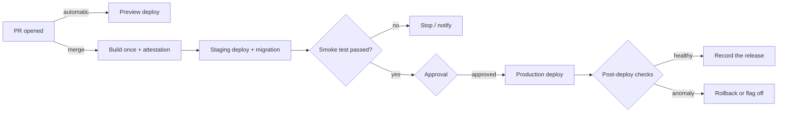

# Deployment Automation and Versioning: From Merge to Release

If CI answers "may this be merged?", CD is **shipping what was merged by the same procedure, as the same artifact, in a way you can undo**. This document is a deep dive under "CI/CD · OIDC · GitOps" and covers automated deploys by target, per-PR previews, environment promotion, database migrations, version and release automation, and post-deploy verification. **Release strategies** such as canary, blue-green and feature flags live in "Canary · Blue-Green · Flags · Rollback", and choosing a deployment target lives in "Targets · Static · Serverless". Facts are as of 2026-09.

## Automated Deploys by Target

| Target | Unit of deployment | Core of the automation | Rolling back |
|---|---|---|---|
| Static sites (GitHub Pages, Cloudflare, Vercel · Netlify) | A bundle of built files | Build once → upload → atomic swap | Switch to the previous deploy, or revert and redeploy |
| Web apps · containers | Container image | Build once and promote by **digest** to every environment | Back to the previous digest |
| Serverless | Function version, revision | Publish an immutable version and move only the alias · traffic | Point the alias · traffic at the previous version |
| Mobile | Signed AAB · IPA | Build · sign · upload with fastlane, EAS and similar; CI increments the build number | An installed binary cannot be rolled back ("App Store · Google Play") |

### Example: Adding CD to This Site

This site is published by GitHub Pages straight from the root files of the `stable` branch. `node tools/build-site.mjs` generates HTML for every document, which is committed alongside; `--check` detects stale generated files; tests run with `node --test tests/*.cjs`. **There is no CI today.** What follows is an example design, not a workflow added to the repository.

According to GitHub's docs, branch publishing is also always deployed by an Actions run, but GitHub manages that run, so you cannot put tests in front of it. Switching the Pages source to **GitHub Actions** lets our own workflow upload only an artifact that passed the tests. The full workflow, which runs only the checks on PRs and, on a push to `stable`, runs `configure-pages` → `upload-pages-artifact` → `deploy-pages` after the checks pass, is in the example design of "GitHub Actions in Practice". Here we look only at **what changes on the deploy side**.

| Item | Branch publishing (today) | Actions publishing (design) |
|---|---|---|
| When it deploys | Unconditionally on every push to `stable` | Only after the tests and `build-site --check` pass |
| What gets published | The files of the `stable` branch as they are | The artifact uploaded by a run that passed the checks. Only the deploy job gets `pages: write`, `id-token: write` |
| Folders starting with a dot | Because of `.nojekyll`, `.ai/` and `.claude/` are also served at public URLs | `upload-pages-artifact` leaves them out by default, so they are no longer published |
| Rolling back | Push a revert commit | Push a revert commit. Artifact retention defaults to one day, so re-running only the deploy job of an old run can fail |

- Never cancel a running production deploy. GitHub's Pages starter template also sets `cancel-in-progress: false`. Only PR checks are cancelled when a new push arrives.
- Add `stable` to the allowed deployment branches of the `github-pages` environment. GitHub recommends a protection rule so that only the default branch can deploy to this environment.
- The post-deploy smoke test checks **what just changed**, not the home page: the URL of a newly edited document, or whether the `v` value that `tools/site/template.html` appends to asset URLs appears in the response. Which tests belong on PRs is in "CI Fundamentals and Test Strategy", and a small team's minimum setup is in "Small Team Playbook".

### Containers: Build Once, Promote by Digest

- A tag (`:latest`, `:v1.4.0`) can be moved to another image. Write the **digest** in the deployment manifest, as in `registry/app@sha256:…`, so that the exact image verified in staging is the one that reaches production. Promotion does not rebuild; it adds another name to the same digest, for example `docker buildx imagetools create --tag registry/app:prod registry/app@sha256:…`. With GitOps, promotion is "a PR that changes the digest in the production folder".

### Serverless and Mobile

- **AWS Lambda**: a published version is a snapshot with its code and configuration frozen, and an alias is a movable name that points at a version. Deploying is publishing a new version and moving the alias; rolling back is moving the alias back. A weighted alias splits traffic across up to two versions.
- **Cloud Run**: deploying a new revision with `--no-traffic` and `--tag` gives it a tag-specific URL without sending it any traffic. Check it there, then move traffic.
- **Mobile**: Android `versionCode` is a positive integer that must grow with each release, and the largest value Google Play allows is 2100000000. An iOS build number cannot be reused within the same version either. Let CI increment the numbers.

## Per-PR Preview Deployments

| Service | Behavior (checked 2026-09) |
|---|---|
| Vercel | Creates a preview deployment for every push to a non-production branch and posts the URL as a PR comment |
| Netlify | Builds a Deploy Preview by default when a PR is opened in a connected repository. The address looks like `deploy-preview-<PR number>--<site>.netlify.app` |
| Cloudflare Workers | With preview builds enabled in Workers Builds, every non-production branch gets a Preview. Previews do not inherit production settings |
| GitHub Pages | The `preview` input of `deploy-pages` is alpha and not available to the public |

Previews easily become **a leak into production**.

- Cloudflare Worker Preview URLs are public by default, and a Preview's service bindings call the bound Worker's **production** deployment. Read exceptions like these first. Give previews no production database or payment keys; use seed data and sandbox accounts only. Pass no secrets to preview builds of fork PRs (the `pull_request_target` section of "GitHub Actions in Practice"). When the PR closes, delete the preview and its temporary resources.

## Environment Promotion and Approval



- Do not rebuild on promotion. The next job takes the digest · artifact ID left by the previous stage as its input.
- Required reviewers, wait timers, deployment branch restrictions and their plan limits are covered in one place, the "Environments and Deployment Protection Rules" section of "GitHub Actions in Practice".
- Put the changelog, the list of migrations and the staging smoke-test results close to the approval screen so approvers can see "what is going out". In continuous deployment with no human approval, **automated checks and automatic rollback conditions** take that place.

## Putting Database Migrations in the Pipeline

There is one rule: **during a deploy, both the old code and the new code must work against the current schema.** The expand → migrate → contract idea is in "Canary · Blue-Green · Flags · Rollback"; here it is mapped onto pipeline order.

| Change | When it runs | Why |
|---|---|---|
| Add a column · table · index (expand) | **Before** the new code is deployed | Old code ignores the new column, and new code needs it |
| Data backfill | **After** the new code starts writing to both, in small batches in a separate job | So a bulk update does not hold up the deploy and its locks |
| Drop a column, enforce NOT NULL (contract) | After the old code is gone **and the rollback window has passed**, in a later release | The old code you might roll back to still reads that column |

Run migrations **once, in one pipeline job**. Run at app startup, they are attempted by every instance at once, and a slow one overlaps with failing health checks and restarts. A PostgreSQL example; these are **steps that ship across several releases**.

```sql
-- Release N (before deploy): fail instead of waiting long for a lock
SET lock_timeout = '5s';
ALTER TABLE users ADD COLUMN display_name text;
-- Release N (separate migration): CONCURRENTLY cannot run inside a transaction block
CREATE INDEX CONCURRENTLY idx_users_display_name ON users (display_name);
-- Release N+2 (contract): after the old code and the rollback window are both gone
ALTER TABLE users DROP COLUMN name;
```

- `lock_timeout` aborts a statement whose lock wait exceeds the limit. It reduces the chance that a queued migration blocks every query behind it. If your migration tool wraps each file in a transaction, `CREATE INDEX CONCURRENTLY` needs the tool's "disable transaction" setting. Since PostgreSQL 11, `ADD COLUMN` with a constant (non-volatile) default does not rewrite the table. A volatile default such as `clock_timestamp()` still rewrites the table and its indexes.

**The limits of rollback.** A down migration cannot bring back the data of a dropped column. Flyway offers undo migrations as a paid-edition feature, and its docs also warn about destructive changes. Before a contract step, confirm your backup and PITR restore point (Backups and Recovery Objectives in "SLO · On-call · Postmortem"), and when something breaks, make **roll forward** (shipping a fixed migration) the default.

## Choosing a Version Scheme

| Scheme | Shape | Fits |
|---|---|---|
| SemVer 2.0.0 | `MAJOR.MINOR.PATCH`, pre-release `1.0.0-rc.1`, build metadata `1.0.0+20260930` | Things others depend on: libraries, public APIs, CLIs |
| CalVer | Ubuntu `YY.0M.MICRO`, pip `YY.MINOR.MICRO`, certifi `YYYY.MM.DD` | Products with a broad scope or tied to schedules and external change |
| Deploy identifier | Commit SHA, build number, deploy time | Internal web services where users never pick a version |

In SemVer, MAJOR is for incompatible API changes, MINOR for backward-compatible features, and PATCH for backward-compatible bug fixes. `0.y.z` is initial development, where anything may change. **Never modify the contents of a released version**; ship a new one. For a web service it is enough to answer "what is running in production right now?" in one line.

### From Conventional Commits to a Version

| Example commit | Meaning | SemVer |
|---|---|---|
| `fix: correct the login redirect` | Bug fix | PATCH |
| `feat(api): add a search filter` | New feature | MINOR |
| `feat!: remove the old auth API` or a `BREAKING CHANGE:` footer | Breaking change | MAJOR |
| `docs:`, `ci:`, `chore:`, `refactor:` and others | Extra types the spec does not mandate | None (unless there is a BREAKING CHANGE) |

The format is `<type>[optional scope]: <description>` (1.0.0). If squash merges are set to use the PR title as the commit title, checking **PR titles** does more than checking individual commits.

### Changelog and Release Automation Tools

| Tool | How it works | Where a human steps in | Fits |
|---|---|---|---|
| release-please (Google) | Reads commits and keeps a **release PR** with the version · CHANGELOG up to date; merging it creates the tag and GitHub Release | Merging the release PR | Apps · services, release types for many languages |
| semantic-release | On every successful CI run on a release branch, decides the version, writes release notes and publishes, all automatically | Nowhere; the commit messages decide | Packages published often |
| Changesets | Contributors add a changeset file per PR stating the bump type and a description; a version PR collects them and publishes | Writing changesets, merging the version PR | Monorepos with interdependent packages |

An example that deploys only in runs where release-please created a release (the SHA is the `v5.0.0` tag as of 2026-09-30).

```yaml
name: release
on:
  push:
    branches: [main]
permissions:
  contents: read
jobs:
  release-please:
    runs-on: ubuntu-latest
    permissions:
      contents: write
      issues: write
      pull-requests: write
    outputs:
      created: ${{ steps.rp.outputs.release_created }}
      tag: ${{ steps.rp.outputs.tag_name }}
    steps:
      - id: rp
        uses: googleapis/release-please-action@45996ed1f6d02564a971a2fa1b5860e934307cf7 # v5.0.0
        with:
          release-type: node
  deploy:
    needs: release-please
    if: needs.release-please.outputs.created == 'true'
    runs-on: ubuntu-latest
    environment: production
    steps:
      - uses: actions/checkout@3d3c42e5aac5ba805825da76410c181273ba90b1 # v7.0.1
        with:
          ref: ${{ needs.release-please.outputs.tag }}
      - env:
          TAG: ${{ needs.release-please.outputs.tag }}
        run: ./scripts/deploy.sh "$TAG"
```

- Tags · releases · pushes made with the default `GITHUB_TOKEN` **do not start new workflow runs** (the rule and its PR exception are in the "Permissions: A Least-Privilege GITHUB_TOKEN" section of "GitHub Actions in Practice"). So a deploy workflow hooked separately on `on: release` silently never runs. Chain the deploy job through outputs in the same workflow as in the example above, or use a GitHub App token. Pass the tag name through `env` rather than putting `${{ }}` directly in `run:` (the injection section of "GitHub Actions in Practice"). If CI on a release PR opened with this token seems stuck, check that exception (waiting for approval) first.

### Tags and GitHub Releases

- **Automatically generated release notes**: list merged PRs, contributors and a full-changelog comparison link. `.github/release.yml` sets categories by label and exclusion rules.
- **Immutable releases** (generally available 2025-10-28): once published, assets cannot be added, replaced or deleted, and the tag cannot be moved or deleted while the release exists. Even after deleting the release, the same tag name cannot be reused. A release attestation is generated automatically. So work in the order **create a draft → attach every asset → publish**.
- **Protecting tags**: the old tag protection rules were moved to rulesets on 2024-08-30. Use a tag ruleset so that only the release automation can create `v*` tags.

## Build Provenance and the Pre-Deploy Check

The release build job records a **provenance attestation** for the artifact (which workflow built it from which commit), and the deploy job checks it just before deploying. For a container it looks like `gh attestation verify oci://<image>@sha256:… --owner <org>`. Since v4, `actions/attest-build-provenance` is a wrapper around `actions/attest`, and new setups are told to use `actions/attest`. Attestations work in public repositories on every plan; private · internal repositories need GitHub Enterprise Cloud. SBOMs and SLSA are covered in "Secrets · SBOM · SLSA".

## Post-Deploy Verification and Automatic Rollback

| Check | What it looks at | On failure |
|---|---|---|
| Smoke test | Right after the deploy, the pipeline checks a few critical paths and **the version actually being served** | Pipeline fails, rollback step runs |
| Synthetic check | Periodically performs flows such as login · payment from outside | Alert and on-call ("SLO · On-call · Postmortem") |
| Metric gate | Compares error rate and latency with the pre-deploy baseline | Automatic rollback, canary halted ("Canary · Blue-Green · Flags · Rollback") |

```bash
for i in 1 2 3 4 5; do
  curl -fsS --max-time 10 "$APP_URL/version" | grep -q "$EXPECTED_SHA" && exit 0
  sleep 15
done
echo "smoke test failed: $EXPECTED_SHA is not live"; exit 1
```

- Do not look only at HTTP 200. A CDN cache or an old instance also returns 200. Put the commit SHA or version in a response and compare it. Check what your platform's automatic rollback watches. Amazon ECS can detect failure through the deployment circuit breaker and CloudWatch alarms and roll back automatically. A Kubernetes Deployment that exceeds `progressDeadlineSeconds` (default 600 seconds) only reports a status and **does not roll itself back**; a higher-level tool such as Argo Rollouts, or the pipeline, has to. Decide the rollback conditions (which metric, above what, for how many minutes) before the deploy.

## Bad Example / Good Example

```text
Bad:  the staging and production jobs each run docker build again. The base image changes in between,
      and an unverified image reaches production.
Good: verify the digest of the image built once on main in staging, then promote that same digest.
```

```text
Bad:  a column-rename migration runs at app startup and ships in the same deploy as the new code.
      After a rollback, the old code looks for a column that no longer exists and everything errors.
Good: add → write to both → backfill → switch reads → drop in a later release. One job runs migrations.
```

## Self-Check Questions

1. How do you prove that what was verified in staging is what reached production? Explain it through the difference between a tag and a digest.
2. Into how many releases do you split a column rename, and does each migration run before or after the deploy?
3. Why make roll forward the default even when down migrations exist?
4. Why does an `on: release` workflow not run for a release created with the default `GITHUB_TOKEN`, and how do you fix it?
5. What failures does a smoke test miss if it checks only for HTTP 200? What would you check for this site?

## References

- [Configuring a publishing source for your GitHub Pages site](https://docs.github.com/en/pages/getting-started-with-github-pages/configuring-a-publishing-source-for-your-github-pages-site), [Deployments and environments](https://docs.github.com/en/actions/reference/workflows-and-actions/deployments-and-environments), [Triggering a workflow](https://docs.github.com/en/actions/how-tos/write-workflows/choose-when-workflows-run/trigger-a-workflow), [Automatically generated release notes](https://docs.github.com/en/repositories/releasing-projects-on-github/automatically-generated-release-notes), [Immutable releases](https://docs.github.com/en/code-security/concepts/supply-chain-security/immutable-releases) — GitHub Docs (github/docs source), checked 2026-09-30
- [actions/deploy-pages](https://github.com/actions/deploy-pages), [actions/upload-pages-artifact](https://github.com/actions/upload-pages-artifact), [Pages static starter workflow](https://github.com/actions/starter-workflows/blob/main/pages/static.yml), [actions/attest](https://github.com/actions/attest), [actions/attest-build-provenance](https://github.com/actions/attest-build-provenance), [gh attestation verify](https://cli.github.com/manual/gh_attestation_verify) — GitHub, checked 2026-09-30
- [Immutable releases are now generally available](https://github.blog/changelog/2025-10-28-immutable-releases-are-now-generally-available/), [Sunset Notice - Tag Protections](https://github.blog/changelog/2024-05-29-sunset-notice-tag-protections/) — GitHub Changelog, confirmed via search results (2026-09-30)
- [Semantic Versioning 2.0.0](https://semver.org/), [Calendar Versioning](https://calver.org/), [Conventional Commits 1.0.0](https://www.conventionalcommits.org/en/v1.0.0/) — each spec's GitHub source; [release-please-action](https://github.com/googleapis/release-please-action), [semantic-release](https://github.com/semantic-release/semantic-release), [Changesets](https://github.com/changesets/changesets) — GitHub, checked 2026-09-30
- [ALTER TABLE](https://www.postgresql.org/docs/current/sql-altertable.html), [CREATE INDEX](https://www.postgresql.org/docs/current/sql-createindex.html), [Client Connection Defaults (lock_timeout)](https://www.postgresql.org/docs/current/runtime-config-client.html), [PostgreSQL 11 Release Notes](https://www.postgresql.org/docs/release/11.0/) — PostgreSQL (documentation source), checked 2026-09-30
- [Undo migrations](https://documentation.red-gate.com/fd/undo-migrations-273973334.html) — Redgate Flyway Docs; [Vercel for GitHub](https://vercel.com/docs/git/vercel-for-github) — Vercel Docs; [Deploy Previews](https://docs.netlify.com/deploy/deploy-types/deploy-previews/) — Netlify Docs, confirmed via search results (2026-09-30)
- [Previews](https://developers.cloudflare.com/workers/previews/), [Build branches](https://developers.cloudflare.com/workers/ci-cd/builds/build-branches/) — Cloudflare Docs (cloudflare-docs source), checked 2026-09-30
- [Lambda aliases](https://docs.aws.amazon.com/lambda/latest/dg/configuration-aliases.html), [Weighted alias](https://docs.aws.amazon.com/lambda/latest/dg/configuring-alias-routing.html), [Amazon ECS deployment failure detection](https://docs.aws.amazon.com/AmazonECS/latest/developerguide/deployment-failure-detection.html) — AWS Docs; [Configure deployment previews](https://cloud.google.com/run/docs/tutorials/configure-deployment-previews) — Google Cloud Docs, confirmed via search results (2026-09-30)
- [Deployments: progressDeadlineSeconds](https://kubernetes.io/docs/concepts/workloads/controllers/deployment/#progress-deadline-seconds) — Kubernetes Docs (source), [docker buildx imagetools create](https://docs.docker.com/reference/cli/docker/buildx/imagetools/create/) — Docker Docs (docker/buildx source); [Version your app](https://developer.android.com/studio/publish/versioning) — Android Developers, checked 2026-09-30; [TN2420: Version Numbers and Build Numbers](https://developer.apple.com/library/archive/technotes/tn2420/_index.html) — Apple Developer, confirmed via search results (2026-09-30)
