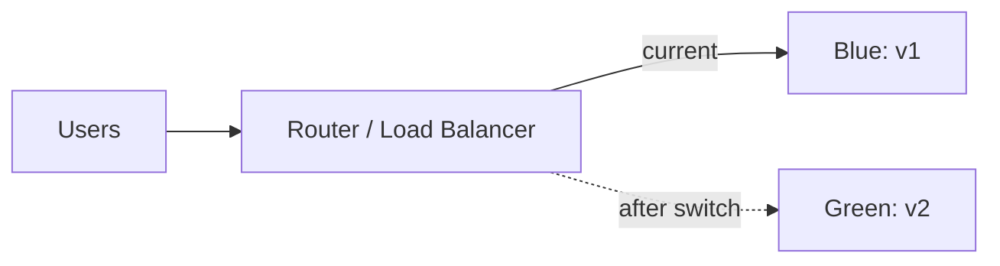
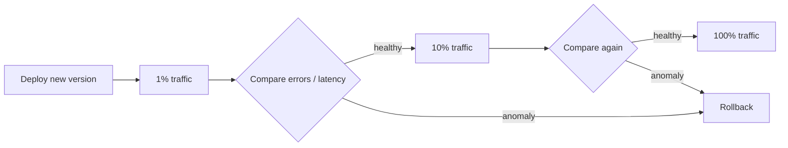

# Release Strategies: Rolling · Blue-Green · Canary · Feature Flag · Rollback

Deploy and release are different. **Deploying puts code into an environment**; **releasing lets users experience the change**. The more you separate them, the smaller the risk.

## Strategies at a Glance

| Strategy | How it works | Benefit | Cost / caution |
|---|---|---|---|
| Recreate | Take the old version down, bring the new one up | Simple | Downtime |
| Rolling | Replace instances a few at a time | Little extra capacity | Two versions briefly coexist |
| Blue-Green | Build an identical environment and switch routing | Fast switch and switch back | Temporarily double resources |
| Canary | Send part of the traffic to the new version and compare | Minimal blast radius | Needs metrics and a baseline |
| Feature Flag | Deploy code; control exposure by configuration | Separates deploy from release | Flag debt must be managed |

## Rolling Update

This is the default strategy of a Kubernetes Deployment. Both `maxUnavailable` and `maxSurge` default to **25%**.

```yaml
spec:
  strategy:
    type: RollingUpdate
    rollingUpdate:
      maxUnavailable: 0
      maxSurge: 1
```

- With `maxUnavailable: 0`, old Pods are removed only after new Pods are ready.
- If the readiness probe is inaccurate, traffic reaches Pods that are not ready and the rolling update loses its point.
- Rolling back: `kubectl rollout undo deployment/<name>` (use `--to-revision` for a specific revision)

## Blue-Green



Bring up the new version (Green) in an environment identical to production, verify it, then change only the router. If something goes wrong, point the router back to Blue. This return is only truly possible if **the database schema is compatible with both versions**.

## Canary

The Google SRE Workbook defines canarying as **a partial and time-limited deployment of a change and its evaluation**. A small slice of production (the canary) is compared with the rest (the control) to decide whether to proceed.



Example comparison metrics: error rate, p95 latency, crash rate, key conversion rate. When automating, define **the pass criteria before the deploy**.

How traffic is split depends on the platform.

- **Cloud Run**: assign traffic percentages per revision, e.g. `gcloud run services update-traffic SERVICE --to-revisions REVISION=5` sends 5% to the new revision.
- **Kubernetes**: a plain Deployment splits only by Pod count. **Argo Rollouts** (`setWeight` steps) or **Flagger** change weights in a service mesh, ingress or the Gateway API, and promote or roll back automatically based on metric analysis.
- **Load balancer / CDN / DNS**: weighted routing between two targets or origins. DNS weights are imprecise because resolvers cache records (TTL).

## Feature Flag

Pete Hodgson's "Feature Toggles" article on martinfowler.com describes release toggles as the most common way to "separate feature **release** from code **deployment**."

| Flag type | Lifespan | Example |
|---|---|---|
| Release Toggle | Short | Hide an unfinished feature |
| Experiment Toggle | Duration of the experiment | A/B test |
| Ops Toggle | During operation | Turn off a heavy feature during an incident (kill switch) |
| Permissioning Toggle | Long | Expose only to paid or beta users |

- **OpenFeature** (CNCF Incubating, promoted 2023-11) offers a vendor-neutral standard API.
- Remove flags you no longer need. Old flags cause combinatorial explosion and incidents.

## Rollback and Roll Forward

```text
Rollback      Return to the previous artifact. Fast and predictable.
Roll Forward  Deploy a fixed version. Chosen when data changes cannot be undone.
Flag Off      Keep the code; just turn the feature off. The fastest.
```

The most common thing that makes rollback hard is **database migration**. Split it with the Parallel Change (Expand → Migrate → Contract) pattern.

1. Expand: add the new column and keep both old and new code working.
2. Migrate: move the data and switch to the new code.
3. Contract: remove the unused column (once things are stable enough).

## Bad Example / Good Example

```text
Bad:  Rename a column and deploy code in one step. If the deploy fails, the old code breaks on the new schema.
Good: Split add column → write both → switch reads → drop old column across several releases.
```

## How Mobile Differs

A mobile binary that is already installed cannot be rolled back. That makes store-level **gradual releases** (Apple Phased Release, Google Play Staged Rollout) and **server-side feature flags** more important. Document 05 covers the details.

## References

- [Deployments](https://kubernetes.io/docs/concepts/workloads/controllers/deployment/) — Kubernetes Docs, accessed 2026-09-28
- [kubectl rollout undo](https://kubernetes.io/docs/reference/kubectl/generated/kubectl_rollout/kubectl_rollout_undo/) — Kubernetes Docs, accessed 2026-09-28
- [Blue Green Deployment](https://martinfowler.com/bliki/BlueGreenDeployment.html) — Martin Fowler, accessed 2026-09-28
- [Canary Release](https://martinfowler.com/bliki/CanaryRelease.html) — Martin Fowler, accessed 2026-09-28
- [Feature Toggles (aka Feature Flags)](https://martinfowler.com/articles/feature-toggles.html) — Pete Hodgson, martinfowler.com, accessed 2026-09-28
- [Parallel Change](https://martinfowler.com/bliki/ParallelChange.html) — martinfowler.com, accessed 2026-09-28
- [Canarying Releases](https://sre.google/workbook/canarying-releases/) — Google SRE Workbook, accessed 2026-09-28
- [OpenFeature becomes a CNCF incubating project](https://www.cncf.io/blog/2023/12/19/openfeature-becomes-a-cncf-incubating-project/) — CNCF, 2023-12-19, accessed 2026-09-28
- [Rollbacks, gradual rollouts, and traffic migration](https://docs.cloud.google.com/run/docs/rollouts-rollbacks-traffic-migration) — Google Cloud Docs, accessed 2026-09-28
- [Canary Deployment Strategy](https://argo-rollouts.readthedocs.io/en/stable/features/canary/) — Argo Rollouts Docs, accessed 2026-09-28
- [Flagger](https://fluxcd.io/flagger/) — Flux, accessed 2026-09-28
