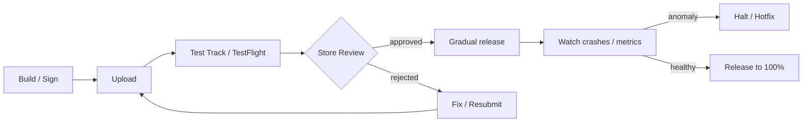

# Mobile Store Distribution: App Store and Google Play

The web reaches every user as soon as you deploy, but a mobile app passes two gates: **store review** and **users updating**. That is why schedules, policies and gradual releases must be designed in advance.

## The Whole Flow



## Accounts and Cost Model

| Item | Apple | Google |
|---|---|---|
| Developer account | Apple Developer Program annual membership | Play Console one-time registration fee |
| Review tool | App Store Connect | Play Console |
| Pre-release testing | TestFlight | Internal / Closed / Open testing tracks |

Amounts vary by region and over time, so check them on the enrollment screen.

## Apple: Review and Testing

- **TestFlight**: up to 100 internal testers and up to 10,000 external testers. External testing requires the first build to be approved by App Review.
- **App Review**: Apple states that on average 90% of submissions are reviewed in less than 24 hours. You can request an **expedited review** for a critical bug fix or an event deadline.
- **Phased Release**: rolls an update out to automatic-update users over 7 days. It can be paused for up to 30 days, and anyone can still download manually at any time.
- Common rejection points (App Review Guidelines):
  - 2.1 App Completeness: a finished build without placeholders, a demo account or demo mode for apps with login, and the backend running during review
  - 5.1.1: if the app supports account creation, it must also offer **account deletion inside the app**

## Apple: Requirements Verified for 2026

| Effective | Requirement |
|---|---|
| 2024-05-01 | If you use listed APIs (required reason APIs), declare approved reasons in the privacy manifest |
| 2026-01-31 | Answer the new age rating questions so update submissions are not interrupted |
| 2026-04-28 | Builds must use Xcode 26 or later with a 26 SDK (e.g. iOS 26) to upload |
| 2026-09-09 | iOS · iPadOS apps must target iOS 13 or later to upload |

- If you include a commonly used third-party SDK (on Apple's list), that SDK's **privacy manifest and signature** are required.
- Apps distributed in the EU need a **trader status** under the DSA (Digital Services Act).

## Google Play: Tracks and New-Account Conditions

| Track | Purpose |
|---|---|
| Internal testing | Up to 100 testers, fast internal QA |
| Closed testing | Chosen tester groups, multiple tracks allowed |
| Open testing | Anyone can join; the test version is visible on the Play Store |
| Production | General release, staged rollout available |

**Personal developer accounts created after 2023-11-13** must run **a closed test with at least 12 testers opted in for 14 consecutive days** before applying for production access. Meeting the conditions does not guarantee approval. Organization accounts and older personal accounts are not affected.

## Google Play: Requirements Verified for 2026

| Effective | Requirement |
|---|---|
| 2026-08-31 | New apps and updates must target Android 16 (API 36) or higher. Wear OS · Automotive: API 35; TV · XR: API 34 |
| 2026-08-31 | Existing apps must target API 35 or higher to stay available to new users on newer Android versions |
| 2026-11-01 | Latest date available when requesting an extension to the above |
| 2026-09-30 | Android developer verification starts in Brazil, Indonesia, Singapore and Thailand (certified devices, participating stores) |
| 2027-02-01 | Updates to apps targeting Android 15+ that do not support 16 KB page sizes cannot be released |

```kotlin
android {
    defaultConfig {
        targetSdk = 36
    }
}
```

- **Data safety** form: every app on closed, open or production tracks must complete it, with a privacy policy link. Apps that collect nothing still fill it in.
- **Developer verification** also applies to apps distributed outside Play and is planned to expand worldwide in 2027. Limited distribution accounts (up to 20 devices) are described for students and hobbyists.

## Running a Staged Rollout

- A Google Play staged rollout percentage **does not increase automatically**. A person raises it after checking metrics.
- If something goes wrong, **halt**: no additional users receive the version, and users who already have it stay on it.
- You can halt even after a 100% rollout; the previous version is then served to new users again.

## Bad Example / Good Example

```text
Bad:  First submission the day before launch. A login-only app without a demo account is rejected; launch slips.
Good: Start TestFlight and a closed test two weeks early, prepare a demo account for review,
      and use phased release plus server feature flags to limit exposure if problems appear.
```

## Pre-Submission Checklist

- [ ] Checked the latest SDK and target API deadlines
- [ ] Privacy manifest / Data safety matches what is actually collected (including SDKs)
- [ ] Demo account and backend ready for review
- [ ] An in-app account deletion path exists
- [ ] Rollout percentages and halt criteria (crash rate, etc.) are defined

## References

- [Upcoming Requirements](https://developer.apple.com/news/upcoming-requirements/) — Apple Developer, accessed 2026-09-28
- [TestFlight](https://developer.apple.com/testflight/) — Apple Developer, accessed 2026-09-28
- [App Review](https://developer.apple.com/distribute/app-review/) — Apple Developer, accessed 2026-09-28
- [App Review Guidelines](https://developer.apple.com/app-store/review/guidelines/) — Apple Developer, accessed 2026-09-28
- [Release a version update in phases](https://developer.apple.com/help/app-store-connect/update-your-app/release-a-version-update-in-phases/) — App Store Connect Help, accessed 2026-09-28
- [Third-party SDK requirements](https://developer.apple.com/support/third-party-SDK-requirements/) — Apple Developer, accessed 2026-09-28
- [Membership Details - Apple Developer Program](https://developer.apple.com/programs/whats-included/) — Apple Developer, accessed 2026-09-28
- [Target API level requirements for Google Play apps](https://developer.android.com/google/play/requirements/target-sdk) — Android Developers, accessed 2026-09-28
- [Support 16 KB page sizes](https://developer.android.com/guide/practices/page-sizes) — Android Developers, accessed 2026-09-28
- [Android developer verification](https://developer.android.com/developer-verification) — Android Developers, accessed 2026-09-28
- [Set up an open, closed, or internal test](https://support.google.com/googleplay/android-developer/answer/9845334?hl=en) — Play Console Help, accessed 2026-09-28
- [App testing requirements for new personal developer accounts](https://support.google.com/googleplay/android-developer/answer/14151465?hl=en) — Play Console Help, accessed 2026-09-28
- [Release app updates with staged rollouts](https://support.google.com/googleplay/android-developer/answer/6346149?hl=en) — Play Console Help, accessed 2026-09-28
- [Provide information for Google Play's Data safety section](https://support.google.com/googleplay/android-developer/answer/10787469?hl=en) — Play Console Help, accessed 2026-09-28
