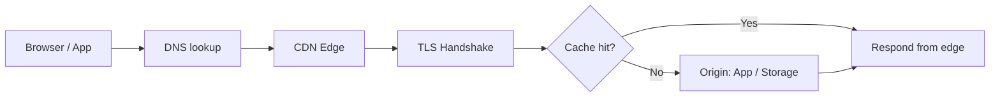

# Domain · DNS · TLS · CDN: The Path Users Take

From the moment a user types a domain into the address bar until the first byte arrives, several layers take part in turn. If any one of them is wrong, **users cannot connect even though the service itself is fine**.

## The Path of a Request



## Domain and DNS Basics

| Record | Purpose | Example |
|---|---|---|
| A / AAAA | Name → IPv4 / IPv6 address | `api.example.com → 203.0.113.10` |
| CNAME | Name → another name | `www → mysite.hosting-provider.net` |
| TXT | Ownership checks, SPF, etc. | Verification string from the hosting provider |
| MX | Designates mail servers | Mail service provider |
| CAA | Specifies which CAs may issue certificates for this domain | `0 issue "letsencrypt.org"` |

- **TTL** sets how fast a change spreads. Lowering TTL ahead of a migration or cutover makes rolling back faster.
- Turn on **2FA** and **auto-renewal** for the domain registrar account. An expired domain is the silliest and most fatal outage.
- The apex domain (`example.com`) cannot hold a CNAME by the standard, so providers often offer features such as ALIAS · ANAME · CNAME flattening.

## TLS Certificates: Lifetimes Are Shrinking

In 2025-04 the CA/Browser Forum passed Ballot SC-081v3, reducing the maximum validity of public TLS certificates in steps.

| Issued | Maximum validity |
|---|---|
| On or after 2026-03-15 | 200 days |
| On or after 2027-03-15 | 100 days |
| On or after 2029-03-15 | 47 days |

Let's Encrypt's announced schedule (checked 2026-09-28):

- 2026-01: 6-day short-lived certificates and IP address certificates generally available
- 2026-05-13: the opt-in `tlsserver` profile switches to 45-day certificates
- 2027-02-10: default profile shortened to 64 days
- 2028-02-16: default profile shortened to 45 days

The conclusion is simple: **certificate renewal is not a human task; it must be automated (ACME)**.

```text
Bad:  Issue a one-year certificate by hand and renew it from a calendar reminder.
Good: Use automatic issuance in your hosting / CDN / ingress, or renew with an ACME client,
      and receive monitoring alerts when expiry approaches.
```

## Forcing HTTPS: HSTS

HSTS (RFC 6797) uses the `Strict-Transport-Security` header to tell browsers "connect to this site only over HTTPS."

```http
Strict-Transport-Security: max-age=31536000; includeSubDomains
```

- Start with a short `max-age` and increase it once nothing breaks.
- Turn on `includeSubDomains` only when every subdomain supports HTTPS.

## CDN and Caching

A CDN answers from an edge close to the user, reducing **latency and origin load**. Caching is controlled with the `Cache-Control` header from the HTTP Caching standard (RFC 9111).

| Target | Example header | Why |
|---|---|---|
| Hashed static files (`app.3f9a.js`) | `public, max-age=31536000, immutable` | The file name changes when content changes |
| HTML | `no-cache` or a short `max-age` | New deploys must show up immediately |
| Personalized API responses | `private, no-store` | Caching them for other users is an incident |

```text
Bad:  Keep file names unchanged with a long cache, so users still get old JS after a deploy.
Good: Put a content hash in file names at build time and cache only HTML briefly.
```

## Cutover Procedure

1. Lower the DNS TTL a few days before the cutover.
2. Confirm certificate issuance and HTTPS responses on the new environment first.
3. Change the DNS record and check lookups from several regions.
4. Keep the old environment until the TTL has fully passed.
5. Once stable, restore the TTL to its original value.

## References

- [RFC 8659: DNS Certification Authority Authorization (CAA) Resource Record](https://www.rfc-editor.org/info/rfc8659/) — IETF, 2019-11, accessed 2026-09-28
- [RFC 6797: HTTP Strict Transport Security (HSTS)](https://www.rfc-editor.org/rfc/rfc6797.html) — IETF, 2012-11, accessed 2026-09-28
- [RFC 9111: HTTP Caching](https://datatracker.ietf.org/doc/html/rfc9111) — IETF, 2022-06, accessed 2026-09-28
- [Ballot SC081v3: Introduce Schedule of Reducing Validity and Data Reuse Periods](https://cabforum.org/2025/04/11/ballot-sc081v3-introduce-schedule-of-reducing-validity-and-data-reuse-periods/) — CA/Browser Forum, 2025-04-11, accessed 2026-09-28
- [Decreasing Certificate Lifetimes to 45 Days](https://letsencrypt.org/2025/12/02/from-90-to-45) — Let's Encrypt, 2025-12-02, accessed 2026-09-28
- [6-day and IP Address Certificates are Generally Available](https://letsencrypt.org/2026/01/15/6day-and-ip-general-availability) — Let's Encrypt, 2026-01-15, accessed 2026-09-28
- [Certificate Lifetime Rationale and Plans](https://letsencrypt.org/docs/cert-lifetimes/) — Let's Encrypt, accessed 2026-09-28
