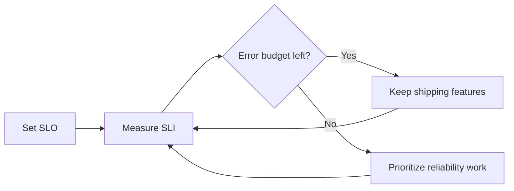
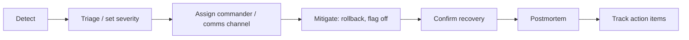

# Observability and Incidents: SLO · Error Budget · On-call · Postmortem

"The server is up" and "users can do what they came to do" are different sentences. The goal of operations is to **promise the second one in numbers and keep that promise**.

## SLI · SLO · SLA

| Term | Definition (per the Google SRE Book) | Example |
|---|---|---|
| SLI | An indicator that measures the level of service | Successful requests / total requests |
| SLO | A target value or range the SLI should reach | 99.9% over 30 days |
| SLA | A promise to customers with consequences (refunds, etc.) if missed | Credits when monthly availability falls short |

- An SLA is a business and contract decision. Engineers keep an internal **SLO stricter than the SLA**.
- 100% is not a goal. Reliability beyond what users can notice **sacrifices feature velocity**.

## Error Budget

The error budget is **1 − SLO**. With an SLO of 99.9%, the budget is 0.1%.

```text
1,000,000 requests over 4 weeks, SLO 99.9%
→ allowed failures = 1,000
→ budget remaining: keep shipping new features
→ budget exhausted: slow releases and prioritize reliability work
```



An error budget lets development and operations agree on "can we deploy?" **with numbers instead of feelings**. Writing that agreement down gives you an error budget policy.

## Alerts Start from the SLO

Waking people for cause metrics such as "CPU at 80%" produces many false alarms. The SRE Workbook recommends alerting on **burn rate** (how fast the budget is being consumed) and looking at several time windows together: the **multiwindow, multi-burn-rate** approach.

```text
Burn rate = actual error ratio / error ratio allowed by the SLO
e.g. spending 2% of a 30-day (720-hour) budget in 1 hour
     burn rate = 0.02 × 720 / 1 = 14.4
```

| Alert level | Meaning | Response |
|---|---|---|
| Page | The budget is burning fast | Respond now |
| Ticket | It is leaking slowly | Handle during working hours |

The SRE Workbook recommends these starting values (for a 30-day SLO).

| Budget consumed | Long window | Short window | Burn rate | Alert |
|---|---|---|---|---|
| 2% | 1 hour | 5 minutes | 14.4 | Page |
| 5% | 6 hours | 30 minutes | 6 | Page |
| 10% | 3 days | 6 hours | 1 | Ticket |

An alert fires only when **both** windows exceed the threshold. The long window keeps a brief error spike from waking people; the short window stops an alert from firing for hours after the incident is already over.

A Prometheus alert rule example (99.9% SLO, so the allowed error ratio is 0.001). It assumes recording rules such as `job:slo_errors_per_request:ratio_rate1h` precompute the error ratio for each window.

```yaml
groups:
  - name: slo-burn-rate
    rules:
      - alert: ErrorBudgetBurn
        expr: |
          (
            job:slo_errors_per_request:ratio_rate1h{job="api"} > (14.4 * 0.001)
            and
            job:slo_errors_per_request:ratio_rate5m{job="api"} > (14.4 * 0.001)
          )
          or
          (
            job:slo_errors_per_request:ratio_rate6h{job="api"} > (6 * 0.001)
            and
            job:slo_errors_per_request:ratio_rate30m{job="api"} > (6 * 0.001)
          )
        labels:
          severity: page
```

## The Three Signals of Observability

| Signal | Question it answers |
|---|---|
| Metrics | How much, how often? (request count, error rate, latency distribution) |
| Logs | What happened? (individual events and context) |
| Traces | Where did it slow down? (request path across services) |

**OpenTelemetry** is a vendor-neutral standard for collecting and exporting metrics, logs and traces, and it reached CNCF Graduated status in 2026-05. Instrumenting with OpenTelemetry means fewer code changes when you switch backends (monitoring products).

## On-call

- The Google SRE Book sets a target of **at most two incidents per 12-hour on-call shift**. The number comes from the estimate that one incident, including root-cause analysis, remediation and follow-up such as the postmortem and bug fixes, takes about 6 hours on average. Scale it down for shorter shifts.
- Link a **runbook** (what to check, what to try) to every alert.
- Delete alerts that need no action. Ignored alerts teach people to ignore the real ones too.

## Incident Response Flow



**Mitigation comes before root-cause analysis.** Even without knowing the cause, stop the user impact first with a rollback or a flag off.

## Backups and Recovery Objectives

Code can be redeployed, but **data comes back only from backups**. First decide, in numbers, how much you can lose and how long you can be down.

| Term | Definition | Question it asks |
|---|---|---|
| RPO (Recovery Point Objective) | The maximum acceptable time since the last recovery point: how much data you can lose | In the worst case, how many minutes of data can we lose? |
| RTO (Recovery Time Objective) | The maximum acceptable delay between the interruption and restoration of service | Within how many minutes or hours must we be back? |

### PITR on Managed Databases

PITR (point-in-time recovery) restores any moment within the retention period from backups and transaction logs.

- **Amazon RDS**: automated backup retention is 1–35 days. Transaction logs are uploaded to S3 every 5 minutes, so the latest restorable time is usually about 5 minutes before now. A restore does not overwrite the existing instance; it creates a **new DB instance**, and settings such as security groups and parameter groups may be created with defaults.
- **Cloud SQL**: PITR log retention is 1–35 days (default 14) on Enterprise Plus and 1–7 days (default 7) on Enterprise.
- Because the restore lands on a new instance, your runbook needs **switching the connection address and restoring settings** to meet the RTO.

### Restore Drill

1. Pick the point to restore (e.g. yesterday 14:00) and the target RTO.
2. Create a new instance with PITR, separate from production. Do not touch production.
3. Check row counts, the latest record timestamp and key queries, then attach the app and run a smoke test.
4. The time from request until the app can use it again is your **measured RTO**; the gap between the last restored record and the target point is your **measured RPO**.
5. Write down every step that blocked you (permissions, networking, parameters, secrets) in the runbook.
6. Delete the restored instance to cut cost and personal-data exposure.

### When Cross-Region Copies Are Worth It

- A contract or regulation requires recovery from a full-region outage
- A paid core service must meet its RPO and RTO even during a region outage
- You need a copy in a **separate place** against account takeover or accidental deletion (also consider copying to another account)

Amazon RDS offers cross-Region automated backups that replicate snapshots and transaction logs to another region. For an early product, or data you can regenerate, it is often not worth the storage and transfer cost. If you copy personal data to an overseas region, also review cross-border transfer requirements.

## Blameless Postmortem

Google runs a **blameless postmortem** culture. It assumes the people involved made the best decisions they could with the information they had at the time, and it **fixes the environment and the system, not the people**.

```text
Bad:  "The person who deployed didn't check, so it broke. Be careful next time."
Good: "There was no pre-deploy migration compatibility check.
       Add a schema compatibility check to CI (owner, due date)."
```

Basic postmortem sections: summary, impact (users, duration, budget spent), timeline, root cause and contributing factors, what went well, where we got lucky, action items (owner, due date).

## References

- [Service Level Objectives](https://sre.google/sre-book/service-level-objectives/) — Google SRE Book, accessed 2026-09-28
- [Implementing SLOs](https://sre.google/workbook/implementing-slos/) — Google SRE Workbook, accessed 2026-09-28
- [Error Budget Policy](https://sre.google/workbook/error-budget-policy/) — Google SRE Workbook, accessed 2026-09-28
- [Alerting on SLOs](https://sre.google/workbook/alerting-on-slos/) — Google SRE Workbook, accessed 2026-09-28
- [Being On-Call](https://sre.google/sre-book/being-on-call/) — Google SRE Book, accessed 2026-09-28
- [Postmortem Culture: Learning from Failure](https://sre.google/sre-book/postmortem-culture/) — Google SRE Book, accessed 2026-09-28
- [Disaster Recovery (DR) objectives](https://docs.aws.amazon.com/wellarchitected/latest/reliability-pillar/disaster-recovery-dr-objectives.html) — AWS Well-Architected Reliability Pillar, accessed 2026-09-28
- [Restoring a DB instance to a specified time for Amazon RDS](https://docs.aws.amazon.com/AmazonRDS/latest/UserGuide/USER_PIT.html) — AWS Docs, accessed 2026-09-28
- [Replicating automated backups to another AWS Region](https://docs.aws.amazon.com/AmazonRDS/latest/UserGuide/USER_ReplicateBackups.html) — AWS Docs, accessed 2026-09-28
- [Configure point-in-time recovery (PITR)](https://docs.cloud.google.com/sql/docs/postgres/backup-recovery/configure-pitr) — Cloud SQL for PostgreSQL Docs, accessed 2026-09-28
- [CNCF Announces OpenTelemetry's Graduation](https://www.cncf.io/announcements/2026/05/21/cloud-native-computing-foundation-announces-opentelemetrys-graduation-solidifying-status-as-the-de-facto-observability-standard/) — CNCF, 2026-05-21, accessed 2026-09-28
