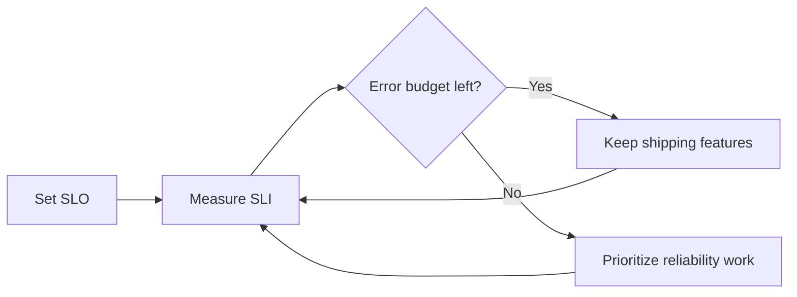
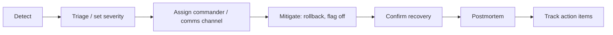

# Observability and Incidents: SLO · Error Budget · On-call · Postmortem

"The server is up" and "users can do what they came to do" are different sentences. The goal of operations is to **promise the second one in numbers and keep that promise**.

## SLI · SLO · SLA

| Term | Definition (per the Google SRE Book) | Example |
|---|---|---|
| SLI | An indicator that measures the level of service | Successful requests / total requests |
| SLO | A target value or range the SLI should reach | 99.9% over 30 days |
| SLA | A promise to customers with consequences (refunds, etc.) if missed | Credits when monthly availability falls short |

- An SLA is a business and contract decision. Engineers keep an internal **SLO stricter than the SLA**.
- 100% is not a goal. Reliability beyond what users can notice **sacrifices feature velocity**.

## Error Budget

The error budget is **1 − SLO**. With an SLO of 99.9%, the budget is 0.1%.

```text
1,000,000 requests over 4 weeks, SLO 99.9%
→ allowed failures = 1,000
→ budget remaining: keep shipping new features
→ budget exhausted: slow releases and prioritize reliability work
```



An error budget lets development and operations agree on "can we deploy?" **with numbers instead of feelings**. Writing that agreement down gives you an error budget policy.

## Alerts Start from the SLO

Waking people for cause metrics such as "CPU at 80%" produces many false alarms. The SRE Workbook recommends alerting on **burn rate** (how fast the budget is being consumed) and looking at several time windows together: the **multiwindow, multi-burn-rate** approach.

```text
Burn rate = actual error ratio / error ratio allowed by the SLO
e.g. spending 2% of a 30-day (720-hour) budget in 1 hour
     burn rate = 0.02 × 720 / 1 = 14.4
```

| Alert level | Meaning | Response |
|---|---|---|
| Page | The budget is burning fast | Respond now |
| Ticket | It is leaking slowly | Handle during working hours |

## The Three Signals of Observability

| Signal | Question it answers |
|---|---|
| Metrics | How much, how often? (request count, error rate, latency distribution) |
| Logs | What happened? (individual events and context) |
| Traces | Where did it slow down? (request path across services) |

**OpenTelemetry** is a vendor-neutral standard for collecting and exporting metrics, logs and traces, and it reached CNCF Graduated status in 2026-05. Instrumenting with OpenTelemetry means fewer code changes when you switch backends (monitoring products).

## On-call

- The Google SRE Book sets a target of **at most two events** per on-call shift (8–12 hours). That leaves time to respond accurately, clean up, and write the postmortem.
- Link a **runbook** (what to check, what to try) to every alert.
- Delete alerts that need no action. Ignored alerts teach people to ignore the real ones too.

## Incident Response Flow



**Mitigation comes before root-cause analysis.** Even without knowing the cause, stop the user impact first with a rollback or a flag off.

## Blameless Postmortem

Google runs a **blameless postmortem** culture. It assumes the people involved made the best decisions they could with the information they had at the time, and it **fixes the environment and the system, not the people**.

```text
Bad:  "The person who deployed didn't check, so it broke. Be careful next time."
Good: "There was no pre-deploy migration compatibility check.
       Add a schema compatibility check to CI (owner, due date)."
```

Basic postmortem sections: summary, impact (users, duration, budget spent), timeline, root cause and contributing factors, what went well, where we got lucky, action items (owner, due date).

## References

- [Service Level Objectives](https://sre.google/sre-book/service-level-objectives/) — Google SRE Book, accessed 2026-09-28
- [Implementing SLOs](https://sre.google/workbook/implementing-slos/) — Google SRE Workbook, accessed 2026-09-28
- [Error Budget Policy](https://sre.google/workbook/error-budget-policy/) — Google SRE Workbook, accessed 2026-09-28
- [Alerting on SLOs](https://sre.google/workbook/alerting-on-slos/) — Google SRE Workbook, accessed 2026-09-28
- [Being On-Call](https://sre.google/sre-book/being-on-call/) — Google SRE Book, accessed 2026-09-28
- [Postmortem Culture: Learning from Failure](https://sre.google/sre-book/postmortem-culture/) — Google SRE Book, accessed 2026-09-28
- [CNCF Announces OpenTelemetry's Graduation](https://www.cncf.io/announcements/2026/05/21/cloud-native-computing-foundation-announces-opentelemetrys-graduation-solidifying-status-as-the-de-facto-observability-standard/) — CNCF, 2026-05-21, accessed 2026-09-28
