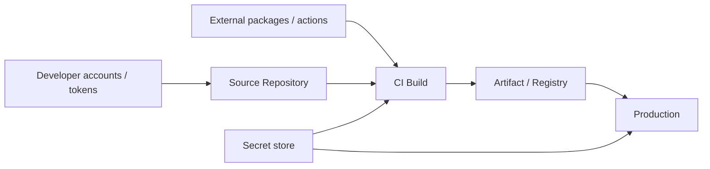

# Security and Supply Chain: Secrets · SBOM · SLSA · Dependencies

Today's products contain far more **borrowed code and tools** than code the team wrote itself. Attackers aim at the weakest link: dependency packages, CI actions, developer tokens.

## Map of Attack Points



Every arrow is an attack path. Put defenses at the same points.

| Point | Typical risk | Basic defense |
|---|---|---|
| Developer accounts | Token leaks, takeover | 2FA, short-lived tokens |
| Source | Malicious commits, unauthorized changes | Branch protection, required review |
| Dependencies | Tampered packages | Lockfiles, vulnerability scans, pinned versions |
| CI | Tampered actions, secret exposure | SHA pinning, least privilege, OIDC |
| Artifact | Substitution | Signing, provenance verification |
| Runtime | Hard-coded secrets | Secret manager, regular rotation |

## Learning from Real Incidents

| When | Incident | Lesson |
|---|---|---|
| 2025-03 | The `tj-actions/changed-files` action was tampered with (CVE-2025-30066); secrets could leak through workflow logs | Pin actions by SHA, rotate exposed secrets immediately |
| 2025-09 | npm ecosystem worm ("Shai-Hulud"): stolen developer credentials used to inject malicious code into other packages and republish them | Remove long-lived publish tokens, minimize publish rights |

npm had already made **Trusted Publishing (OIDC)** generally available on 2025-07-31, before the incident. After it, on 2025-11-05 npm capped write-enabled granular tokens at a 90-day maximum lifetime and set a 7-day default for new granular tokens, and on 2025-12-09 it revoked all remaining classic tokens. Publish with Trusted Publishing instead of long-lived tokens.

## Managing Secrets

```text
Bad:  Commit a .env file to the repository, and after the leak just revert the commit.
Good: Store it in a secret manager and inject it at runtime. If it leaks, "rotate", don't just "delete".
```

- A secret that has entered Git history once should be treated as **already leaked**.
- Since 2024-03 GitHub enables secret scanning and **push protection** by default on new public repositories owned by personal accounts. Push protection blocks pushes that contain supported secrets.
- For cloud access from CI, use short-lived tokens obtained via OIDC (document 03).

## SBOM: What Is Inside

An SBOM (Software Bill of Materials) is a list of the components in a product. When a new vulnerability is announced, it lets you answer "do we ship this library?" **within minutes**.

- Main formats: **SPDX** and **CycloneDX**. Both are machine-processable.
- On 2026-07-29 US CISA and partners published the **2026 Minimum Elements for an SBOM**, replacing the 2021 NTIA minimum elements. New elements include Component Hash Algorithm, Component License, SBOM Tool Name and SBOM Generation Context, and they apply to all software, including open source, AI software and SaaS.

## SLSA: Who Built It, and How

SLSA is a specification that splits supply chain security into **tracks and levels**. **v1.2**, announced 2025-11-24, is the latest and is backward compatible with v1.1.

| Track | Focus |
|---|---|
| Build Track | Verify that an artifact was built as expected. The lowest level only requires provenance to exist; higher levels add protection against tampering with the build and provenance |
| Source Track (new in v1.2) | Threats in authoring, reviewing and managing source. Level 2 covers history and provenance; Level 3 covers continuous enforcement of technical controls |

GitHub Artifact Attestations produce build provenance and, per GitHub's documentation, provide **SLSA v1.0 Build Level 2**.

Produce the SBOM and provenance together in the release build job.

```yaml
permissions:
  contents: read
  id-token: write
  attestations: write
steps:
  - uses: actions/checkout@<commit-sha>
  - run: npm ci && npm run build
  - run: mkdir -p dist && tar -czf dist/app.tar.gz build
  - run: npm sbom --sbom-format cyclonedx > dist/sbom.cdx.json
  - uses: actions/attest-build-provenance@<commit-sha>
    with:
      subject-path: dist/app.tar.gz
```

- `npm sbom` builds a CycloneDX or SPDX SBOM from the installed dependencies. For mixed languages or container images, use a tool such as syft (`syft <image> -o spdx-json`).
- `attest-build-provenance` signs with an OIDC token (`id-token: write`) and stores the attestation with the `attestations: write` permission.

The consumer verifies before deploying.

```bash
gh attestation verify ./dist/app.tar.gz --repo my-org/my-app
```

## Dependency Health

- Commit a **lockfile** and install exactly from it in CI (`npm ci`, etc.).
- Use tools such as Dependabot for vulnerability alerts and update PRs.
- **OpenSSF Scorecard** automatically checks an open source project's security practices (branch protection, signing, dependency management, etc.) and scores them 0–10. Check it before adopting a new dependency.

## Regulation: EU Cyber Resilience Act

If you sell products with digital elements in the EU, check the CRA.

- **From 2026-09-11** manufacturers must report actively exploited vulnerabilities and severe security incidents.
- Deadlines: an early warning within 24 hours of becoming aware, a notification within 72 hours, and a final report within 14 days after a corrective measure is available for vulnerabilities, or within one month of the notification for severe incidents.
- Reports go through ENISA's Single Reporting Platform. The remaining obligations apply from 2027-12-11.

## Minimum Practice List

- [ ] 2FA on every account; tokens short-lived with least privilege
- [ ] Secret scanning / push protection enabled
- [ ] Lockfiles committed, dependency vulnerability alerts on
- [ ] CI actions pinned by SHA, workflow `permissions` minimized
- [ ] SBOM and provenance attached to release artifacts
- [ ] A vulnerability reporting channel (security policy) and response procedure documented

## References

- [Supply Chain Compromise of Third-Party tj-actions/changed-files](https://www.cisa.gov/news-events/alerts/2025/03/18/supply-chain-compromise-third-party-tj-actionschanged-files-cve-2025-30066-and-reviewdogaction) — CISA, 2025-03-18, accessed 2026-09-28
- [Widespread Supply Chain Compromise Impacting npm Ecosystem](https://www.cisa.gov/news-events/alerts/2025/09/23/widespread-supply-chain-compromise-impacting-npm-ecosystem) — CISA, 2025-09-23, accessed 2026-09-28
- [npm trusted publishing with OIDC is generally available](https://github.blog/changelog/2025-07-31-npm-trusted-publishing-with-oidc-is-generally-available/) — GitHub Changelog, 2025-07-31, accessed 2026-09-28
- [npm security update: Classic token creation disabled and granular token changes](https://github.blog/changelog/2025-11-05-npm-security-update-classic-token-creation-disabled-and-granular-token-changes/) — GitHub Changelog, 2025-11-05, accessed 2026-09-28
- [npm classic tokens revoked, session-based auth and CLI token management now available](https://github.blog/changelog/2025-12-09-npm-classic-tokens-revoked-session-based-auth-and-cli-token-management-now-available/) — GitHub Changelog, 2025-12-09, accessed 2026-09-28
- [Secret scanning and push protection are enabled by default on new public repositories](https://github.blog/changelog/2024-03-11-secret-scanning-and-push-protection-are-enabled-by-default-on-new-public-repositories/) — GitHub Changelog, 2024-03-11, accessed 2026-09-28
- [2026 Minimum Elements for a Software Bill of Materials (SBOM)](https://www.cisa.gov/resources-tools/resources/2026-minimum-elements-software-bill-materials-sbom) — CISA, 2026-07-29, accessed 2026-09-28
- [Announcing SLSA v1.2](https://slsa.dev/blog/2025/11/announce-slsa-v1.2) — SLSA, 2025-11-24, accessed 2026-09-28
- [SLSA specification v1.2](https://slsa.dev/spec/v1.2/) — SLSA, accessed 2026-09-28
- [Artifact attestations](https://docs.github.com/en/actions/concepts/security/artifact-attestations) — GitHub Docs, accessed 2026-09-28
- [OpenSSF Scorecard](https://openssf.org/projects/scorecard/) — OpenSSF, accessed 2026-09-28
- [Cyber Resilience Act - Reporting obligations](https://digital-strategy.ec.europa.eu/en/policies/cra-reporting) — European Commission, accessed 2026-09-28
- [npm-sbom](https://docs.npmjs.com/cli/v11/commands/npm-sbom/) — npm Docs, accessed 2026-09-28
- [Using artifact attestations to establish provenance for builds](https://docs.github.com/actions/security-for-github-actions/using-artifact-attestations/using-artifact-attestations-to-establish-provenance-for-builds) — GitHub Docs, accessed 2026-09-28
- [actions/attest-build-provenance](https://github.com/actions/attest-build-provenance) — GitHub, accessed 2026-09-28
- [anchore/syft](https://github.com/anchore/syft) — Anchore, accessed 2026-09-28
