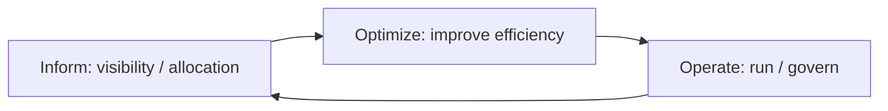
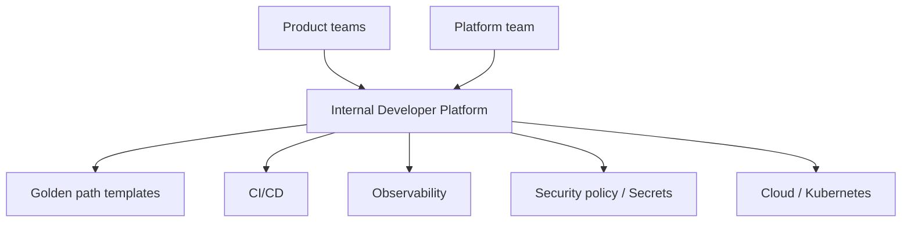

# FinOps and Platform Engineering: Cost Accountability and Internal Developer Platforms

As a service grows, two questions appear: "**Whose cost is this, and is it worth it?**" and "**Must every team invent its own way to deploy?**" The first is FinOps; the second is Platform Engineering.

## What FinOps Is

The FinOps Foundation sees FinOps as an operating practice in which engineering, finance and business together **maximize the value of technology spending**. The core is not "cutting costs" but **shared accountability for value per cost**.



| Phase | What happens | Examples |
|---|---|---|
| Inform | Make visible who spends how much on what | Allocate cost per team and service with tags · labels, track against budget |
| Optimize | Reduce waste and lower unit prices | Remove idle resources, rightsizing, review commitment discounts |
| Operate | Lock it in through policy and habit | Budget alerts, regular cost reviews, cost review at design time |

## Framework Changes in 2025–2026

- **Framework 2025** added **Scopes** as a core element. Spending beyond public cloud, such as SaaS, AI, licensing and data centers (**Cloud+**), is managed per scope.
- **Framework 2026** added the Executive Strategy Alignment capability, connecting technology spending to business strategy. The Foundation's mission wording also changed from "Cloud" to "Technology".
- **FOCUS** (FinOps Open Cost and Usage Specification): an open specification that aligns billing data from multiple clouds and SaaS vendors to one schema. **v1.4** was ratified on 2026-06-04.

## FinOps Engineers Can Do

```text
Bad:  Get shocked by the month-end bill, then spend a week finding who created each resource.
Good: Enforce owner · service · env tags on every resource,
      and alert the owning team when spending passes a set share of the budget.
```

```yaml
labels:
  owner: team-checkout
  service: payment-api
  env: production
  cost-center: product
```

- Watch **unit cost**: "infrastructure cost per order" is more useful for decisions than "total monthly cost".
- Consider scaling down or scaling to zero for dev and staging outside working hours.
- Egress (data transfer) and log retention costs are often underestimated.
- As in the AWS Well-Architected Cost Optimization pillar, cost is **a quality attribute decided at design time**.

## What Platform Engineering Is

The CNCF Platforms White Paper (2023-04) defines a platform as **a curated set of common capabilities and experiences** that make internal users' (product and app teams') work easier, and describes platform engineering as the practice of planning and providing such platforms. It covers people, processes, policies and technology.



- **Golden path**: a standard path where "security, observability and deployment come built in if you follow it". It should be **the easiest choice**, not a mandate.
- **Platform as a product**: treat internal developers as customers, research their needs, and measure adoption and satisfaction.
- A developer portal (for example, tools such as Backstage) is only a means; the portal is not the platform itself.

## Maturity Model

The CNCF Platform Engineering Maturity Model looks at five aspects across four levels.

| Aspect | Question |
|---|---|
| Investment | How are people and budget assigned to the platform? |
| Adoption | Why and how do developers come to use the platform? |
| Interfaces | How (docs, CLI, portal, API) do developers use the platform? |
| Operations | How are platform capabilities run and improved? |
| Measurement | How is the platform's effect measured? |

Four levels: **Provisional → Operational → Scalable → Optimizing**. The goal is not to push every aspect to the top level; the model is a tool for choosing the level that fits your organization.

## When Do You Need a Platform Team?

```text
Signal present: every team copies its own CI/CD, certificate and monitoring setup, and the same incidents repeat.
Too early:      there is one product team and deployment is already unified.
```

In a small organization, **a shared template repository and a documented deployment procedure** can be the first form of a platform instead of a dedicated team.

## References

- [What is FinOps?](https://www.finops.org/introduction/what-is-finops/) — FinOps Foundation, accessed 2026-09-28
- [FinOps Phases](https://www.finops.org/framework/phases/) — FinOps Foundation, accessed 2026-09-28
- [Framework 2025: Scopes](https://www.finops.org/insights/2025-finops-framework/) — FinOps Foundation, 2025, accessed 2026-09-28
- [FinOps Framework 2026](https://www.finops.org/insights/2026-finops-framework/) — FinOps Foundation, 2026, accessed 2026-09-28
- [FOCUS Specification](https://focus.finops.org/focus-specification/) — FinOps Foundation, accessed 2026-09-28
- [Cost Optimization Pillar - AWS Well-Architected](https://docs.aws.amazon.com/wellarchitected/latest/framework/the-pillars-of-the-framework.html) — AWS Docs, accessed 2026-09-28
- [CNCF Platforms White Paper](https://tag-app-delivery.cncf.io/whitepapers/platforms/) — CNCF TAG App Delivery, 2023-04, accessed 2026-09-28
- [Platform Engineering Maturity Model](https://tag-app-delivery.cncf.io/whitepapers/platform-eng-maturity-model/) — CNCF TAG App Delivery, 2023-11, accessed 2026-09-28
