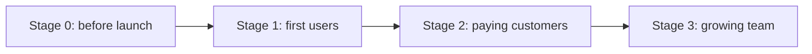

# Practical Guide for Small Teams: Solo Developers and Small Teams

The earlier documents went as far as tools for large organizations. But what a team of 1–5 people needs is not **a little of everything** but **a few things that reliably prevent incidents**.

## Principles

1. **Manage less**: start from the highest abstraction (Static, PaaS, Serverless).
2. **Make it reversible**: a rollback path comes before automatic deployment.
3. **Make it visible**: know about an outage before your users do.
4. **Protect what you cannot lose first**: domain, accounts, data, secrets.

## Setup by Stage



| Stage | Minimum setup |
|---|---|
| 0. Before launch | Git + PRs, static / PaaS hosting, preview deploys, domain auto-renewal, 2FA on every account |
| 1. First users | Auto-deploy after CI tests, error tracking, uptime checks, automatic DB backups and one restore drill |
| 2. Paying customers | One or two simple SLOs, budget alerts, a status page, feature flags, an incident record template |
| 3. Growing team | Documented deployment procedure, template repository, on-call rotation, cost tag policy |

## Example Combinations

| Product type | Starting combination | Next step |
|---|---|---|
| Docs · landing page | GitHub Pages or Cloudflare Workers Static Assets | CDN cache rules, analytics |
| Web app + API | Vercel / Netlify (frontend) + serverless container (API) + managed DB | Staging environment, canary |
| Mobile app + backend | TestFlight · closed test + serverless backend | Phased release, server feature flags |
| SaaS for the Korean public sector | Start by checking for a CSAP-certified cloud | Reflect the required certification grade |

Plan conditions change. Check commercial-use permission, billing units and provider roadmaps with the checklist in document 01.

## Minimum Pipeline

```yaml
name: ci
on: [push, pull_request]
permissions:
  contents: read
jobs:
  test:
    runs-on: ubuntu-latest
    steps:
      - uses: actions/checkout@<commit-sha>
      - run: npm ci
      - run: npm test
      - run: npm run build
```

For deployment, you can start with the hosting provider's Git integration and no extra scripts. What matters is **a structure where nothing deploys if tests fail**.

## Operating Habits for Solo Developers

- **Deploy small and often**: one change at a time means you immediately know what broke.
- **No Friday-night deploys**: if you work alone, you also handle weekend outages alone.
- **Know where the rollback button is**: try returning to a previous deploy in the provider dashboard once, in advance.
- **A backup is only a backup once restored**: practice a real restore once a quarter.
- **Cost alerts**: turn on alerts for free-plan caps and paid overage, so a traffic spike does not become a billing spike.
- **Keep secrets in one place**: gather them in a single password manager or secret manager.

## Bad Example / Good Example

```text
Bad:  "I'm alone, so I need neither staging nor tests." → You first learn of outages from user reports.
Good: Check the preview deploy yourself, and ship to production only when CI tests pass.
      Uptime checks tell you before users do.
```

```text
Bad:  Create domain, cloud and store accounts all with one personal email and no 2FA.
Good: Use a work account with 2FA, keep recovery codes safe, and get alerts before payment methods expire.
```

## 30-Minute Pre-Launch Checklist

- [ ] Domain auto-renewal on and payment method valid
- [ ] HTTPS certificate issuance and renewal confirmed as automatic
- [ ] Tried rolling back to a previous version
- [ ] Error tracking and uptime alerts reach my phone
- [ ] DB backups exist and the restore procedure is documented
- [ ] No secrets in the repository (secret scanning passes)
- [ ] For mobile: latest SDK and target API requirements met, and a demo account ready for review
- [ ] Cost alerts configured

## How to Revisit This Track

Read whatever hurts most right now. Scared of deploying: 04. Learning about outages late: 07. Scared of the bill: 09. Stuck in app review: 05.

## References

- [GitHub Pages limits](https://docs.github.com/en/pages/getting-started-with-github-pages/github-pages-limits) — GitHub Docs, accessed 2026-09-28
- [Static Assets · Cloudflare Workers docs](https://developers.cloudflare.com/workers/static-assets/) — Cloudflare Docs, accessed 2026-09-28
- [Vercel Hobby Plan](https://vercel.com/docs/plans/hobby) — Vercel Docs, accessed 2026-09-28
- [Cloud Run billing settings for services](https://docs.cloud.google.com/run/docs/configuring/billing-settings) — Google Cloud Docs, accessed 2026-09-28
- [Secure use reference](https://docs.github.com/en/actions/reference/security/secure-use) — GitHub Docs, accessed 2026-09-28
- [Service Level Objectives](https://sre.google/sre-book/service-level-objectives/) — Google SRE Book, accessed 2026-09-28
- [Upcoming Requirements](https://developer.apple.com/news/upcoming-requirements/) — Apple Developer, accessed 2026-09-28
- [Target API level requirements for Google Play apps](https://developer.android.com/google/play/requirements/target-sdk) — Android Developers, accessed 2026-09-28
