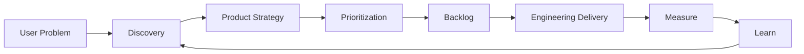

# Product Owner Overview

A Product Owner does more than relay requirements or manage a backlog.

> The role is to **decide where limited time and resources can create the greatest user and business value, and guide the team in that direction**.

## Core Questions a PO Owns

1. Whose problem are we solving, and what is it?
2. Why should we address it now?
3. What will we build first?
4. What will we choose not to do?
5. How will we measure success?
6. Can the development team implement it without ambiguity?
7. Did the result deliver real value to users?



## Scope of PO Responsibilities

| Area | PO Responsibility |
|---|---|
| Users | Understand problems and context |
| Product | Goals, scope, and priorities |
| Business | Understand value, cost, and risk |
| Engineering | Provide clear requirements and decisions |
| Design | User workflows and experience quality |
| Data | Define success and evaluate results |
| Organization | Align stakeholders and make decisions |

## PO Deliverables

A PO **creates decisions**, not merely documents. Documents communicate those decisions.

Typical deliverables:

- Product Goal
- Problem Statement
- User Scenario / Workflow
- Roadmap
- Backlog
- Acceptance Criteria
- Priority
- Decision Log
- Release Scope
- Metrics / Outcome Review

## A Simplified Day in the Life of a PO

```text
Understand the problem
→ Choose
→ Clarify
→ Support development
→ Validate
→ Learn
→ Choose again
```

A good PO is less concerned with increasing the number of features than with **reducing the likelihood of building the wrong ones**.
