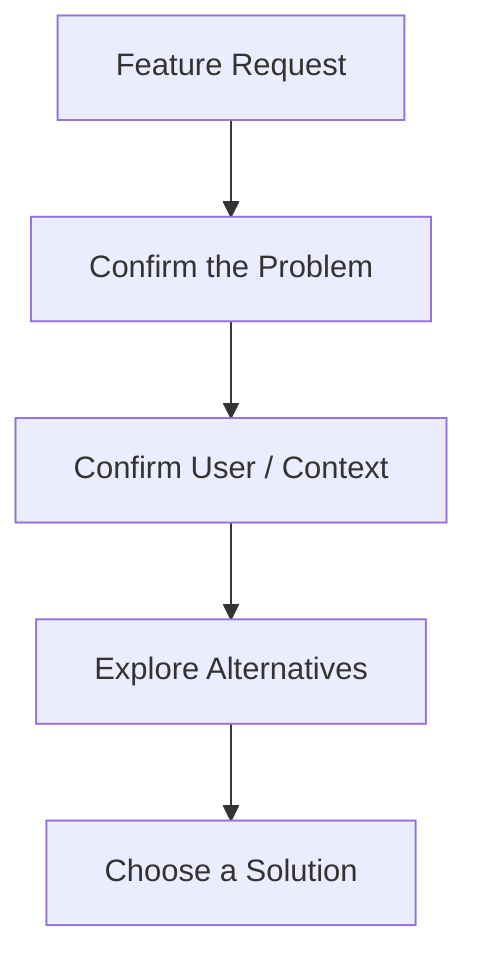

# PO Qualifications and Core Competencies

More than a particular degree or certification, a PO needs **the ability to structure problems and take responsibility for choices**.

## Eight Core Competencies

| Competency | Description |
|---|---|
| Problem definition | Distinguish symptoms from underlying problems |
| User understanding | Identify real workflows and pain points |
| Prioritization | Choose by comparing value, cost, and risk |
| Product judgment | Assess the overall experience and context beyond individual features |
| Technical understanding | Understand implementation constraints and costs well enough to discuss them |
| Communication | Translate meaning between stakeholders |
| Data interpretation | Use metrics as evidence for judgment, rather than as goals in themselves |
| Accountability | Avoid postponing ambiguous decisions |

## How a Good PO Thinks

### Do Not Accept Feature Requests at Face Value

```text
Request:
"Please add a button."

PO:
Why is it needed?
When will it be used?
What is wrong with the current workflow?
Is adding a button the smallest solution?
```

### Establish the Problem Before the Solution



## Are Certifications Necessary?

Scrum/Agile certifications can help with learning concepts and signaling knowledge during hiring, but they do not guarantee PO competence.

More meaningful practical evidence includes:

- Finding a real user problem
- Explaining the evidence behind a change in priorities
- Deciding to stop a failed feature
- Reducing scope with the development team
- Using outcome metrics to make the next decision

## Patterns a PO Should Avoid

- Copying requests directly into tickets
- Giving the development team only a solution
- Trying to satisfy every stakeholder
- Turning the roadmap into a list of promises
- Mistaking a rising metric for product value
- Refusing to develop any technical understanding
- Postponing important decisions until after another meeting

Ultimately, a PO's qualifications show in **the ability to explain what not to build, as well as what to build**.
