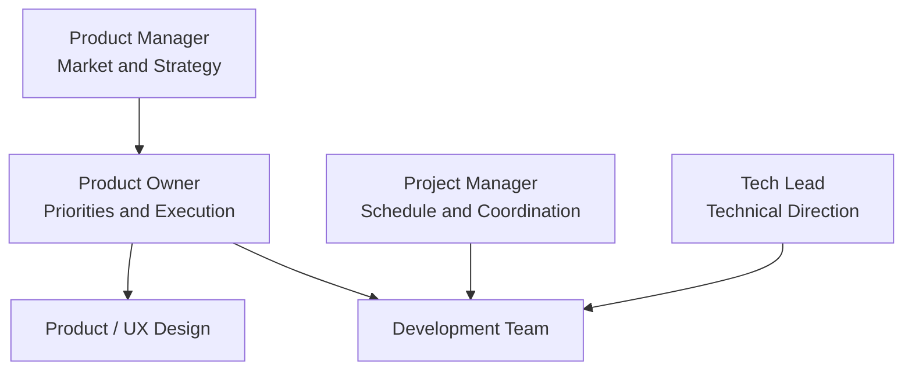

# PO, PM, and Project Manager: Key Differences

Titles vary by organization, but the roles become clearer when distinguished by their central responsibilities.

| Role | Central Question | Main Responsibilities |
|---|---|---|
| Product Owner | What should we build next? | Backlog, priorities, and team decisions |
| Product Manager | What product should we build, and why? | Market, strategy, and product direction |
| Project Manager | How do we finish within the schedule? | Schedule, resources, dependencies, and execution management |
| UX/Product Designer | How will users experience it? | Workflow, interaction, and usability |
| Tech Lead | How should we build it technically? | Architecture, implementation direction, and quality |



## Roles Overlap in Practice

In a small team, one person may serve as both PM and PO.

```text
Startup
Founder / Product Lead
├─ PM responsibilities
├─ PO responsibilities
└─ Some Project Management
```

Larger organizations divide responsibilities more finely.

## The Simplest Way to Distinguish the Roles

### Product Manager

Looks at the market and the product as a whole.

- Market
- Competition
- Positioning
- Pricing
- Long-term strategy
- Growth

### Product Owner

Works closely with the development team to make product decisions concrete.

- Backlog
- Scope
- Acceptance
- Priority
- Release units

### Project Manager

Manages whether work proceeds according to plan.

- Schedule
- Resource
- Dependency
- Risk
- Communication Plan

## The Most Common Failures

When a PO only tracks schedules like a Project Manager, product judgment disappears.

Conversely, talking only about strategy without answering the development team's detailed questions leaves the PO role unfilled.

> A PO can be seen as a **decision-making interface** between strategy and implementation.

## What a Product Manager Actually Does

A PM connects user problems to business goals and adjusts product direction after release. Daily work can take the following forms.

| Work | Action | Example Deliverables |
|---|---|---|
| Discovery | Validate problems through interviews, usage data, and competing products | Problem statement, research summary |
| Strategy | Define target users, differentiation, and success | Product brief, strategy document |
| Prioritization | Compare opportunities and align choices with teams and stakeholders | Outcome-based roadmap, decision log |
| Outcome review | Review usage and results to adjust subsequent investment | Metric review, experiment results |

Responsibilities vary by organization size and team structure. Based on [Atlassian's explanation of the Product Manager role](https://www.atlassian.com/agile/product-management/product-manager).

## What a Project Manager Actually Does

A Project Manager manages the execution conditions needed to deliver agreed results. These are practical examples across a project's lifecycle.

| Work | Action | Example Deliverables |
|---|---|---|
| Scope and planning | Agree completion criteria; plan work, schedules, and resources | Scope definition, schedule, resource plan |
| Dependencies and risk | Identify prerequisites and bottlenecks; assign response owners | Dependency list, risk/issue log |
| Progress and change | Communicate status against plan and change impacts; coordinate approval | Status report, change log |
| Closing | Confirm acceptance, operational handover, and remaining responsibilities; capture lessons | Acceptance record, handover documents, retrospective |

These examples translate the scope, deliverables, risk, and cross-team communication in [PMI's explanation of project management](https://www.pmi.org/about/what-is-project-management) into practical work.

## Collaboration and Decision Boundaries

PMs/POs lead discussions of product direction and value, developers of feasibility and implementation, and Project Managers of schedules, resources, and dependencies. When a delay is expected, for example, the Project Manager exposes its impact and the PM/PO discusses scope choices with developers based on value. Titles alone do not establish approval authority; each organization should name its decision owners.

In Scrum, the PO is **accountable for maximizing product value and managing the Product Backlog effectively**, rather than merely administering Sprints. **Developers create and manage the Sprint Backlog** and decide how to implement the work. PM and Project Manager are not separate accountabilities defined by Scrum. [Scrum Guide](https://scrumguides.org/scrum-guide.html).
