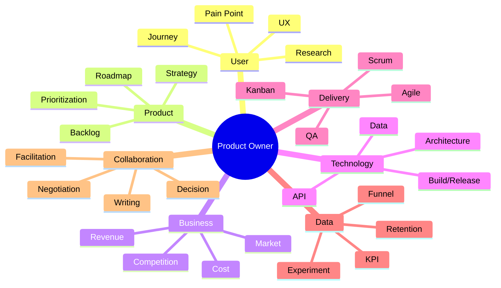

# A Knowledge Map for Product Owners

A PO need not be an expert in every field. However, the role requires **enough breadth to ask meaningful questions and make judgments across specialties**.

## 1. Users and UX

What to know:

- Actual behavior beyond personas
- User Journey
- Task Flow
- Usability
- Discoverability
- Error State
- Accessibility
- Feedback Loop

## 2. Product Strategy

- Vision
- Product Goal
- Positioning
- Problem/Solution Fit
- Roadmap
- Opportunity Cost
- MVP / MLP
- The concept of Product-Market Fit

## 3. Technology

You do not need to become a developer, but understanding the following is valuable.

- Client / Server
- API
- Database
- State
- File Format / Serialization
- Frontend / Backend
- Build / Deploy
- Git / Branch / PR
- Architecture / Dependency
- Basic concepts of Performance / Memory

## 4. Data

- KPI
- North Star Metric
- Funnel
- Conversion
- Retention
- Cohort
- Leading / Lagging Indicator
- A/B Test
- Correlation vs Causation

## 5. Delivery

- Backlog
- Sprint
- Kanban
- Definition of Done
- Acceptance Criteria
- QA
- Release
- Technical Debt
- Dependency

## 6. Business

- Revenue Model
- Cost Structure
- Basic concepts of LTV / CAC
- Pricing
- Market size
- Competing products
- Customer Segment

A PO's goal is not deep expertise in everything, but **adjusting the depth of knowledge to what each decision requires**.
