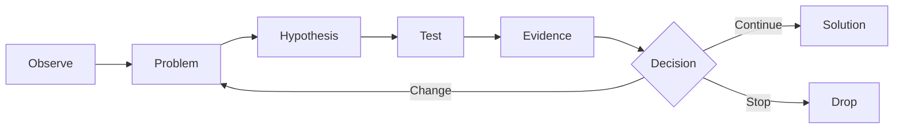
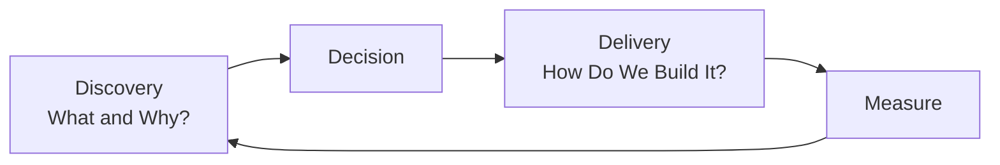

# Problem Discovery, Product Strategy, and Roadmaps

Before delivering well, you need to **choose the right problem**.

## Discovery Cycle



## Problem Statement

A good problem statement does not prescribe a solution.

Poor example:

> We need a Camera Preset button.

Better example:

> Users repeatedly need to reproduce the same camera state, but currently have to enter the values manually each time.

This framing opens up more possible solutions.

## Questions for Evaluating an Opportunity

- How many users experience it?
- How often does it occur?
- How painful is it?
- What workarounds exist today?
- How would solving it change behavior?
- Does it fit our product strategy?
- What are the implementation costs and risks?

## The Role of a Roadmap

A roadmap is not a list of dated feature promises.

```text
Poor Roadmap
Q1 Feature A
Q2 Feature B
Q3 Feature C

Good Roadmap
Now  : Animation workflow friction
Next : Asset interoperability
Later: Automation / scripting
```

It is better to build it around **problems and outcomes**.

## Strategy Hierarchy

```text
Vision
↓
Product Strategy
↓
Product Goal
↓
Opportunity / Problem
↓
Initiative
↓
Feature / Experiment
↓
Backlog Item
```

It is difficult to explain why a feature should be built if it is disconnected from this hierarchy.

## Think Separately About Discovery and Delivery



A PO connects both areas. With weak discovery, faster development can simply mean building the wrong thing faster.
