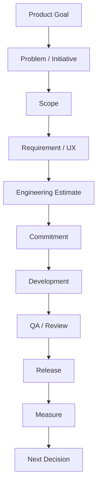

# Product Owner Delivery Work Process

This is the process of turning problems selected during discovery into actual product changes.

## The Full Cycle



## 1. Intake

Receive the request.

Do not put it straight into the backlog.

Check:

- Who requested it
- The actual problem
- Frequency
- Impact
- Current workarounds

## 2. Clarify

Clarify the problem and goal.

```text
Background
Problem
User
Expected Outcome
Constraints
```

## 3. Scope

Determine the smallest effective scope.

```text
Full Idea
↓
Core Value
↓
Essential Workflow
↓
MVP Scope
```

## 4. Design / Technical Alignment

Review the following with designers and engineers:

- Interaction
- Error State
- Data
- Compatibility
- Performance
- Technical Risk
- Dependency

## 5. Ready for Development

At minimum, the following must be clear before development starts.

- Why we are building it
- Who it is for
- What is in scope
- What is out of scope
- Criteria for completion
- Open questions

## 6. Development Support

A PO must not disappear once development starts.

The PO promptly handles:

- Decisions on ambiguous requirements
- Scope trade-offs
- Judgments on new edge cases
- Conflicts between priorities

## 7. Acceptance

Verify the actual user workflow, rather than simply checking whether a ticket is marked done.

## 8. Release

Check release notes, documentation, migration, and rollout risks.

## 9. Outcome Review

```text
Did we build it?              = Output
Did users use it?             = Adoption
Did the problem diminish?     = Outcome
Did it create business value? = Impact
```

A PO must connect output to outcomes, rather than stopping at output.
