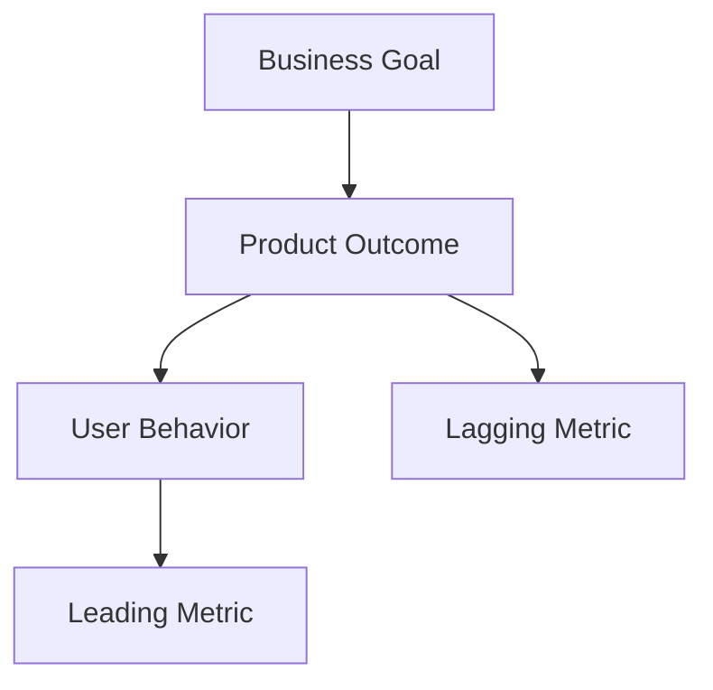

# Measuring Results, Making Decisions, and Using Metrics

A good metric is **information that changes the next action**, rather than a number for reporting.

## Output vs Outcome

| Type | Example |
|---|---|
| Output | Released 5 features |
| Adoption | Used by 40% of users |
| Outcome | Reduced task time by 25% |
| Impact | Increased retention / reduced support |

A PO should focus on outcomes more than outputs.

## Metric Tree



## Common Metric Types

### Acquisition

Are users arriving?

### Activation

Have they experienced the core value for the first time?

### Engagement

Are they actually using it repeatedly?

### Retention

Do they return?

### Efficiency

Have time, clicks, and failures decreased?

### Quality

Have crashes, errors, and support issues decreased?

## Leading vs Lagging

```text
Leading
= A behavioral indicator that anticipates future results

Lagging
= A final result that has already occurred
```

Example:

- Leading: Number of Camera Presets saved
- Lagging: Reduction in Camera Setup time

## Metric Pitfalls

- Assuming that an increasing number is always good
- Measuring only what is easy to measure
- Looking only at averages and missing differences between segments
- Ignoring the possibility that increased usage reflects increased friction
- Turning a metric into a target and encouraging gaming

## Decision-Making Framework

```text
Evidence
↓
Interpretation
↓
Options
↓
Trade-off
↓
Decision
↓
Expected Result
↓
Measure
```

A decision log should record at least:

- What was decided
- What evidence supported it
- What was given up
- What results would cause the decision to change

For a PO, data is **a tool for reducing uncertainty**, not "the answer."
