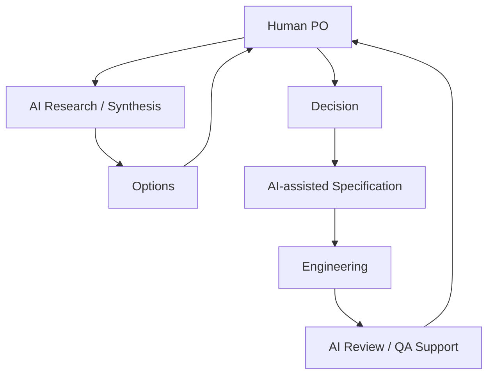

# The Product Owner in the AI Era

AI can greatly reduce the time a PO spends writing documents, but it does not assume responsibility for the product.

## Tasks Well Suited to AI

- Summarizing interviews
- Comparing competing products
- Clustering feedback
- Drafting requirements
- Proposing acceptance criteria
- Exploring edge cases
- Organizing tickets
- Drafting release notes
- Finding anomalous metric patterns
- Summarizing meetings and extracting decisions
- Generating prototypes / mockups
- Investigating the codebase

## Responsibilities Humans Must Retain

- Which users to prioritize
- Which problems to solve
- Which trade-offs to accept
- Which evidence to trust
- How far to reduce scope
- Final quality standards
- Product direction

## An AI-Assisted PO Workflow



## Example AI Agent Roles

| Agent | PO Tasks |
|---|---|
| Researcher | Investigate feedback, competing products, and code |
| Analyst | Analyze metrics and patterns |
| Spec Writer | Draft feature specifications |
| Reviewer | Review missed edge cases |
| Technical Explorer | Investigate areas affected by implementation |
| Meeting Scribe | Extract decisions and actions |

## Principles for Effective Use

### 1. Make the Decision Context Explicit to AI

```text
Poor instruction:
"Plan a feature."

Good instruction:
"The goal is X, the users are Y, and the constraints are Z.
Compare 3 alternatives and show the trade-offs of each.
I will make the decision."
```

### 2. Connect It to the Codebase and Real Data

To prevent AI from offering only generalities, provide real context:

- The actual repository
- Actual user feedback
- Actual metrics
- Actual designs
- Actual issues

### 3. Include an Agent That Challenges the Proposal

Do not rely only on agents that advocate for a feature.

```text
Proposal
↓
Adversarial Review
- Is it really necessary?
- Can existing features solve it?
- Is the scope too large?
- Does it conflict with the user's mental model?
```

## PO Skills That Become More Important in the AI Era

These competencies become more important, rather than less important, because of AI:

- Problem Framing
- Taste / Product Judgment
- Prioritization
- Systems Thinking
- Technical Literacy
- Evidence Evaluation
- Decision Ownership

As AI lowers implementation costs, **the relative cost of choosing what to build grows.**

In the AI era, a PO should therefore be someone who **repeatedly makes better choices in an environment that enables rapid experimentation**, rather than someone who produces more documents.
