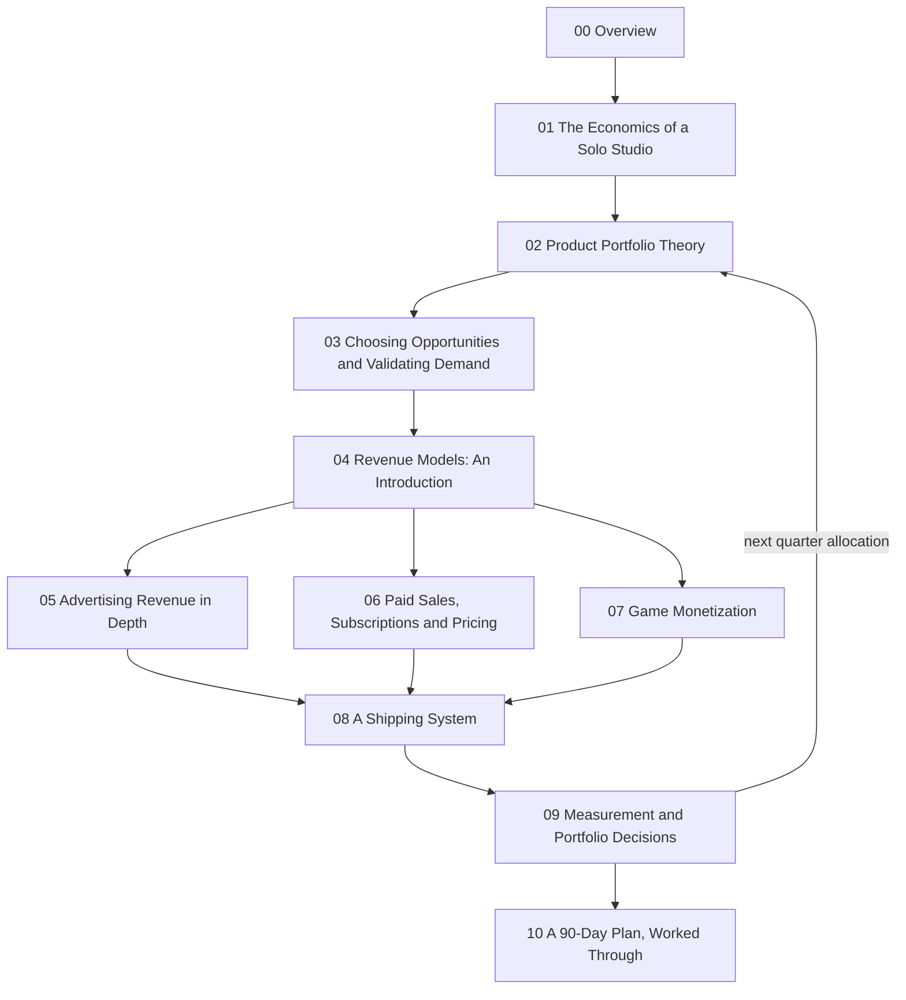

# Solo Studio Monetization Overview

> **Learning goal**: Understand that AI agents have sharply lowered the cost of building but not the cost of distribution and attention, and explain the order in which the eleven documents of this track tackle the problem of "many prototypes, few launches, little revenue".

As of: 2026-09-28. Fees, policies and statistics are the values checked on this date, and every document lists its sources with dates. All example numbers are **assumptions**.

## Key Concepts

This track teaches, in textbook order, how a developer or PO who can build anything quickly **chooses what to build, ships it and gets paid for it**.

| Term | Meaning | Where this track covers it |
|---|---|---|
| Build cost | The time and money needed to turn an idea into a working product | 01 |
| Distribution cost | Store review, payment setup, terms, tax, launch preparation | 04, 08 |
| Attention cost | The cost of getting strangers to find, trust and try the product | 03, 05 |
| Bet | Putting time into a product whose outcome is uncertain | 02 |
| Revenue model | The way the value users receive is turned into money | 04–07 |
| Portfolio | The set of products being operated, built or validated at once, and the split of hours between them | 02, 09 |

## Principles

### Costs AI Lowered and Costs It Did Not

Product revenue can be written roughly as this product:

> Monthly revenue = people who reach the product × paid conversion rate (or ad exposure) × revenue per person

An AI coding agent **does not directly raise any term of this formula.** What shrinks is the build time that sits outside the multiplication.

| Cost item | Change after AI agents | Why |
|---|---|---|
| Code, UI and test drafts | Large decrease | The agent takes over repetitive work |
| Asset and document drafts | Decrease | Drafts are fast, but review time remains |
| Store review, payments, tax | Small decrease | People still check and are accountable for rules and procedures |
| Discovery, trust, reviews | No decrease, more competition | Everyone ships more with the same tools |

Evidence of rising supply already exists. According to Appfigures, worldwide app releases across the App Store and Google Play rose about 60% year over year in Q1 2026 (reported by TechCrunch, 2026-04-18). SteamDB counted more than 19,000 games released on Steam in 2025, almost half of them with fewer than ten reviews (2025-12). The easier building becomes, **the less the mere fact of having built something brings anyone to your door.**

### The Core Problem: Many Prototypes, Few Launches

Building is fun and, thanks to AI, fast; the work just before launch is dull and shrinks less with AI. So starting a new prototype always looks more attractive, and hours are spread thinly across many products.

1. **No selection criteria** — there are no numbers to compare which product is worth more (01, 02).
2. **Building without validation** — build time is spent without knowing whether demand exists (03).
3. **No way to get paid** — even after launch, no payment or ads are attached (04–07).
4. **Shipping is not a habit** — there is no repeatable launch procedure (08).
5. **Unable to stop** — without kill criteria, products stay "in progress" forever (02, 09).

## Learning Map

Part 1 (00–04) covers concepts and theory; part 2 (05–10) covers revenue models in depth and execution. The measurements in 09 feed back into the portfolio decisions of 02.

| No. | Document | Question it answers |
|---|---|---|
| 01 | The Economics of a Solo Studio | What does one hour of my time cost, and how long can I last? |
| 02 | Product Portfolio Theory | How many bets, how big, and until when? |
| 03 | Choosing Opportunities and Validating Demand | How do I confirm demand before building? |
| 04 | Revenue Models: An Introduction | How should this product get paid? |
| 05 | Advertising Revenue in Depth | How much traffic does a target amount of ad revenue need? |
| 06 | Paid Sales, Subscriptions and Pricing | At what price and on what cycle should I sell? |
| 07 | Game Monetization | How do games make money? |
| 08 | A Shipping System | How do I make shipping a repeatable procedure? |
| 09 | Measurement and Portfolio Decisions | What do I grow, keep or stop? |
| 10 | A 90-Day Plan, Worked Through | What does the example studio do in 90 days? |

## Applied: The Example Studio

The whole track uses the same **example studio**. Every number below is an assumption and does not describe any real business.

| Item | Value (assumption) |
|---|---|
| Team | 1 person + AI agents |
| Workable hours per month | 160 hours |
| Monthly fixed cost | KRW 500,000 (AI subscriptions, servers, tools) |
| Target living cost | KRW 3,000,000 per month |
| Operating cash | KRW 18,000,000 |
| Prototypes | 12: 3 games, 4 creative tools, 3 productivity apps, 2 content sites |
| One of the content sites | A technical documentation site preparing for AdSense |
| Launched products | 1, with KRW 0 monthly revenue |

Runway divides operating cash by the money that leaves each month.

> Runway = KRW 18,000,000 ÷ (KRW 3,000,000 + KRW 500,000) = 18,000,000 ÷ 3,500,000 ≈ 5.14 → **about 5.1 months**

With no revenue, the operating cash runs out in about five months. The goal of this track is to design a path to **KRW 3,500,000 of monthly net revenue** (living cost + fixed cost) before then. Taxes are not included in this calculation (see the Business section).

## Connections to Other Sections

This track does not re-explain the site's other sections; it points to them by name where needed.

| Section | Documents to read alongside | Where this track uses them |
|---|---|---|
| Product Planning & Operations | Discovery · Strategy · Roadmaps / Metrics and decisions | 03, 09 |
| Marketing | Market & Customer Research · Segmentation / AI Search · GEO/AEO / Marketing Metrics · Unit Economics | 03, 05, 09 |
| Platform Deployment & Services | App Store · Google Play / Small Team Playbook | 04, 08 |
| Business | Registration · Mail-Order Sales / Terms · Privacy · E-Commerce / VAT · Zero Rate · Tax Invoices | 04, 06 |

## Going Deeper

**Why "build more" is not the answer.** Product outcomes follow a power-law distribution in which a few take most of the total (01 checks this with data). In such a distribution the number of attempts matters, but **an attempt that never ships does not count as an attempt.** A prototype that is on no store and in no search index has no chance of drawing the big win from the tail. So the default strategy of this track is not "build more" but "choose few, ship to the end, and judge quickly".

## Common Misconceptions

- **"AI made building easy, so monetization got easy too"** — Building got easy. So did it for every competitor using the same tools.
- **"A good product spreads by itself"** — A product without a designed discovery path (search, stores, communities) stays invisible however good it is.
- **"Pick the revenue model after users arrive"** — Ads and subscriptions need completely different traffic, trust and retention. The model changes the product design (04).
- **"Twelve prototypes are assets"** — Unshipped prototypes are closer to inventory that consumes upkeep and attention (02).

## Self-Check Questions

1. Can you name two costs AI agents reduced and two they did not?
2. Of the three terms in the monthly revenue formula, which is weakest for your product right now?
3. Compute the example studio's Runway yourself. How many months would it be if the monthly fixed cost were KRW 800,000?
4. Which of the eleven documents should you read first in your current situation, and why?
5. Can you explain in one sentence why an unshipped prototype is at a disadvantage in a power-law distribution?

## References

- [The App Store is booming again, and AI may be why — TechCrunch](https://techcrunch.com/2026/04/18/the-app-store-is-booming-again-and-ai-may-be-why/) (2026-04-18, citing Appfigures data, accessed 2026-09-28)
- [Steam Game Release Summary by Year — SteamDB](https://steamdb.info/stats/releases/) (accessed 2026-09-28)
- [More than 19,000 games launched on Steam this year—but almost half have fewer than 10 reviews — PC Gamer](https://www.pcgamer.com/gaming-industry/more-than-19-000-games-launched-on-steam-this-year-but-almost-half-have-fewer-than-10-reviews/) (2025-12, citing SteamDB data, accessed 2026-09-28)
- [Default Alive or Default Dead? — Paul Graham](https://paulgraham.com/aord.html) (2015-10, accessed 2026-09-28)
