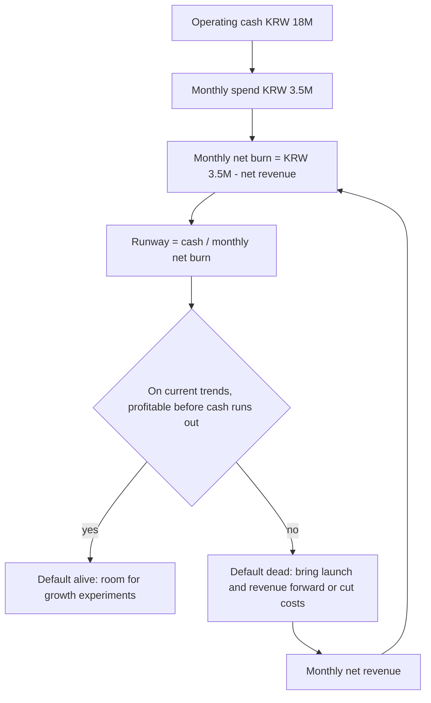

# The Economics of a Solo Studio

> **Learning goal**: Compute the hourly cost, fixed and variable costs, Runway and break-even point with the example studio's numbers, and explain what the power-law distribution of product outcomes means for strategy.

As of: 2026-09-28. All example numbers are assumptions, and taxes are left out of the calculations.

## Key Concepts

| Concept | Definition | What it means for a solo studio |
|---|---|---|
| Opportunity cost | The value of the alternative given up by a choice | Hours spent on one product cannot be spent on another |
| Fixed cost | Money that leaves every month regardless of sales | AI subscriptions, base server fees, tools, and living costs |
| Variable cost | Money that grows with sales or usage | Store and payment fees, AI API cost per user |
| Contribution margin | Price − variable cost per unit | The money each sale contributes to paying fixed costs |
| Runway | Cash ÷ monthly net burn | The number of months you can last without revenue |
| Default alive | On current cost and revenue trends, you reach profitability before the money runs out | The test Paul Graham proposed in a 2015 essay |
| Break-even | The point where net revenue = total cost | KRW 3,500,000 of monthly net revenue for the example studio |
| Power law | A distribution where a few outcomes take most of the total | Why you plan with the median, not the mean |

## Principles

### Time as the Scarcest Resource

In a solo studio, time runs out before money does. Dividing the monthly cost by workable hours gives the **baseline hourly cost**.

> Baseline hourly cost = (living cost KRW 3,000,000 + fixed cost KRW 500,000) ÷ 160 hours = 3,500,000 ÷ 160 = **KRW 21,875**

Compare every task against this amount. Spending 40 hours on a new prototype spends 40 × 21,875 = **KRW 875,000** worth of time. On top of that comes the opportunity cost: what those 40 hours would have produced if spent marketing a product already launched.

### Fixed Cost, Variable Cost and Contribution Margin

Living costs are not a business expense in accounting terms, but when judging a solo studio's survival they behave like a fixed cost. The break-even quantity is:

> Break-even quantity = monthly fixed cost ÷ contribution margin per unit

Example (assumption): a KRW 5,000 monthly subscription, a 15% store fee, and an AI API cost of KRW 750 per user per month.

| Item | Amount |
|---|---|
| Price | KRW 5,000 |
| Store fee 15% | − KRW 750 |
| AI API cost | − KRW 750 |
| Contribution margin | **KRW 3,500** |
| Break-even subscribers | 3,500,000 ÷ 3,500 = **1,000** |

A product with AI features pays an API cost for every use. That variable costs can be larger than in traditional software is a new variable in the economics of products in the AI era.

### Runway and Default Alive

> Runway = KRW 18,000,000 ÷ KRW 3,500,000 ≈ 5.14 → **about 5.1 months** (with zero revenue)

In his 2015 essay "Default Alive or Default Dead?", Paul Graham defined a company as **default alive if, extending current costs and revenue growth, it reaches profitability before the money runs out**, and default dead otherwise. The two scenarios below (assumptions) grow net revenue by the same KRW 500,000 each month and **differ only in starting one month apart.**

| Month | A net revenue (starts month 3) | A cash at month end | B net revenue (starts month 4) | B cash at month end |
|---|---|---|---|---|
| 1 | 0 | 14.5M | 0 | 14.5M |
| 2 | 0 | 11.0M | 0 | 11.0M |
| 3 | 0.5M | 8.0M | 0 | 7.5M |
| 4 | 1.0M | 5.5M | 0.5M | 4.5M |
| 5 | 1.5M | 3.5M | 1.0M | 2.0M |
| 6 | 2.0M | 2.0M | 1.5M | **0** |
| 7 | 2.5M | 1.0M | 2.0M | 1.5M short |
| 8 | 3.0M | 0.5M | — | — |
| 9 | 3.5M | **0.5M (break-even)** | — | — |

Amounts are in KRW. A reaches break-even in month 9 with KRW 500,000 left (default alive). B hits zero cash at the end of month 6 (default dead). **A launch that is one month late is enough to flip survival.** This is why launch speed is an economic question for a solo studio.

### The Power Law of Product Outcomes

| Source | Finding |
|---|---|
| RevenueCat, State of Subscription Apps 2025 | Among newly launched subscription apps, the bottom 25% made USD 19 or less in their first year and the top 5% made USD 8,880 or more, a gap of over 400x |
| VG Insights, Global Indie Games Market Report 2024 (reported by Game World Observer) | Of more than 12,000 indie releases on Steam in January–September 2024, under 0.5% were estimated to account for about 80% of revenue |
| SteamDB (2025-12) | More than 19,000 Steam releases in 2025, almost half with fewer than ten reviews |

In such a distribution **the mean is pulled up by a few huge hits and must not be used for planning.** Plan on the median or below, and treat the big wins in the tail as "a bonus that can appear after many launches". And to reach the tail, you have to ship first.

## Applied: The Example Studio

| Metric | Calculation | Result |
|---|---|---|
| Baseline hourly cost | 3,500,000 ÷ 160 | KRW 21,875 |
| Runway (zero revenue) | 18,000,000 ÷ 3,500,000 | about 5.1 months |
| Monthly hours per product if split evenly over 12 prototypes | 160 ÷ 12 | about 13.3 hours |
| Break-even net revenue | living cost + fixed cost | KRW 3,500,000 per month |
| Gross revenue needed at a 15% fee | 3,500,000 ÷ 0.85 | about KRW 4,118,000 |

Diagnosis: with zero revenue and no trend, the studio is **default dead** today. Splitting hours evenly across 12 products leaves just over 13 hours per product per month, so none of them reaches launch and marketing. Document 02 handles this problem with WIP limits.

## Going Deeper

### What AI Agents Change and What They Do Not

| Area | What changes | What does not |
|---|---|---|
| Fixed cost | AI subscriptions become a new fixed cost | Living costs stay the same |
| Variable cost | Products with AI features pay API costs per use | Store and payment fee rates stay the same |
| Build time | Time to a prototype drops sharply | Review, policy work and customer support time remain |
| Demand | — | AI does not increase the number of problems people will pay to solve |
| Competition | Competitors get faster with the same tools | The cost of earning discovery and trust does not fall |

### Break-even Seen Through 1,000 True Fans

In his 2008 essay "1,000 True Fans", Kevin Kelly argued that a creator can make a living from 1,000 true fans who each spend USD 100 a year. Applying the same logic to the example studio (assumption: one fan spends KRW 100,000 a year):

> Annual net revenue needed = KRW 3,500,000 × 12 = KRW 42,000,000 → 42,000,000 ÷ 100,000 = **420 people**

A solo studio's advantage is that it can aim for hundreds of paying users, not millions.

## Common Misconceptions

- **"Thanks to AI, building costs almost nothing"** — The agent may be cheap, but your time costs KRW 21,875 an hour.
- **"Plan from the average revenue"** — Under a power law the mean is inflated by a few. Plan on the median or below.
- **"Runway is balance ÷ business fixed costs"** — In a solo studio, living costs belong in the denominator too.
- **"Revenue is income"** — Only after fees, API costs and taxes do you see what is really left.
- **"A one-month launch delay makes little difference"** — As the scenarios show, one month can flip survival.

## Self-Check Questions

1. Compute your baseline hourly cost from your monthly costs and workable hours.
2. With a KRW 8,000 monthly subscription, a 15% fee and an API cost of KRW 1,000 per user per month, how many subscribers break even?
3. In scenario B, what is the minimum monthly increase in net revenue that would have kept cash from running out? (Recompute the table.)
4. Where would you look for median, not mean, figures for your product category?
5. Can you describe one way an AI feature increases variable cost?

## References

- [Default Alive or Default Dead? — Paul Graham](https://paulgraham.com/aord.html) (2015-10, accessed 2026-09-28)
- [1000 True Fans — Kevin Kelly, The Technium](https://kk.org/thetechnium/1000-true-fans/) (2008-03, accessed 2026-09-28)
- [State of Subscription Apps 2025 — RevenueCat](https://www.revenuecat.com/state-of-subscription-apps-2025) (2025-03, accessed 2026-09-28)
- [Indie games come close to AA/AAA games in revenue on Steam — Game World Observer](https://gameworldobserver.com/2024/10/16/indie-games-revenue-steam-vs-aaa-titles-vg-insights) (2024-10-16, citing the VG Insights report, accessed 2026-09-28)
- [More than 19,000 games launched on Steam this year—but almost half have fewer than 10 reviews — PC Gamer](https://www.pcgamer.com/gaming-industry/more-than-19-000-games-launched-on-steam-this-year-but-almost-half-have-fewer-than-10-reviews/) (2025-12, accessed 2026-09-28)
