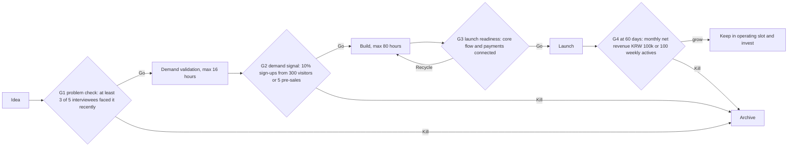

# Product Portfolio Theory

> **Learning goal**: Treat products as bets, compute Expected Value and variance, and design a portfolio for 160 hours a month using small bets, the barbell, Stage-Gate, kill criteria set in advance and WIP limits.

As of: 2026-09-29. All probabilities and amounts are illustrative assumptions.

## Key Concepts

| Concept | Definition | Source |
|---|---|---|
| Bet | Putting limited resources on something with an uncertain outcome | General decision theory |
| Expected Value | The sum of (probability × value) over outcomes | Probability theory |
| Variance | How widely outcomes scatter around the expected value | Probability theory |
| Small bets | Instead of staking everything on one product, look for signal through many small bets | Daniel Vassallo |
| Barbell strategy | Hold a very safe side and a very aggressive side together and avoid the middling middle | Nassim Nicholas Taleb, *Antifragile* (2012) |
| Stage-Gate | A new-product development model that places gates between stages and decides Go/Kill/Hold/Recycle against criteria set in advance | Robert G. Cooper (research in the 1980s, formalized from 1986) |
| Kill criteria | A condition written before starting: "if we fall short of this number, we stop" | A one-person version of Stage-Gate gate criteria |
| Sunk-cost fallacy | The tendency to continue because of costs already spent | Arkes & Blumer (1985) |
| WIP limit | A cap on the number of work items in progress at once | Kanban (David J. Anderson, 2010), Little's Law |

## Principles

### Expected Value and Variance

> Expected Value = Σ (probability of an outcome × value of the outcome)

Suppose the same 480 hours (160 hours a month × 3 months) are spent in two ways. The value is monthly net revenue on success (all assumptions).

| Strategy | Setup | Success probability | Monthly net revenue on success | Monthly Expected Value | Standard deviation | Chance at least one succeeds |
|---|---|---|---|---|---|---|
| Big bet | 480 hours × 1 | 10% | KRW 3,000,000 | KRW 300,000 | about KRW 900,000 | 10% |
| Small bets | 80 hours × 6 (assumed independent) | 15% each | KRW 500,000 each | 6 × 75,000 = KRW 450,000 | about KRW 437,000 | 62.3% |

How it is computed (in units of KRW 10,000):

- Big bet variance = 0.1 × (300 − 30)² + 0.9 × (0 − 30)² = 7,290 + 810 = 8,100 → standard deviation 90
- Variance of one small bet = 0.15 × (50 − 7.5)² + 0.85 × (0 − 7.5)² = 270.94 + 47.81 = 318.75; six together 1,912.5 → standard deviation about 43.7
- At least one success = 1 − 0.85⁶ = 1 − 0.3771 = 0.6229

How to read it: under these assumptions small bets have both a higher expected value and less scatter. But the key point is that **the probabilities and payoff sizes are assumptions**. If each small bet had a 5% success probability, the expected value would be 6 × 0.05 × 50 = 15 (KRW 150,000), lower than the big bet. The purpose of this table is not the conclusion but the habit of writing numbers down and comparing them.

### Small Bets and the Barbell

Daniel Vassallo said "Don't build a product. Build a portfolio of small bets," recommending that you only bet more once you see a signal (2020). Taleb's barbell strategy keeps one side very safe and takes large risks only on the other side, **avoiding the middling middle.**

Translated to a solo studio:

| Side | Example | Purpose |
|---|---|---|
| Safe side | Reliable cash flow: operating a product that already earns, contract or service work | Protect the Runway |
| Aggressive side | Several small bets with capped losses | Exposure to big wins in the tail |
| Middle to avoid | A mid-sized product that takes six months without validation | Large losses and an unclear upside |

### Stage-Gate and Kill Criteria Set in Advance

Cooper's Stage-Gate is a model for new-product development in large companies, but its core idea, **"decide Go/Kill at each gate against criteria set in advance"**, carries over directly to a solo studio. The threshold numbers below are examples (assumptions); 03 and 09 set them again per product.

Criteria are **written before starting and not changed after seeing the results.** Criteria changed after the fact are rationalization, not criteria.

### The Sunk-Cost Fallacy

Arkes and Blumer (1985) showed, among other studies, in a field experiment that people who paid more for a theater season ticket attended more plays over the following months than people who received discounts: money already spent drags later decisions along. In products it looks like "I've already spent 200 hours, just a little more."

- **Bad example**: "I've already spent 200 hours on this app, I can't throw it away. Let's add three more features."
- **Good example**: "What changes if I spend 40 more hours (KRW 875,000 worth)? Is there evidence it can reach the G4 criteria? If not, move it to the archive and write down what I learned."

### WIP Limits and Little's Law

Little's Law states that in a stable flow, **average lead time = average WIP ÷ throughput**. Kanban uses this relationship to limit the number of items in progress.

> Example studio: WIP 12, throughput 0.5 launches per month (assumption) → lead time = 12 ÷ 0.5 = **24 months**
> Cut WIP to 2 with the same throughput → 2 ÷ 0.5 = **4 months**

In practice, reducing WIP often raises throughput too, because there is less context switching. Suggested starting point (assumption): at most 2 in build, at most 2 in validation, and products in operation managed by an hour budget rather than a count.

## Applied: The Example Studio

**Hour allocation (160 hours a month, assumption)**

| Area | Hours | Share | Content |
|---|---|---|---|
| Operate | 32 | 20% | Improving and supporting the launched product (P1), plus distribution shared by several products (the shared audience in Going Deeper) |
| Build | 80 | 50% | Taking the 2 WIP items to launch |
| Validate | 24 | 15% | Checking demand signals for 2 new candidates (03) |
| Manage | 24 | 15% | Tax, measurement, learning, next month's plan |
| Total | 160 | 100% | |

This table is the track's default allocation. The 90-day plan in 10 starts from it and lists every deviation with its reason.

**Sorting the 12 prototypes (assumption)**

| State | Count | Example |
|---|---|---|
| Operating slot | 1 | P1 habit tracker (launched, one of the 3 productivity apps) |
| Build slots | 2 | C2 technical documentation site (preparing for AdSense), creative tool T1 with a pre-sale signal |
| Validation slots | 2 | Game GM1 (Steam page signal, 07), productivity app P2 (passed G1 through interviews, G2 measured with a waitlist and fake door page, 03) |
| Archive | 7 | 2 games (GM2, GM3), 3 creative tools (T2–T4), 1 productivity app (P3), 1 content site (C1) |
| Total | 12 | |

The archive is not deletion. Tidy the repository, write one line on "the condition for taking it back out", and leave it alone. The launched P1 sits in the operating slot. P1 shipped before the G4 gate existed and so had no criteria set in advance; document 10 writes its first date and state, using the same numbers as G4.

## Going Deeper

**Correlation within the portfolio.** As with financial portfolios, products that move together lose the benefit of diversification. If four products all depend on Google search traffic and AdSense, one change in the search algorithm shakes all of them at once. The axes to diversify are **acquisition channel** (search, stores, communities), **revenue model** (ads, sales, subscriptions) and **platform** (web, iOS, Android, Steam). Look at the fit table in 04 again from this angle, and use the checklist in 04's Going Deeper to score the example studio's three-path combination.

**Validation buys information.** If 16 hours of validation can avoid 80 hours of building, those 16 hours (KRW 350,000 worth) are insurance that can save up to 64 hours (KRW 1,400,000 worth).

### The Portfolio's Shared Asset: One Audience

Products can be archived or killed, but the people who found them can stay with the studio. To avoid gathering the first 100 users (08) from scratch for every bet, design **the audience as an asset of the studio rather than of one product**.

| Element | Rule (assumption) | Related documents |
|---|---|---|
| One email list | Waitlists, the newsletter and buyer notices go into a single studio list, split by product tags. A new product's waitlist page only adds a tag to the same list | 03, 08 |
| Cross-links between products | Link only where relevant: C2's image and asset articles → T1, T1's export-complete screen → GM1's Steam page, every product's footer → the studio list sign-up | 05 |
| Bundles | Bundle only after each product has passed G4 on its own. Pricing rule in 06 | 06 |
| Build in public | Post one number and one decision a week as a public log. When a product is archived, the log and the followers remain | 08, 09 |

- Consent: collect consent for the waitlist and consent to receive promotional messages (newsletter, new-product notices) separately. See the Business section's "Terms · Privacy · E-Commerce".
- Correlation: a shared audience makes products share an acquisition channel. It is an asset and a common risk at once, so measure how much with the checklist in 04's Going Deeper.

**What the 16 hours a month of "shared distribution" in 10 contain (assumption)**

| Work | Hours a month |
|---|---|
| Build-in-public log, 1 post a week × 4 weeks | 4 |
| Studio newsletter once a month (news from each product) | 3 |
| Community participation and posts (each product's first-100 source, 08) | 5 |
| Checking and updating cross-links and sign-up forms | 2 |
| Replying to waitlisted people and subscribers, tidying tags | 2 |
| Total | 16 |

## Common Misconceptions

- **"Small bets always beat big bets"** — It flips depending on probabilities and payoff sizes. Write the numbers down and compare.
- **"The barbell means splitting half and half"** — The point is not the ratio but a structure that avoids middling risk.
- **"Kill criteria can be set after seeing results"** — Criteria set after the results are rationalization.
- **"Running many things at once finishes them sooner"** — By Little's Law, the more WIP, the longer each product's lead time.
- **"Moving something to the archive is failure"** — An explicit stop is a decision that wins back time.

## Self-Check Questions

1. If each of the six small bets had an 8% success probability, what would the monthly Expected Value and the "chance at least one succeeds" be?
2. Sort your current products into the barbell's safe side, aggressive side and middle to avoid.
3. For one product in progress, what should its G4 criteria have been if you had written them before starting?
4. Compute your lead time from your current WIP and monthly launch throughput.
5. Which acquisition channel do your products share, and how many would be hit at once if that channel closed?

## References

- [Daniel Vassallo, "Don't build a product. Build a portfolio of small bets." — X](https://twitter.com/dvassallo/status/1258518741106618368) (2020-05, accessed 2026-09-28)
- [Daniel Vassallo — dvassallo.com](https://dvassallo.com/) (accessed 2026-09-28)
- [Antifragile (book) — Wikipedia](https://en.wikipedia.org/wiki/Antifragile_%28book%29) (Taleb, 2012, accessed 2026-09-28)
- [The Stage-Gate Model: An Overview — Stage-Gate International](https://www.stage-gate.com/blog/the-stage-gate-model-an-overview/) (accessed 2026-09-28)
- [The psychology of sunk cost — Arkes & Blumer, Organizational Behavior and Human Decision Processes 35(1)](https://www.sciencedirect.com/science/article/abs/pii/0749597885900494) (1985, accessed 2026-09-28)
- [Stable Systems: Little's Law and Kanban — Nave](https://getnave.com/blog/kanban-littles-law/) (accessed 2026-09-28)
