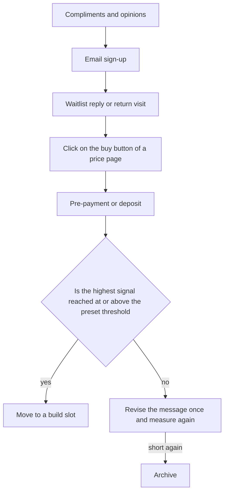

# Choosing Opportunities and Validating Demand

> **Learning goal**: Size opportunity candidates bottom-up, confirm demand before building with Mom Test interviews, fake doors, pre-sales and waitlists, and decide against pass criteria set in advance.

As of: 2026-09-28. Market sizes and threshold numbers are all assumptions; fill in real values with your own research.

## Key Concepts

| Concept | Meaning |
|---|---|
| Opportunity source | Where you discover a problem to solve (your own friction, user complaints, platform changes, search demand, and so on) |
| TAM / SAM / SOM | Total market / the market you can actually reach / the share you can realistically capture |
| Bottom-up estimate | Building market size from below as "number of customers × spend per customer" |
| Fake door (smoke test) | An experiment that opens a price page or button for a product or feature that does not exist yet and measures the response |
| Pre-sale | Validation that takes real payment before launch, often at a discount |
| Waitlist | Validation that collects emails for a launch notice |
| Mom Test | Customer-interview rules that ask about specific past behavior instead of collecting compliments (Rob Fitzpatrick) |
| Signal threshold | A pass number set before the experiment |

## Principles

### Where Opportunities Come From

| Source | Where to look for signal | Strength | Risk |
|---|---|---|---|
| Your own friction | Tasks you keep working around | You know the problem deeply | It may be a problem only you have |
| Complaints about existing products | Low-star store reviews, complaint threads in communities | People are already spending money | Complaints can be loud while willingness to switch is weak |
| Platform changes | New OS APIs, store policy or fee changes | A short window with few competitors opens | The window closes fast |
| Search demand | Search Console, keyword tools, Q&A sites | Demand shows up as numbers | AI answers can reduce clicks (05) |
| Adjacent expansion | Requests from users of a product you already launched | The first customers already exist | The market may be small |

### Market Size for Small Products: Bottom-up

For a small product, a top-down estimate such as "1% of the global design software market" is useless. Build up from below: who, how many, and how much they pay.

> TAM = potential customers with the problem × annual willingness to pay
> SAM = the part of TAM you can reach with your language, platform and payment methods
> SOM = the share of SAM you can realistically win in the first one to two years

**Example: a hypothetical creative tool (all numbers are assumptions)**

| Level | Calculation | Result |
|---|---|---|
| TAM | 50,000 potential customers × KRW 20,000 a year | KRW 1.0 billion |
| SAM | Korean and English, share able to pay on the web 20% → 10,000 × KRW 20,000 | KRW 200 million |
| SOM | 2% of SAM customers → 200 × KRW 20,000 | KRW 4,000,000 a year (about KRW 333,000 a month) |

- **Bad example**: "TAM is KRW 1 billion, so taking just 1% gives KRW 10 million a year."
- **Good example**: "SOM is about KRW 330,000 a month, roughly 10% of break-even (KRW 3,500,000 a month) from this one product. Treat it as a side product that covers the KRW 500,000 fixed cost, or proceed only if there is a way to widen SAM."

### Validating Demand Before Building: The Evidence Ladder

Actions are stronger evidence than words, and money is stronger than actions.

- **Fake door**: Tell anyone who presses the button right away that "this is not ready yet and we will notify you at launch." Do not take money or pretend it exists.
- **Pre-sale**: Real payment makes it the strongest signal. It also creates e-commerce obligations such as refund terms, a delivery date and mail-order sales registration. Read the Business section's "Registration · Mail-Order Sales" and "Terms · Privacy · E-Commerce" first.
- **Waitlist**: Collecting emails requires consent to personal data collection and a privacy policy. Filter signal quality once more with reply and return-visit rates after sign-up.
- **Steam wishlist**: A strong advance signal for games. How to read it is covered in 07.

### Mom Test Interviews

In *The Mom Test* (2013), Rob Fitzpatrick set out three rules for asking questions even your mom cannot lie to you about: **talk about their life instead of your idea, ask about specifics in the past instead of opinions about the future, and talk less and listen more.**

| Bad question | Why it is bad | Good question |
|---|---|---|
| "Would you use an app like this?" | A hypothetical future; politeness produces "yes" | "The last time you did this task, how did you do it?" |
| "Would you pay KRW 5,000 a month?" | Opinions about price do not predict behavior | "Are you spending any money or time on this problem right now?" |
| "What do you think of my idea?" | You end up collecting compliments | "When did this problem last happen? What did it cost you then?" |

### Set Signal Thresholds First

If you set the criteria after the experiment, any result reads as "promising". Write one line before the experiment.

> Hypothesis / metric / period / pass threshold / action if passed / action if missed

Example (assumption): "Productivity app P solves freelancers' schedule-sorting problem / waitlist sign-ups per landing-page visit / 2 weeks / at least 10% of 300 visitors / move to a build slot / revise the message once and measure again; if short again, archive."

## Applied: The Example Studio

This lays out the products placed in validation slots in 02 and the first validation method for each other type. All thresholds are assumptions, run within the monthly validation budget of 24 hours.

| Type | First signal to watch | Method | Example pass threshold (assumption) | Period |
|---|---|---|---|---|
| Game | Steam page wishlists, demo play | Publish a Steam page, a short demo | Follow the criteria in 07 | See 07 |
| Creative tool | Pre-payment | Price page + early-bird payment | 5 payments from 300 visitors | 3 weeks |
| Productivity app | Past behavior, waitlist sign-ups | 5 Mom Test interviews + waitlist page | At least 3 interviewees faced it recently, 10% sign-up | 2 weeks |
| Content site | Search impressions and clicks | Publish 20 articles, then Search Console | At least 100 weekly clicks by week 8 | 8 weeks |

The technical documentation site already has articles, so the traffic math in 05 comes before "demand validation". If visitor numbers fall far short of what the target RPM math requires, consider other models (04) alongside ads.

## Going Deeper

**Conversion rates wobble in small samples.** The standard error of a conversion rate p is √(p × (1 − p) ÷ n) (a normal approximation, and a rough one for small samples).

| Visitors n | Observed sign-up rate | Standard error | Rough 95% range (± 1.96 × standard error) |
|---|---|---|---|
| 300 | 10% | √(0.09 ÷ 300) ≈ 1.73 points | about 6.6% to 13.4% |
| 50 | 10% | √(0.09 ÷ 50) ≈ 4.24 points | about 1.7% to 18.3% |

A 10% seen from 50 visitors might really be 2% or 18%. So set a **minimum sample size** in advance along with the threshold. Not having enough traffic to fill the sample is itself an important signal: "there is no acquisition channel".

## Common Misconceptions

- **"We got lots of compliments, so there is demand"** — Compliments sit at the bottom of the evidence ladder.
- **"A big TAM means a good opportunity"** — A solo studio's problem is SOM and the path to reach it.
- **"No competitors means opportunity"** — There may be no competitors because there is no demand. First check whether anyone already spends money.
- **"A fake door deceives users"** — Telling the truth immediately and taking no money makes it an honest experiment. The moment you take payment, it is a pre-sale with legal obligations.
- **"If validation is ambiguous, build a bit more"** — Ambiguous means missed. Revise the message once, measure again, and stop if it misses again.

## Self-Check Questions

1. Write a bottom-up TAM/SAM/SOM for one current candidate. What percentage of break-even is the SOM?
2. Find one question from a recent customer conversation that broke the Mom Test and rewrite it as a good question.
3. What is the highest rung of the evidence ladder your product has reached so far?
4. With 100 visitors and a 10% sign-up rate, compute the rough 95% range.
5. What are two legal obligations to check before starting a pre-sale?

## References

- [The Mom Test — Rob Fitzpatrick (Goodreads)](https://www.goodreads.com/en/book/show/52283963-the-mom-test) (2013, accessed 2026-09-28)
- [The Mom Test by Rob Fitzpatrick — mtlynch.io book report](https://mtlynch.io/book-reports/the-mom-test/) (accessed 2026-09-28)
- [Fake Door Testing: What It Is and How to Run One — Learning Loop](https://learningloop.io/plays/fake-door-testing) (accessed 2026-09-28)
