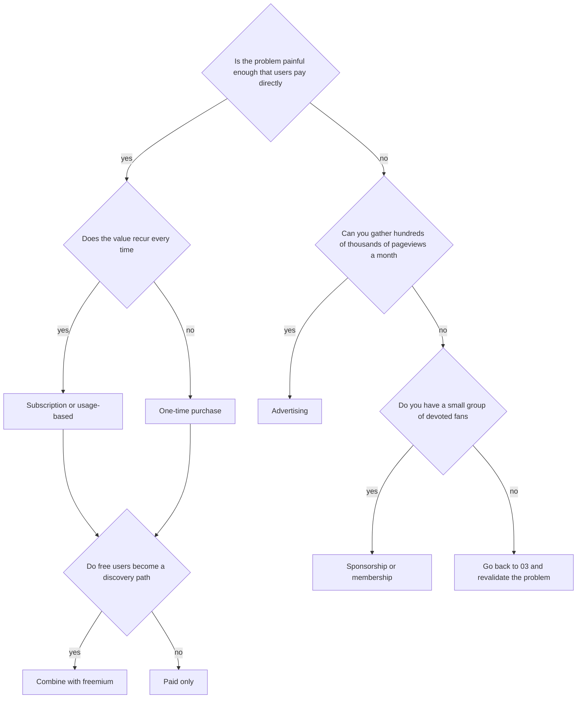

# Revenue Models: An Introduction

> **Learning goal**: Distinguish what each of nine revenue models needs, compute fit by product type and unit economics by model, and read the main platform and payment fees as of 2026-09-29 together with their sources.

As of: 2026-09-29. Fees change often, so re-check the official documents in the table before acting. All example numbers are assumptions, and taxes are left out.

## Key Concepts

| Model | Who pays for what | Typical example |
|---|---|---|
| Advertising | Advertisers pay for users' attention | Content sites, free mobile games |
| One-time purchase | Users pay once | Paid apps, Steam games, templates |
| Subscription | Users pay on a cycle | Productivity apps, memberships |
| Freemium | Some free users pay for paid features | Free tool + Pro plan |
| Usage-based | Pay for what you use | AI generation credits, API calls |
| Commission / marketplace | A percentage of each transaction | Asset markets, brokerage platforms |
| Licensing | Companies or developers pay for usage rights | Commercial licenses for fonts, assets, source code |
| Sponsorship / donation | Fans pay creators | Patreon, donation buttons |
| Services | Customers pay for your time | Contract work, setup and onboarding help, courses |

**Merchant of Record (MoR)**: A payment arrangement in which the provider legally becomes "the seller" and handles payment, per-country VAT and sales-tax calculation and remittance, and refunds on your behalf. Its fees are higher than an ordinary payment processor's, but it reduces the burden of foreign tax compliance.

## Principles

### Each Model Needs Different Things

| Model | Traffic | Trust | Retention | Payment infrastructure |
|---|---|---|---|---|
| Advertising | Very high | Low | Medium | Low (an ad network account) |
| One-time purchase | Medium | Medium | Low | Medium |
| Subscription | Medium | High | Very high | High |
| Freemium | High | Medium | High | High |
| Usage-based | Medium | High | Medium | High (including cost control) |
| Commission / marketplace | High on both sides | Very high | High | Very high (settlement) |
| Licensing | Low | High | Low | Low (contracts) |
| Sponsorship / donation | Low (a few fans) | Very high | High | Low (use a platform) |
| Services | Low | High | Low | Low (tax invoices) |

The most common solo-studio mistake is attaching **ads to a product with no traffic, and a subscription to a product whose retention is unproven**.

### Fit by Product Type

The table below is an example (assumption) that shows the reasoning. Game details are in 07 and pricing design in 06.

| Model | Game | Creative tool | Productivity app | Content site |
|---|---|---|---|---|
| Advertising | Medium (high for casual mobile) | Low | Low | High |
| One-time purchase | High (PC) | High | Medium | Medium (ebooks, templates) |
| Subscription | Low | Medium | High | Medium (membership) |
| Freemium | Medium (F2P, heavy to operate) | High | High | Low |
| Usage-based | Low | Medium (AI generation features) | Medium | Low |
| Commission / marketplace | Low | Medium (templates, assets) | Low | Low |
| Licensing | Low | Medium | Low | Low |
| Sponsorship / donation | Medium | Medium | Low | Medium |
| Services | Low | Low | Medium (onboarding help) | Medium (courses, advice) |

### Unit Economics by Model: The Scale Needed for KRW 3,500,000 of Monthly Net Revenue

| Model | Formula | Assumption | Scale needed |
|---|---|---|---|
| Advertising | pageviews × RPM ÷ 1,000 | RPM KRW 3,000 | 3,500,000 ÷ 3,000 × 1,000 ≈ **1,166,667 PV a month** |
| One-time purchase | units × price × (1 − fee rate) | KRW 10,000, 15% fee → KRW 8,500 | 3,500,000 ÷ 8,500 ≈ **412 units a month** |
| Subscription | retained subscribers × monthly price × (1 − fee rate) | KRW 5,000 a month, 15% → KRW 4,250 | 3,500,000 ÷ 4,250 ≈ **824 retained** |
| Freemium | active free users × paid conversion × net paid price | 3% conversion, net price KRW 4,250 | 824 ÷ 0.03 ≈ **27,467 active** |
| Usage-based | usage revenue × (1 − cost ratio) | 40% cost ratio (AI API) | 3,500,000 ÷ 0.6 ≈ **KRW 5.83M of usage** |
| Marketplace | GMV × take rate | 10% take rate | **KRW 35M GMV a month** |
| Licensing | contracts × contract amount | KRW 500,000 each | **7 a month** |
| Sponsorship | sponsors × amount × (1 − platform fee) | KRW 5,000 a month, 10% → KRW 4,500 | 3,500,000 ÷ 4,500 ≈ **778 people** (payment processing fees extra) |
| Services | hours sold × hourly rate | KRW 50,000 an hour | **70 hours a month** (44% of 160 hours) |

Judge a subscription by **LTV** rather than monthly revenue. With 8% monthly churn (assumption), LTV ≈ 4,250 ÷ 0.08 = **KRW 53,125**. Churn math and pricing design are covered in depth in 06.

### Platform and Payment Fees (as of 2026-09-29)

| Platform | Fee | Conditions and notes |
|---|---|---|
| Apple App Store | Standard 30%, Small Business Program 15% | For developers with up to USD 1M in proceeds in the prior year and new developers who apply. Auto-renewing subscriptions retained for more than a year: 15%. South Korea's third-party payment commission is 26%. EU and US external-link rules are outside this track, so check Apple's documents directly |
| Google Play (South Korea, current) | 15% on the first USD 1M a year (enrollment required), 30% above, 15% on auto-renewing subscriptions. With Korean alternative billing (the developer's own billing) the fee drops by 4 percentage points: 11% (15% tier), 26% (30% tier) | Alternative-billing rates per Play Console Help. The new structure announced 2026-03-04 is scheduled to reach South Korea by 2026-12-31 (reported) |
| Google Play (US, UK, EEA, from 2026-06-30) | Service fee: 10% on the first USD 1M a year and on auto-renewing subscriptions. Above USD 1M, non-recurring products pay 15% on new installs and 20% on existing installs in the Apps Experience Program, 20% and 25% outside it. A separate 5% billing fee applies when using Google Play billing | Program enrollment in Play Console from 2026-09. Rolling out to Australia by 2026-09-30, Japan and South Korea by 2026-12-31, the rest by 2027-09-30 (reported) |
| Steam | 30% on each game's revenue up to USD 10M, 25% from USD 10M to 50M, 20% above | For revenue from 2018-10-01. A USD 100 Steam Direct fee per app, recouped in payouts after USD 1,000 adjusted gross revenue (07) |
| itch.io | The developer chooses 0–100%, default 10% | Open revenue sharing, introduced in 2015 |
| Stripe (US) | Domestic cards 2.9% + 30 cents | South Korea is not on Stripe's list of supported merchant countries |
| Paddle (MoR) | 5% + 50 cents | Paddle calculates, collects and remits taxes as the seller |
| Lemon Squeezy (MoR) | 5% + 50 cents, plus extra rates for international payments, PayPal, subscriptions and more | Acquired by Stripe in 2024, migrating to Stripe Managed Payments. New sign-ups: reported as waitlist or invite-only, not officially confirmed. In 2026-06 an announcement that invite-free public sign-up for Stripe Managed Payments was coming soon was reported, but its opening is not confirmed (accessed 2026-09-29). If starting now, use Paddle or Gumroad |
| Stripe Managed Payments (MoR) | Stripe processing fees + 3.5% per transaction. The 3.5% applies to the full transaction amount including indirect taxes such as VAT (Stripe Support) | Public preview from 2026-02, invite-free public sign-up announced as coming in 2026-06 (reported). **Not available to sellers in South Korea**: Stripe does not list South Korea as a supported merchant country, and 2026 secondary sources list it among excluded countries (the official country list could not be checked directly, accessed 2026-09-29) |
| Gumroad | Direct sales 10% + 50 cents, plus payment processing fees; via Discover 30% | MoR since 2025-01 |
| Patreon | 10% for new creators after 2025-08-04, plus payment processing fees | Earlier creators keep their existing rates |
| Google AdSense (content) | Publisher share 80% (after the buy-side platform fee) | About 68% of advertiser spend for ads bought through Google Ads (05) |

## Applied: The Example Studio

For each prototype type, pick **only one model to test first** (assumption).

| Type (count) | First model | Why | Deep dive |
|---|---|---|---|
| Games (3) | PC one-time purchase | Steam has a mature paid-sales structure, and wishlists show an advance signal | 07 |
| Creative tools (4) | One-time purchase or freemium, via an MoR | Stripe is hard to use directly from South Korea, and an MoR reduces foreign tax work | 06 |
| Productivity apps (3) | Subscription (free trial) | Only when there is recurring value | 06 |
| Content sites (2) | Advertising + a supporting model | The technical documentation site is preparing for AdSense | 05 |

**Combination example (assumption)**: ads KRW 500,000 (166,667 PV at an RPM of KRW 3,000) + creative tool one-time sales KRW 1,500,000 (KRW 8,500 × 177) + productivity app subscriptions KRW 1,500,000 (KRW 4,250 × 353) = **about KRW 3,500,000** (KRW 3,504,750). Stacking three small paths is also safer, from the correlation angle of 02, than gathering 1,166,667 PV or 824 subscribers through a single model.

## Going Deeper

### The Cost of Mixing Models

Every added model adds one more payment integration, refund policy, set of terms and metric. For a solo studio, start from **one main model per product plus at most one supporting model**.

**Rule for adding a supporting model**: do not attach a supporting model until the main model has passed G4 in 02 (60 days after launch: monthly net revenue of KRW 100,000 or more, or 100 weekly active users). Adding a model before the main one has produced a signal makes it impossible to tell which one worked, and only doubles the payment, terms and metrics work. Even after it passes, write the supporting model's threshold and period first, as in 03, and remove it if it lowers the main model's key metric (for example, trial to payment). Example: T1 tests a subscription asset pack only after its one-time sales pass G4. C2's main model is ads, and the link from C2 to T1 is not a revenue model but distribution (02, Going Deeper).

### Break-Even Between an MoR and a Direct PG

"An MoR is expensive" is true if you look only at fees; once tax work is counted, the answer depends on sales volume. The calculation uses 06's overseas one-time sale ($29, KRW 40,600 at an assumed KRW 1,400). All numbers are assumptions.

| Item | Paddle (MoR) | Direct PG (Toss Payments, 3.4% assumed) |
|---|---|---|
| Fee per sale | $29 × 5% + $0.50 = $1.95 = KRW 2,730 | 40,600 × 3.4% ≈ KRW 1,380 |
| Overseas tax | Paddle, as the seller, calculates, collects and files | You do it. Digital products sold to EU consumers carry EU VAT from the first sale even for sellers outside the EU, which can be filed in one country through the non-Union OSS. Other countries must be checked one by one |
| Monthly fixed cost | 0 | Tax work 4 hours a month × KRW 21,875 = KRW 87,500 + annual fee KRW 110,000 ÷ 12 ≈ KRW 9,167 = about KRW 96,667 |

> Difference per sale = 2,730 − 1,380.4 = KRW 1,349.6 → break-even = 96,667 ÷ 1,349.6 ≈ 71.6 sales → the MoR is cheaper up to 71 sales a month, and **the direct PG is cheaper from the 72nd sale** (break-even gross about KRW 2.91M)

| Monthly tax hours (assumption) | Monthly fixed cost | Break-even | MoR cheaper | Direct PG cheaper |
|---|---|---|---|---|
| 2 hours | about KRW 52,917 | 39.2 sales | 39 a month or fewer | From the 40th sale |
| 4 hours | about KRW 96,667 | 71.6 sales | 71 a month or fewer | From the 72nd sale |
| 8 hours | about KRW 184,167 | 136.5 sales | 136 a month or fewer | From the 137th sale |

- How to read it: T1's day-60 net revenue of KRW 450,000 (09) is about 12 sales a month at 06's $29 price (450,000 ÷ 37,870). That is far below break-even, so the MoR is cheaper for the example studio.
- Left out: the PG sign-up fee of KRW 220,000, tax adviser fees, time spent on chargebacks and fraud, and domestic VAT filing (needed on both paths). Foreign-card rates differ by contract and may exceed 3.4% (to be confirmed). The higher the rate, the higher the break-even volume, and the longer the MoR stays ahead.
- VAT itself: VAT on digital products sold to consumers abroad, such as in the EU, arises on either path. An MoR calculates and collects it at checkout automatically; with a direct PG the seller must add each country's VAT at checkout or, failing that, absorb it. Absorbing 20% VAT on a $29 sale costs 29 × 20% × 1,400 = KRW 8,120 per sale, about six times the fee gap above (KRW 1,349.6). Without checkout set up to add each country's VAT, the direct PG is more expensive at any volume.

### Checking Model, Channel and Platform Correlation

Use the three axes from 02's Going Deeper (revenue model, acquisition channel, platform) to check the example studio's combination (ads KRW 0.5M + creative tool one-time sales KRW 1.5M + productivity app subscriptions KRW 1.5M). Two paths score 1 when they share an axis, 0.5 when they partly share it and 0 when they do not (the scoring is an assumption).

| Path | Revenue model | Main acquisition channel | Platform and payment account |
|---|---|---|---|
| A: C2 ads (KRW 0.5M) | Ads | Google search | Web, AdSense account |
| B: T1 one-time (KRW 1.5M) | Paid by users directly (one-time) | Links from C2 (via search) and communities | Web, Paddle |
| C: Productivity app subscription (KRW 1.5M) | Paid by users directly (subscription) | Communities and the studio newsletter | Web, Toss Payments |

| Pair | Model | Channel | Platform and payment | Total (max 3) |
|---|---|---|---|---|
| A–B | 0 | 0.5 | 0.5 | 1.0 |
| A–C | 0 | 0.5 (newsletter sign-ups come from C2) | 0.5 | 1.0 |
| B–C | 0.5 | 0.5 | 0.5 | 1.5 |
| Overall | | | | 3.5 / 9 |

Making the same KRW 3.5M with three ad-supported content sites would score 3 on every pair: 9 / 9.

- Shock test (assumption): if Google search traffic falls 50% and half of B's traffic comes via search and C2, A becomes KRW 0.25M, B becomes 1.5 × (1 − 0.5 × 0.5) = KRW 1.125M, and C stays at KRW 1.5M in the short run → KRW 2.875M in total (−17.9%). A single ad path would have fallen to KRW 1.75M (−50%).
- The biggest single risk is the payment account. If the Paddle account stops, B's KRW 1.5M (42.9% of the total) disappears at once. That is why B and C sit on different payment paths.
- Order of the check: (1) write the three axes for each path (2) score each pair (3) run a shock test on the most shared axis (4) if one axis can shake half or more of the total, choose the next bet from candidates that do not share it.

### Taxes and Displayed Prices

Prices to Korean consumers are displayed including VAT, while app-store and overseas revenue are handled differently for VAT. The net prices in these tables are illustrative numbers without tax. Read the Business section's "VAT · Zero Rate · Tax Invoices" alongside.

## Common Misconceptions

- **"Make it free and add ads"** — Advertising is the model with the largest traffic requirement.
- **"Subscription is the best model"** — Without recurring value and low churn, a subscription only adds refunds and cancellations.
- **"The fee is 30%"** — In 2026, 10-15% is common for small developers depending on the payment method (for example, Google Play US: 10% on the first USD 1M a year plus a separate 5% billing fee with Google Play billing; South Korea currently 15%, 11% with alternative billing). It also varies by region and install date.
- **"An MoR is just expensive"** — Compare it with the time and tax cost of filing foreign VAT yourself.
- **"Add the revenue model later"** — The model changes onboarding, the free tier and the metrics.

## Self-Check Questions

1. Pick one of your products and name the weakest of the four requirements in the table above.
2. With a KRW 9,900 monthly subscription and a 15% fee, how many retained subscribers produce KRW 3,500,000 of monthly net revenue?
3. With 10,000 active free users, 2% paid conversion and a net price of KRW 4,250, what is the monthly net revenue?
4. When Stripe is hard to use directly from South Korea, what are two payment options to consider for overseas sales?
5. In the example studio's combination, what would you have to grow, and by how much, to make the same KRW 3,500,000 without ads?

## References

- [App Store Small Business Program — Apple Developer](https://developer.apple.com/app-store/small-business-program/) (accessed 2026-09-28)
- [Membership details — Apple Developer Program](https://developer.apple.com/programs/whats-included/) (15% on subscription renewals after one year, accessed 2026-09-28)
- [Apple announces App Store Small Business Program — Apple Newsroom](https://www.apple.com/newsroom/2020/11/apple-announces-app-store-small-business-program/) (2020-11, accessed 2026-09-28)
- [Distributing apps using a third-party payment provider in South Korea — Apple Developer](https://developer.apple.com/support/storekit-external-entitlement-kr/) (accessed 2026-09-28)
- [Service fees — Play Console Help](https://support.google.com/googleplay/android-developer/answer/112622?hl=en) (accessed 2026-09-28)
- [Changes to Google Play's billing requirements for developers serving users in South Korea — Play Console Help](https://support.google.com/googleplay/android-developer/answer/11222040?hl=en) (4-point cut for alternative billing, accessed 2026-09-29)
- [Google Play Apps Experience Program — Google Play Console](https://play.google.com/console/about/programs/appsexperience/) (program rates above USD 1M, accessed 2026-09-29)
- [Understanding Google Play's lower service fees — Play Console Help](https://support.google.com/googleplay/android-developer/answer/16954621?hl=en) (accessed 2026-09-28)
- [Expanded billing choice and lower fees on Google Play — Android Developers Blog](https://android-developers.googleblog.com/2026/06/play-expanded-billing.html) (2026-06, accessed 2026-09-28)
- [Google settles with Epic Games, drops its Play Store commissions to 20% — TechCrunch](https://techcrunch.com/2026/03/04/google-settles-with-epic-games-drops-its-play-store-commissions-to-20/) (2026-03-04, accessed 2026-09-28)
- [Valve creates new rev share tiers to give big sellers a break — Game Developer](https://www.gamedeveloper.com/business/valve-creates-new-rev-share-tiers-to-give-big-sellers-a-break) (2018-11, accessed 2026-09-28)
- [Steam Direct Fee — Steamworks Documentation](https://partner.steamgames.com/doc/gettingstarted/appfee) (accessed 2026-09-28)
- [Introducing open revenue sharing — itch.io](https://itch.io/updates/introducing-open-revenue-sharing) (2015, accessed 2026-09-28)
- [Pricing — Stripe](https://stripe.com/pricing) / [Global availability — Stripe](https://stripe.com/global) (accessed 2026-09-28)
- [Pricing — Paddle](https://www.paddle.com/pricing) (accessed 2026-09-28)
- [Fees — Lemon Squeezy Docs](https://docs.lemonsqueezy.com/help/getting-started/fees) (accessed 2026-09-28)
- [2026 Update: Lemon Squeezy + Stripe Managed Payments — Lemon Squeezy](https://www.lemonsqueezy.com/blog/2026-update) (2026, confirmed through search results, accessed 2026-09-29)
- [Managed Payments pricing — Stripe Support](https://support.stripe.com/questions/managed-payments-pricing) (charged on the tax-inclusive total, accessed 2026-09-29)
- [Stripe's Merchant of Record (Stripe Managed Payments): How Does it Work? — Paddle](https://www.paddle.com/resources/stripe-managed-payments) (secondary source from a competitor, states South Korea is excluded, accessed 2026-09-29)
- [EU VAT One Stop Shop (OSS) — Your Europe](https://europa.eu/youreurope/business/taxation/vat/one-stop-shop/index_en.htm) (non-Union OSS, accessed 2026-09-29)
- [Gumroad's fees — Gumroad Help Center](https://gumroad.com/help/article/66-gumroads-fees) (accessed 2026-09-28)
- [A standard platform fee for new creators — Patreon Help Center](https://support.patreon.com/hc/en-us/articles/36426991446797-A-standard-platform-fee-for-new-creators-effective-after-August-4-2025) (2025, accessed 2026-09-28)
- [Updates to how publishers monetize with AdSense — Google](https://blog.google/products/adsense/evolving-how-publishers-monetize-with-adsense/) (2023-11, accessed 2026-09-28)
