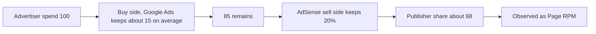

# Advertising Revenue in Depth

> **Learning goal**: Explain how ad revenue is built from impressions, CTR, CPC, CPM, RPM and fill rate, compute the pageviews a target amount needs, and tell apart what raises RPM from what loses you the account.

As of: 2026-09-29. Revenue shares and policies follow the official documents, and all RPM figures are assumptions. The exchange rate uses the track-wide assumption of USD 1 = KRW 1,400 (the Seoul FX market close on 2026-09-09 was KRW 1,336.1).

## Key Concepts

| Metric | Definition | Formula |
|---|---|---|
| Impression | The number of times an ad is shown on a page | ad requests × fill rate |
| Fill rate | The share of ad requests actually filled with an ad | filled requests ÷ all requests |
| CTR | Clicks as a share of impressions | clicks ÷ impressions |
| CPC | Advertiser cost per click | ad spend ÷ clicks |
| CPM | Advertiser cost per 1,000 impressions | ad spend ÷ impressions × 1,000 |
| Page RPM | Publisher's estimated earnings per 1,000 pageviews | estimated earnings ÷ pageviews × 1,000 |
| Viewability | How much of an ad was actually visible on screen | Definitions differ by measurement tool |
| Invalid traffic | Clicks or impressions that do not reflect genuine user interest | A policy violation; grounds for deductions and suspension |

CPM and CPC are **what advertisers pay**; RPM is **what publishers receive**. Google's help example: earning USD 0.15 from 25 pageviews gives a Page RPM = (0.15 ÷ 25) × 1,000 = USD 6.00 (KRW 8,400 at the assumed KRW 1,400 rate).

## Principles

### How Ad Spend Reaches the Publisher

In November 2023 Google announced that from early 2024 AdSense would split its revenue share into buy-side and sell-side rates and pay mainly per impression. **AdSense for content publishers receive 80% of the amount left after the advertiser platform's fee.** For ads bought through Google Ads, Google Ads keeps on average about 15% of advertiser spend, so the publisher's share is about 68% of advertiser spend.

> 100 × (1 − 0.15) × 0.80 = 68

### Decomposing Page RPM

> Page RPM ≈ ad requests per page × fill rate × publisher earnings per 1,000 impressions

Example (assumption): 3 ads per page, 90% fill rate, publisher earnings of KRW 1,000 per 1,000 impressions.

- 1,000 pageviews → 3,000 ad requests → 2,700 impressions
- Earnings = 2,700 × 1,000 ÷ 1,000 = KRW 2,700 → **Page RPM KRW 2,700**

Adding more ads raises requests, but can lower viewability and user experience, and with them earnings per impression and return visits. The three terms of the formula are not independent.

### Traffic Math: Pageviews Needed for a Target Amount

> Monthly pageviews needed = target monthly earnings ÷ Page RPM × 1,000

Google explains that AdSense earnings vary with content category and visitor region, and it publishes no fixed average RPM. The RPM values below are therefore **assumptions for seeing the range**.

| Target monthly earnings | RPM KRW 1,000 (assumption) | RPM KRW 3,000 (assumption) | RPM KRW 6,000 (assumption) |
|---|---|---|---|
| KRW 500,000 (example studio fixed cost) | 500,000 PV | 166,667 PV | 83,333 PV |
| KRW 3,500,000 (break-even) | 3,500,000 PV | 1,166,667 PV | 583,333 PV |

Even just covering the KRW 500,000 fixed cost at an RPM of KRW 3,000 takes about 5,556 PV a day (166,667 ÷ 30). For real planning, recompute this table with **your own site's Page RPM** four to eight weeks after ads go live.

### What Raises RPM

| Factor | How it works | What you can do | Caution |
|---|---|---|---|
| Topic | Advertiser competition differs by topic | Cover topics with buying intent (tool comparisons, adoption guides) within your expertise | Writing on topics you don't know just for RPM lowers quality |
| Geography | Ad demand differs by visitor country | Reach readers in other regions with English pages | Pages at machine-translation quality create quality problems |
| Layout | Ads that are not seen are worth little | Place a moderate number of ads within the flow of the text | Placements that make ads look like content violate policy |
| Core Web Vitals | Slow, jumpy pages hurt both search and users | Reserve ad slot sizes to prevent CLS | LCP ≤ 2.5 s, INP ≤ 200 ms, CLS ≤ 0.1 is the "good" bar |

Google Search Central recommends good Core Web Vitals and explains that this aligns with what its core ranking systems seek to reward. If ads slow the page down, **search traffic can fall and total earnings with it.**

### How to Lose the Account: Invalid Traffic and Policy

AdSense forbids artificially inflating ad impressions or clicks, including clicking your own ads, asking for clicks, and automated impressions or clicks. With high invalid traffic an account can be suspended or closed; on closure, unpaid earnings are not paid out and are refunded to advertisers.

- **Bad example**: "I clicked my own ads a few times to test them." / "I wrote 'please click an ad' at the end of posts." / "I bought cheap traffic to raise pageviews."
- **Good example**: "I check ads with the preview tool, split traffic by channel and watch for odd spikes. I attract visitors with content."

At the approval stage, the rejection "your site isn't ready to show ads (low value content)" is common. Google asks for original, useful content and a good user experience and navigation.

### Why Content Sites Need Search and AI-Search Traffic

The ad model assumes large, repeated visits. For a one-person content site, traffic at that scale mostly comes from search. Yet in a Pew Research Center study (2025-07-22), visits where a Google results page showed an AI summary produced clicks on traditional result links 8% of the time versus 15% without one, and clicks on source links inside the AI summary 1% of the time. For search-traffic strategy, read the Marketing section's "AI Search · GEO/AEO" document alongside.

### Ads in Apps and Games

| Format | Characteristics | Core AdMob policy |
|---|---|---|
| Banner | Stays visible on part of the screen | Do not overlap content or buttons in ways that invite accidental clicks |
| Interstitial | Full screen at transition points | Only at natural transition points. Loading unexpectedly, showing after every click, or showing during gameplay is prohibited |
| Rewarded | The user chooses it to earn a reward | Show only after the user clearly opts in. Rewarded interstitials need an intro screen with an option to decline |

How ads fit into a game's economy design is covered in 07.

## Applied: The Example Studio

Assuming the technical documentation site C2, preparing for AdSense, gets 5,000 pageviews a month at the plan's start (D0 in 10, 2026-10-05) (6,200 on 09's day-60 dashboard):

| Item | Calculation | Result |
|---|---|---|
| Monthly ad earnings at an RPM of KRW 3,000 | 5,000 × 3,000 ÷ 1,000 | KRW 15,000 |
| Multiple needed to reach the KRW 500,000 fixed cost | 166,667 ÷ 5,000 | about 33.3x |
| Multiple needed to reach KRW 3,500,000 break-even | 1,166,667 ÷ 5,000 | about 233.3x |

The D90 gate in 10 (double down at 10,000 or more, kill under 3,000) sets the double-down line at twice this baseline and the kill line at 60% of it.

Conclusion: ads alone are unlikely to support the studio from this site. Its role is **to earn a floor of ad revenue and to be the path through which the studio's other products are discovered**. Order of work (assumption):

1. Approval prep: merge or strengthen thin pages, and check navigation, the privacy policy and cookie notice.
2. Ad placement: reserve slot sizes to prevent CLS, and start with few ads per page.
3. Measurement: after four to eight weeks, recompute the table above with the real Page RPM (09).
4. Linking: from each document, link to the related tool product and to the studio list sign-up (the combination example in 04, the shared audience in 02's Going Deeper).

## Going Deeper

### Ad Management Companies Beyond AdSense

As you grow, consider an ad management company. Raptive lowered its entry bar to 25,000 monthly pageviews on 2025-10-16, but sites between 25,000 and 99,999 pageviews need at least 50% of traffic from the US, UK, Canada, New Zealand or Australia. Mediavine's Journey says that from 2026-01-15 sites can apply with at least 1,000 sessions from Tier 1 countries in 30 days. Both assume **English-speaking traffic**, so for a Korean site the traffic of its English pages decides eligibility.

### Ads Are the Floor, Not the Ceiling

Ad revenue per visitor is small, so it earns less per person than selling ebooks, templates or tools to the same visitors. Ads are the easiest first step for turning traffic into money; once traffic is confirmed, layer the other models from 04 on top.

## Common Misconceptions

- **"AdSense 80% means I get 80% of what advertisers spend"** — It is 80% after the buy-side fee. For ads via Google Ads it is about 68%.
- **"More ads mean more earnings"** — If viewability, Core Web Vitals and return visits drop, earnings can fall.
- **"Once approved, the money comes"** — Approval is the start. Earnings are pageviews × RPM.
- **"One accidental click on my own ad is fine"** — Clicking your own ads is prohibited. Check ads with the preview tool.
- **"If rankings rise, traffic follows"** — Studies show fewer clicks on results that include an AI summary.

## Self-Check Questions

1. With 2 ads per page, an 80% fill rate and publisher earnings of KRW 1,500 per 1,000 impressions, what is the Page RPM?
2. At a Page RPM of KRW 2,000, how many pageviews a day on average are needed to earn KRW 1,000,000 a month?
3. If an advertiser spends KRW 1,000,000 through Google Ads, roughly how much is the AdSense publisher's share?
4. Name two moments when an interstitial must not be shown.
5. Besides ads, what value can your content site give the studio?

## References

- [Updates to how publishers monetize with AdSense — Google](https://blog.google/products/adsense/evolving-how-publishers-monetize-with-adsense/) (2023-11, accessed 2026-09-28)
- [AdSense revenue share — Google AdSense Help](https://support.google.com/adsense/answer/180195?hl=en) (accessed 2026-09-28)
- [Page RPM — Google AdSense Help](https://support.google.com/adsense/answer/112030?hl=en) (accessed 2026-09-28)
- [How much will you earn with AdSense? — Google AdSense Help](https://support.google.com/adsense/answer/9902?hl=en) (accessed 2026-09-28)
- [Invalid traffic — Google AdSense Help](https://support.google.com/adsense/answer/16737?hl=en) (accessed 2026-09-28)
- [Top invalid traffic and policy violations that lead to account closure — Google AdSense Help](https://support.google.com/adsense/answer/2660562?hl=en) (accessed 2026-09-28)
- [What to do when your site is not ready to show ads — Google AdSense Help](https://support.google.com/adsense/answer/12176698?hl=en) (accessed 2026-09-28)
- [Understanding Core Web Vitals and Google search results — Google Search Central](https://developers.google.com/search/docs/appearance/core-web-vitals) (accessed 2026-09-28)
- [Google users are less likely to click on links when an AI summary appears in the results — Pew Research Center](https://www.pewresearch.org/short-reads/2025/07/22/google-users-are-less-likely-to-click-on-links-when-an-ai-summary-appears-in-the-results/) (2025-07-22, accessed 2026-09-28)
- [Interstitial ad guidance — Google AdMob Help](https://support.google.com/admob/answer/6066980?hl=en) (accessed 2026-09-28)
- [Policies for ad units that offer rewards — Google AdMob Help](https://support.google.com/admob/answer/7313578?hl=en) (accessed 2026-09-28)
- [Raptive Drops Traffic Requirement By 75% To 25,000 Views — Search Engine Journal](https://www.searchenginejournal.com/raptive-drops-traffic-requirement-by-75-to-25000-views/558780/) (2025-10, accessed 2026-09-28)
- [Journey Minimum Requirements — Journey by Mediavine](https://journeymv.zendesk.com/hc/en-us/articles/24633185741723-Journey-Minimum-Requirements) (accessed 2026-09-28)
- [Won-dollar rate falls KRW 9.5 to 1,336.1 — Asia Economy (Korean)](https://view.asiae.co.kr/article/2026090915324235252) (2026-09-09, accessed 2026-09-28)
