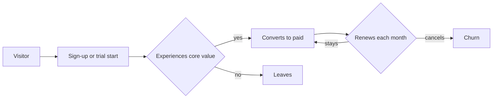
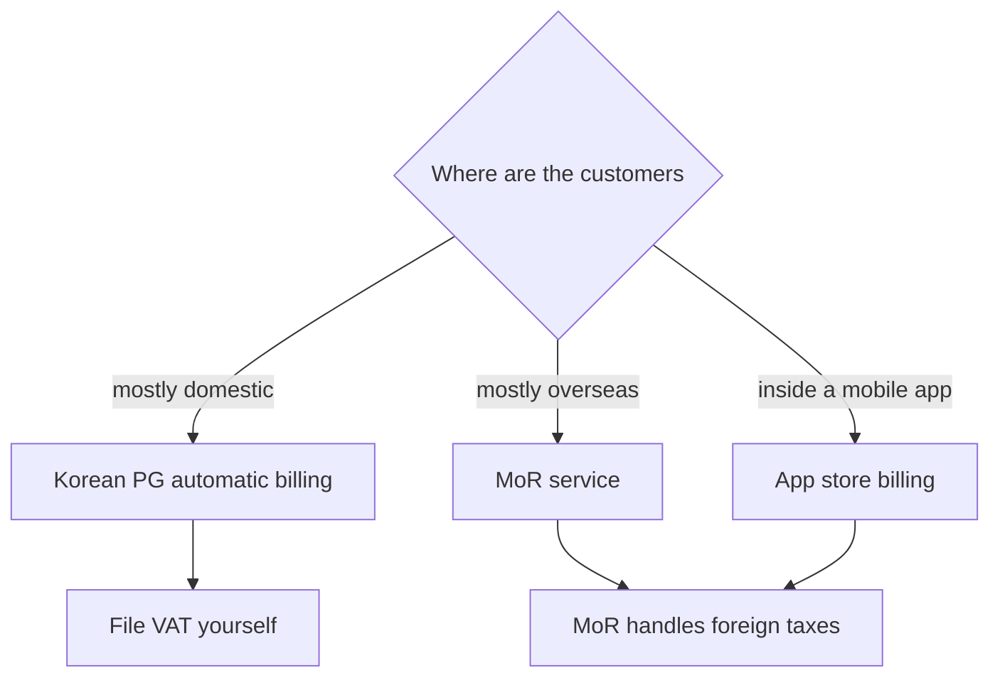

# Paid Sales, Subscriptions and Pricing

> **Learning goal**: Compare the economics of one-time sales, subscriptions and freemium with arithmetic, set a price with a method, and choose a payment path a Korean solo developer can actually use.

Where document 04 drew the map of revenue models, this document digs only into models where "the user pays directly". Numbers are illustrative assumptions; fees and benchmarks carry their source and the date they were checked.

As of: 2026-09-29.

## Key Concepts

| Term | Definition | Calculation |
|---|---|---|
| MRR | Monthly Recurring Revenue | paying subscribers × monthly revenue per subscriber |
| ARR | Annual Recurring Revenue | MRR × 12 |
| Churn | Share of paying subscribers who cancel in a month | cancellations in month ÷ paying subscribers at start of month |
| LTV | Net revenue a customer yields before churning | monthly net revenue ÷ monthly churn (simple model) |
| Conversion rate | Share of free users or trial users who pay | payers ÷ base |

The difference between the three ways of selling is **the shape of the money**.

| Model | Shape of the money | Strength | Trap for a solo studio |
|---|---|---|---|
| One-time sale | A peak right after launch, then a tail | Simple to build, low user resistance | A treadmill: you must find new buyers every month |
| Subscription | A staircase that accumulates (leaking by churn) | Predictable revenue, large LTV | Duty to keep delivering value, cancellation handling |
| Freemium | A thin paid layer on a wide free base | Minimal entry friction | Support cost of free users, low conversion |

## Principles

### Value-Based Pricing

The ceiling of a price is **the value the customer perceives**, the floor is **cost**, and the position in between is set by **alternatives (competing products, free tools, the effort of doing it yourself)**. Products built with AI have near-zero marginal cost, so cost-plus pricing means little. Madhavan Ramanujam and Georg Tacke's *Monetizing Innovation* (2016) recommends asking about willingness to pay **before** building and designing the product around the price. The pre-sale in document 03 is its strongest form.

### Price Psychology: Anchoring and Decoy

- **Anchoring**: the first number seen becomes the reference for later judgments (Tversky & Kahneman, 1974). Show the most expensive plan first and the middle plan looks reasonable.
- **Decoy (asymmetric dominance effect)**: adding a third option that is clearly worse than only one option raises that option's share (Huber, Payne & Puto, 1982). Replication is debated, so confirm with an A/B test.

### Price Discrimination Through Tiers

The way to charge different prices for the same product is to let customers **pick their own segment**. The axes are usage (number of exports), features (advanced features), buyer (individual or team) and term (monthly or annual). An annual discount is a tool that pulls cash forward and lowers churn.

**Bundles** are price discrimination too. Customers who want one product buy it alone; those who want both pick the bundle. Rules for a solo studio (assumption): (1) bundle only after each product has passed G4 in 02 on its own (2) price the bundle at 70-80% of the sum of single prices (3) if, over the 30 days after launch, single-product revenue falls by more than the bundle adds (cannibalization), withdraw the bundle. Announce bundles through the studio's shared list (02, Going Deeper).

### Van Westendorp Price Sensitivity Meter

A survey proposed by Dutch economist Peter van Westendorp in 1976 asks four things: too expensive to buy / expensive but worth considering / cheap (a good deal) / so cheap that quality is doubtful. The intersections of the cumulative curves give an **acceptable price range**. Respondents must be real target customers, and stated prices are more generous than actual payment.

### Trial Design and Conversion Benchmarks

| Metric | Benchmark | Source |
|---|---|---|
| Free trial to paid (B2B self-serve, no card required) | Good 4-6%, great 10-15% | Kyle Poyar (Growth Unhinged), ChartMogul and ProductLed, 200 B2B self-serve products, surveyed 2026-01 |
| Free trial to paid (card required) | Good 25-35%, great 50-60% | Same source |
| Freemium to paid | Good 3-5%, great 8-12% | Same source |
| App trials of 17 days or more vs 4 days or less, trial to paid (median) | 42.5% vs 25.5% | RevenueCat trial length analysis (17,000+ apps), 2026 |
| Paid conversion within 35 days of install (median) | Hard paywall 10.7%, freemium 2.1% | RevenueCat State of Subscription Apps 2026 |
| Annual subscribers retained after one year (median) | Freemium apps 28%, hard paywall apps 27% | Same report |
| B2C SaaS monthly churn | Good 3-5%, great under 2% | Lenny's Newsletter (2022), based on ProfitWell data from about 13,000 SaaS companies |

- The same author's 2023 edition (Lenny's Newsletter, survey of 1,000+ products) gave 8-12%/15-25% for trials and 3-5%/6-8% for freemium. The table uses the newer 2026 edition, but its sample (200 B2B products, USD 1-10M in annual revenue) and its trial split (card required or not) differ, so do not read the two years as a trend.
- Benchmarks **use different denominators**. First check whether a rate is per visitor, per sign-up or per trial start.
- A trial that asks for a card (opt-out) gets fewer trial starts and shows a higher conversion rate. In Korea, automatic free-to-paid conversion carries prior consent and notice duties under the E-Commerce Act (Business track, "Terms · Privacy · E-Commerce").



## Applied: The Example Studio

The example studio (assumption) needs KRW 3.5 million a month (living costs 3.0 million + fixed costs 0.5 million). VAT is excluded; figures are supply values.

**A. Domestic web subscription (Toss Payments general card fee 3.4%, assumed)**

```text
KRW 9,000/month × (1 − 0.034) = net KRW 8,694 per subscriber per month
Subscribers needed = 3,500,000 ÷ 8,694 = 402.6 → 403
Assumed monthly churn 5%: 403 × 0.05 = 20.15 → about 21 leave every month
LTV = 8,694 ÷ 0.05 = KRW 173,880 (average lifetime 20 months)
ARR = KRW 3.5 million × 12 = KRW 42 million
```

Holding 403 subscribers needs **21 new paying subscribers every month**. At 25% trial-to-paid (assumed, a trial that takes a card) that is 84 trial starts, and at 2% visit-to-trial (assumed) 4,200 visits a month.

**B. Overseas one-time sale (Paddle 5% + $0.50, exchange rate KRW 1,400 assumed)**

```text
$29 − ($29 × 0.05 + $0.50) = $27.05 → KRW 37,870
Sales needed = 3,500,000 ÷ 37,870 = 92.4 → 93 sales every month, and 93 again next month
```

**C. iOS subscription (Small Business Program 15%)**

```text
US storefront (displayed price excludes sales tax): $4.99 × 0.85 = $4.2415 → KRW 5,938
Subscribers needed = 3,500,000 ÷ 5,938 = 589.4 → 590
Storefront whose price includes 10% VAT, like South Korea: $4.99 ÷ 1.1 × 0.85 = $3.856 → KRW 5,398
Subscribers needed = 3,500,000 ÷ 5,398 = 648.4 → 649
```

Whether App Store prices include tax differs by storefront. Where VAT is included, the tax comes off before the commission, so the same displayed price needs about 10% more subscribers.

Bad example:

> "Release it free for now and charge later once users gather." Six months passed without ever asking about price.

Good example:

> Before launch, sent the four Van Westendorp questions to 30 waitlisted people, then opened an early-bird payment link at a price inside the acceptable range and counted actual payments.

## Going Deeper

### Choosing Payment Infrastructure (checked 2026-09-29)

| Path | Fee (as published) | Notes |
|---|---|---|
| Apple App Store | Standard 30%, Small Business Program 15% (up to $1M proceeds in the prior year), subscription renewals after the first year 15% | In Korea, a 26% commission structure applies when alternative payment is used (announced 2022) |
| Google Play | Currently 15% up to $1M a year, auto-renewing subscriptions 15% (since 2022-01-01). Korean alternative billing cuts it by 4 points (15% → 11%) | Press reports a new structure for Korea (10% on the first $1M, among others) planned for 2026-12-31; recheck in document 04's table |
| Toss Payments (Korean PG) | General card rate 3.4%, sign-up fee KRW 220,000, annual fee KRW 110,000 (per comparison sources) | Preferential rates for small merchants; automatic billing needs a separate review and contract |
| Paddle (MoR) | 5% + 50 cents | Supports Korean sellers; Paddle, as seller, calculates, collects and files taxes |
| Lemon Squeezy (MoR) | 5% + 50 cents + surcharges for international payments, subscriptions and more | Acquired by Stripe in 2024, migrating to Stripe Managed Payments. New sign-ups: reported as waitlist or invite-only, not officially confirmed. In 2026-06 an announcement that invite-free public sign-up for Stripe Managed Payments was coming soon was reported, but its opening is not confirmed (accessed 2026-09-29) |
| Stripe Managed Payments (MoR) | Stripe processing fees + 3.5% per transaction. The 3.5% applies to the full transaction amount including indirect taxes such as VAT (Stripe Support) | Public preview from 2026-02, invite-free public sign-up announced as coming in 2026-06 (reported). **Not available to sellers in South Korea**: Stripe does not list South Korea as a supported merchant country, and 2026 secondary sources list it among excluded countries (the official country list could not be checked directly, accessed 2026-09-29) |
| Stripe (direct processor) | Not applicable | Korea is not on Stripe's list of supported merchant countries; needs an entity abroad |

A Korean solo developer starting overseas sales now should look at Paddle or Gumroad (both MoRs) first. The break-even between an MoR and a direct PG is computed in 04's Going Deeper.

### What a Merchant of Record Changes

- An **MoR** legally becomes the seller to the customer. The MoR calculates, collects and files each country's VAT or sales tax, and the developer receives a **payout** from the MoR.
- With a direct processor (PG, Stripe), the developer is the seller, so per-country tax duties stay with the developer.
- How payouts are treated in Korean taxation (zero rating, evidence) is not repeated in this track. See the Business track's "VAT · Zero Rate · Tax Invoices" and "Income Tax · Corporate Tax · Withholding · Books", and confirm with a tax accountant.



## Common Misconceptions

- **"A lower price sells more."** A solo studio's bottleneck is acquisition. Halve the price and the same revenue needs twice the customers and twice the support load.
- **"Subscriptions are always better."** Put a subscription on a tool that cannot deliver new value each month and churn eats the LTV. Some products fit a one-time sale plus paid upgrades.
- **"Below the benchmark means failure."** With different denominators and price points, the comparison does not hold. Your own product's number from last month is the first baseline.
- **"The lowest fee is best."** An MoR's 5% includes tax handling. Compare it with the cost of doing per-country tax work yourself.

## Self-Check Questions

1. With subscribers worth KRW 8,694 net a month, how many are needed for KRW 3.5 million a month, and at 5% monthly churn how many new ones must you win each month?
2. A Van Westendorp survey sent to 30 waitlisted people gave an acceptable price range of KRW 7,000-15,000. What early-bird price would you set, and what real payment test would correct for answers being more generous than actual payment?
3. Which denominator must you confirm before comparing trial conversion benchmarks?
4. Explain the difference between an MoR and a direct processor in terms of tax duties.
5. For one of your products, decide which axis (usage, features, buyer, term) to split plans on.

## References

- [RevenueCat - State of Subscription Apps 2026](https://www.revenuecat.com/state-of-subscription-apps) (accessed 2026-09-29)
- [RevenueCat - How long should your free trial be?](https://www.revenuecat.com/blog/growth/free-trial-length) (accessed 2026-09-29)
- [Lenny's Newsletter - What is good free-to-paid conversion](https://www.lennysnewsletter.com/p/what-is-a-good-free-to-paid-conversion) (2023, accessed 2026-09-29)
- [Lenny's Newsletter - What is good monthly churn](https://www.lennysnewsletter.com/p/monthly-churn-benchmarks) (2022, ProfitWell data, accessed 2026-09-29)
- [Growth Unhinged (Kyle Poyar) - The 2026 free-to-paid conversion report](https://www.growthunhinged.com/p/free-to-paid-conversion-report) (2026, accessed 2026-09-29)
- [Wikipedia - Van Westendorp's Price Sensitivity Meter](https://en.wikipedia.org/wiki/Van_Westendorp%27s_Price_Sensitivity_Meter) (accessed 2026-09-29)
- [Huber, Payne & Puto (1982), Journal of Consumer Research](https://academic.oup.com/jcr/article/9/1/90/1839380) (accessed 2026-09-29)
- [Apple Developer - App Store Small Business Program](https://developer.apple.com/app-store/small-business-program/) (accessed 2026-09-29)
- [Apple Developer - Auto-renewable Subscriptions](https://developer.apple.com/app-store/subscriptions/) (accessed 2026-09-29)
- [CNBC - Apple opens up third-party app payments in South Korea (2022-06-30)](https://www.cnbc.com/2022/06/30/apple-opens-up-third-party-app-payments-in-korea-will-take-26percent-cut-.html) (accessed 2026-09-29)
- [Google Play Console Help - Service fees](https://support.google.com/googleplay/android-developer/answer/112622?hl=en) (accessed 2026-09-29)
- [Kyunghyang Shinmun - Google Play fee cut, Korea from December (2026-03-05, in Korean)](https://www.khan.co.kr/article/202603052151005) (accessed 2026-09-29)
- [PortOne blog - Comparing Korean PGs in 2026 (in Korean)](https://blog.portone.io/opi_pg-comparison2026/) (accessed 2026-09-29)
- [Toss Payments Developer Center - Understanding automatic billing (in Korean)](https://docs.tosspayments.com/guides/v2/billing) (accessed 2026-09-29)
- [Paddle Help Center - Which countries are supported by Paddle?](https://www.paddle.com/help/start/intro-to-paddle/which-countries-are-supported-by-paddle) (accessed 2026-09-29)
- [Lemon Squeezy - 2026 Update: Lemon Squeezy + Stripe Managed Payments](https://www.lemonsqueezy.com/blog/2026-update) (accessed 2026-09-29)
- [Stripe - Global availability](https://stripe.com/global) (accessed 2026-09-29)
- [Stripe Support - Managed Payments pricing](https://support.stripe.com/questions/managed-payments-pricing) (accessed 2026-09-29)
- [Google Play Console Help - Changes to Google Play's billing requirements for developers serving users in South Korea](https://support.google.com/googleplay/android-developer/answer/11222040?hl=en) (accessed 2026-09-29)
