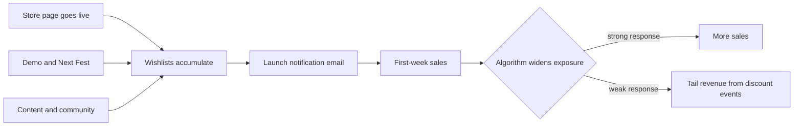

# Game Monetization

> **Learning goal**: Tell apart the money structures of premium, F2P and ad-supported games, know the key Steam and mobile numbers and Korean rules, and keep a solo developer's game scope under control.

Games are the highest-variance asset in a solo studio's portfolio: in document 02's terms, the aggressive end of the barbell. This document covers how to shrink that bet to a size you can calculate.

## Key Concepts

| Model | Who pays | Key metrics | Fit for a solo developer |
|---|---|---|---|
| Premium (paid) | Each buyer, once | Wishlists, conversion, price | High: low operating load, a proven path on PC |
| F2P + IAP | A small share of spending users | Retention, ARPDAU, payer conversion | Low: content operations and user acquisition costs are large |
| Ad-supported (rewarded ads and others) | Advertisers | DAU, ad impressions, eCPM | Medium: assumes huge install volume |
| Hybrid | Ads + IAP | ARPDAU | Medium: complex to design |

- **Wishlist**: the list where a Steam user marks "interested". It is the audience for launch notifications.
- **D1/D7/D30 retention**: share of users who return on day 1, 7 and 30 after install.
- **ARPDAU**: revenue per daily active user per day = daily revenue ÷ DAU.
- **Rewarded ads**: ads a user chooses to watch in exchange for a reward. For ad rate math, see document 05.

## Principles

### How Money Works on Steam

| Item | Detail | Source |
|---|---|---|
| Revenue share | Per game lifetime revenue: Valve 30% up to $10M, 25% from $10M to $50M, 20% above $50M | Valve announcement, applies to revenue after 2018-10-01 |
| Steam Direct fee | $100 per app, non-refundable. Recouped in payment once adjusted gross revenue passes $1,000 | Steamworks documentation |
| Revenue distribution | Of about 41,000 games released over the prior three years, half grossed $500 or less | Game World Observer, reported 2023-10-06 |

The last row is how document 01's power law shows up in games. The median game does not earn a living.

### Wishlists and Launch Visibility

- Per Steamworks documentation, users who wishlist a game get an email **at launch** and **when it is discounted 20% or more**. That is why wishlists on launch day underpin first-week sales.
- Chris Zukowski's (howtomarketagame.com) **heuristics**: about 7,000 wishlists gathered within a short period makes a "Popular Upcoming" appearance likely. First-week sales are roughly 15-25% of wishlists at launch, and games under 5,000 wishlists are quoted at a median of about 15%. These were confirmed through secondary sources, not the original page, so use them only as planning assumptions.
- **Steam Next Fest**: an event that shows pre-release demos for one week. Each game can join only once. The October 2026 edition was announced for October 19-26 (submission deadline September 28), and the February 2027 edition for February 22 to March 1 (registration deadline 2027-01-10).
- **Regional pricing**: Valve provides a tool that suggests per-currency prices relative to a USD base price, and the developer sets the final price.



### Mobile Game Numbers

- GameAnalytics' 2025 mobile benchmarks (about 11,600 games) reported median D1 around 22%, D7 around 3.4-3.9%, D30 under 1%, and top-quartile D1 around 26-28% (per secondary summaries).
- Revenue = DAU × ARPDAU. DAU is built from new installs times retention, so low retention demands large daily install volume (usually paid ads).
- IAP revenue carries app store fees (document 06). Ad revenue follows ad network settlement (document 05).

## Applied: The Example Studio

The example studio (assumption) has three game prototypes: G1 roguelike puzzle (PC), G2 hyper-casual (mobile), G3 narrative adventure (PC).

**If G1 sells on Steam at $9.99 (all assumptions)**

```text
Assumed average net unit price after VAT, refunds, regional prices and discounts: $7
After Valve's 30% → 7 × 0.7 = $4.90 → KRW 6,860 at KRW 1,400
Launch wishlists 3,000 × first week 15% (heuristic) = 450 units
First-week revenue = 450 × 4.90 = $2,205 ≈ KRW 3.087 million
To earn KRW 3.5 million in the first week: 3,500,000 ÷ 6,860 = 510.2 → 511 units
Wishlists needed = 511 ÷ 0.15 = 3,406.7 → about 3,407
```

**If G2 runs ad-supported (all assumptions)**

```text
Target DAU 2,000 × ARPDAU $0.04 = $80 a day
30 days = $2,400 ≈ KRW 3.36 million (gross, before ad network settlement)
Assume 3 active days per install on average → holding DAU 2,000 needs about 667 installs a day, 20,000 a month
```

Without a channel that brings 20,000 installs a month without ads, G2 does not work on paper. G1 has wishlists as a **pre-launch leading indicator**, so the bet size can be adjusted.

Bad example:

> G3, now with an open-world editor and multiplayer, has been in production for two years. It still has no store page.

Good example:

> Built a 20-minute demo containing only G1's core loop first, opened the store page, watched the pace of wishlist growth, then set the production scope.

### Scope Control for a Solo Developer

- **One core loop**: if the fun does not repeat within 30 seconds, more content will not revive it.
- **Vertical slice**: finish one short stretch at final quality first and use it for store assets (trailer, screenshots).
- **Fixed time, variable scope**: apply document 08's appetite to games too. Fix the date and cut features.
- **Avoid live-ops models**: F2P live operations demand daily events and balancing. For one person, premium is the default.

## Going Deeper

### Duties When Selling Games in Korea (checked 2026-09-29)

| Duty | Detail | What it means for a solo developer |
|---|---|---|
| Age rating | A game must be rated before distribution (Game Industry Promotion Act Article 21). Platforms designated as self-rating operators, such as Google and Apple, handle it through a store questionnaire | On mobile stores this often ends with the questionnaire |
| Steam and other non-designated platforms | As of July 2024 reports, Valve was only considering designation as a self-rating operator | PC games rated All, 12+ or 15+ apply to the Game Contents Rating Board (GCRB), adults-only to the Game Rating and Administration Committee (GRAC). The fee table lists KRW 360,000 for PC, and a game production business registration certificate is required |
| Loot box probability disclosure | From 2024-03-22, a duty to display item types and probabilities (Enforcement Decree amendment) | If you add gacha or random boxes, show the odds in the game and on the website |
| Damages for disclosure violations | In force from 2025-08-01: up to three times the damages for intentional violations, and the company must prove it was not at fault | Loot boxes carry large legal risk for one person |

- The legal basics and procedure are in the Business track's "Terms · Privacy · E-Commerce", under game ratings.
- For VAT and foreign withholding on game revenue, see the Business track's tax documents.

## Common Misconceptions

- **"A good game sells itself."** On Steam, exposure is decided by wishlists and early response. Starting marketing on launch day is too late.
- **"F2P earns more."** That is the story of a small top slice. F2P works only with retention, content operations and a user acquisition budget all in place.
- **"Wishlist conversion is a fixed number."** It swings widely with genre, price and trailer. Use heuristics only as ranges.
- **"You can join Next Fest again any time."** It is once per game. Use it after the demo is ready.

## Self-Check Questions

1. For premium, F2P and ad-supported games, who pays and which metrics are central?
2. With a net unit price of $4.90 and 15% first-week conversion, how many wishlists does KRW 5 million in first-week revenue need? (KRW 1,400 per dollar)
3. What does a mobile game with 22% D1 need to hold its DAU?
4. Which rating path must a Korean solo developer releasing a PC game on Steam take?
5. What duties arrived in 2024 and in 2025 for games with loot boxes?

## References

- [Variety - Valve Introduces New Revenue Split Changes For Steam Sales (2018)](https://variety.com/2018/gaming/news/valve-revenue-split-changes-1203078700/) (accessed 2026-09-29)
- [Steamworks - Steam Direct Fee](https://partner.steamgames.com/doc/gettingstarted/appfee) (accessed 2026-09-29)
- [Steamworks - Wishlists](https://partner.steamgames.com/doc/marketing/wishlist) (accessed 2026-09-29)
- [Steamworks - Discounting](https://partner.steamgames.com/doc/marketing/discounts) (accessed 2026-09-29)
- [Steamworks - Steam Next Fest: October 2026](https://partner.steamgames.com/doc/marketing/upcoming_events/nextfest/2026october) (accessed 2026-09-29)
- [Steamworks - Steam Next Fest: February 2027](https://partner.steamgames.com/doc/marketing/upcoming_events/nextfest/feb_2027) (accessed 2026-09-29)
- [Steamworks - Pricing](https://partner.steamgames.com/doc/store/pricing) (accessed 2026-09-29)
- [How To Market A Game - Benchmarks](https://howtomarketagame.com/benchmarks/) (accessed 2026-09-29)
- [presskit.gg - How to Get More Steam Wishlists Before Launch](https://presskit.gg/field-guides/how-to-build-steam-wishlist) (accessed 2026-09-29)
- [Game World Observer - 41k games released on Steam over past 3 years (2023-10-06)](https://gameworldobserver.com/2023/10/06/steam-stats-41k-games-last-3-years-half-made-500-or-less) (accessed 2026-09-29)
- [GameAnalytics - 2025 Mobile Gaming Benchmarks](https://www.gameanalytics.com/reports/2025-mobile-gaming-benchmarks) (accessed 2026-09-29)
- [Korea Policy Briefing - Loot box information disclosed from March 22 (in Korean)](https://www.korea.kr/news/policyNewsView.do?newsId=148924297) (accessed 2026-09-29)
- [Law Times - Litigation special rules for loot box disclosure violations take effect (in Korean)](https://www.lawtimes.co.kr/news/articleView.html?idxno=210245) (accessed 2026-09-29)
- [Asia Economy - Steam considers self-rating operator status in Korea (2024-07-03, in Korean)](https://www.asiae.co.kr/article/2024070317305284345) (accessed 2026-09-29)
- [Game Contents Rating Board - Fee guide (in Korean)](https://www.gcrb.or.kr/Mobile_NEW/sub/fee%20calculation.aspx) (accessed 2026-09-29)
