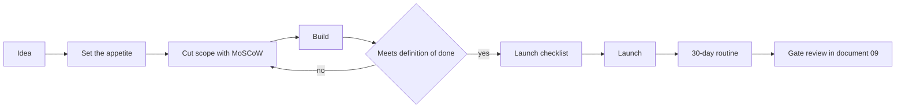

# A Shipping System

> **Learning goal**: Know why prototypes fail to ship, and build a shipping system made of a definition of done, scope cutting, a repeatable launch checklist, a launch cadence and a 30-day post-launch routine.

AI agents made building faster, but **shipping does not get faster on its own**. That is why the example studio (assumption) has twelve prototypes and one launch. Shipping is made by a system, not by willpower.

As of: 2026-09-29.

## Key Concepts

### Five Reasons Prototypes Never Ship

| Cause | Symptom | How a system prevents it |
|---|---|---|
| Scope creep | "Just one more thing" repeats | Fix the time first and cut scope (appetite) |
| Polish loop | You keep reworking screens that already work | Write the bar for "good enough" into the definition of done |
| Fear of launch | The launch date keeps slipping | Ship small and often to lighten each launch |
| No distribution | Only after building: "who do I tell?" | Decide where the first 100 users come from before building |
| Context switching | Touching twelve projects a little in turn | Limit work in progress (WIP) (document 02) |

### A Definition of Done for a Solo Studio

Shippable = **all** of the following are true.

- A first-time user can finish one core task without help.
- A path to getting paid works (payment, ads, or a pre-sale link). For free products, a path to collect contact details.
- Measurement is on: visits, activation and payment events (document 09).
- Terms, privacy policy and business information are displayed (Business track).
- A known-bug list exists, and critical bugs are zero.
- Three channels for the first announcement are chosen.

## Principles

### Fix the Time and Cut the Scope

- **Parkinson's law**: "Work expands so as to fill the time available for its completion" (C. Northcote Parkinson, The Economist, 1955). Without a deadline, polishing never ends.
- **Appetite (Shape Up)**: a concept Ryan Singer of Basecamp set out in *Shape Up* (2019). Instead of "how long will it take?", first decide "how much time is this worth?", then design a solution that fits that time. Basecamp uses six-week build cycles and a two-week cooldown.
- **MoSCoW**: a prioritization technique Dai Clegg created at Oracle in 1994, splitting work into Must, Should, Could and Won't. DSDM (Agile Business Consortium) guidance recommends keeping **Must at no more than 60% of effort (time)** and Could at about 20%, leaving room to protect the Musts when the schedule slips. Split by time, not by count.

### Ship Small and Often

- A line widely attributed to Reid Hoffman (LinkedIn co-founder): "If you are not embarrassed by the first version of your product, you've launched too late." It does not mean abandon quality; it means do not hide for long before learning.
- Pieter Levels publicly started a "12 startups in 12 months" challenge in 2014, and Nomad List and Remote OK came out of it. Fix the launch cadence and shipping becomes a habit instead of an event.



## Applied: The Example Studio

The example studio gives the MVP of T1, a pixel art editor (creative tool), a **60-hour appetite** (assumption). At 16 hours a week on T1 out of 160 hours a month, that is about four weeks.

| Class | Items | Hours | Share |
|---|---|---|---|
| Must | Canvas, palette, two layers, PNG export, payment (early bird) | 36 hours | 60% |
| Should | Four animation frames, shortcuts | 12 hours | 20% |
| Could | Themes, share link | 12 hours | 20% |
| Won't (not this time) | Collaboration, mobile app, plugins | 0 hours | 0% |
| Total | | 60 hours | 100% |

If Must exceeds 60%, cut the scope again. If the Musts are not done at hour 45, drop the Coulds and shrink the Shoulds. **The launch date does not move.**

### Launch Cadence

- The example studio uses an **8-week cycle** (6 weeks building + 2 weeks cooldown) (assumption). 52 weeks a year ÷ 8 weeks = 6.5, so six or seven launch opportunities a year.
- Each cycle allows one "big launch" (a new product or monetization) and several "small launches" (features, price experiments).
- The two cooldown weeks go to bug fixing, the gate review in document 09, and betting on the next cycle.

### A Repeatable Launch Checklist

```text
[D-14] Confirm three sources of the first 100 users, publish a waitlist page
[D-7]  Check the definition of done, run one test payment and one refund
[D-3]  Finalize store and landing copy, screenshots, price table
[D-1]  Verify measurement events, verify the rollback path, three announcement drafts
[D-0]  Deploy, email the waitlist, announce in three channels, answer questions for the first 24 hours
```

Design the first 100 users before the product. For choosing channels and tiering launches, see the Marketing track's "Go-to-Market · Launch · PLG and SLG" and "Channel Strategy · Content · Paid · Lifecycle · Community".

### The 30-Day Post-Launch Routine

| When | What to do | Number to watch |
|---|---|---|
| D+1 | Error logs, payment failures, answer first questions | Critical error count |
| D+3 | Fix where users get stuck in activation | Sign-up to core task completion rate |
| D+7 | Short conversations with five users (the Mom Test from document 03) | First-week retention, first payments |
| D+14 | One price or onboarding experiment | Conversion rate |
| D+30 | Gate review in document 09: kill, continue or double down | Thresholds set in advance |

Bad example:

> Started a new prototype the day after launch. A month later, the payment button turned out to have been broken on mobile.

Good example:

> Put the 30-day routine on the calendar first, and set new-prototype time to zero for that period.

## Going Deeper

### Running the Release Pipeline with AI Agents

| Stage | Work for the agent | Gate a human keeps |
|---|---|---|
| Build and test | Run tests, lint and builds in CI, summarize failures | What the tests actually verify |
| Release notes | Draft changes from commits and issues | The sentences sent to users |
| Store assets | Fit screenshot specs, draft descriptions and translations | Whether promised features really exist |
| Deployment | Deploy to staging, run smoke tests | Production approval and rollback decisions |
| After launch | Summarize error logs, triage questions | Answers on refunds and personal data |

Build the pipeline following the Platform track's "CI/CD Pipeline: From Commit to Production" and "Practical Guide for Small Teams: Solo Developers and Small Teams". Keep payments, personal data and production approval as human gates.

## Common Misconceptions

- **"A little more polish and the response will improve."** Pre-launch polish tests no hypothesis. Response can only be measured after launch.
- **"A launch is one big event."** Shipping small and often makes each failure cheap and speeds up learning.
- **"If AI builds it, there is no need to cut scope."** Building gets cheaper, but testing, support and maintenance costs still grow with the number of features.
- **"Users can be found after launch."** A launch without a source for the first 100 users is a launch nobody sees.

## Self-Check Questions

1. Pick which of the five causes kept one of your prototypes from shipping, and write down the system that would prevent it.
2. With an 80-hour appetite, what is the most time Must can take under DSDM guidance?
3. How does an appetite differ from an estimate?
4. If the example studio used a 5-week cycle (4 weeks + 1-week cooldown) instead of the 8-week cycle (6 weeks + 2-week cooldown), how many launch chances would it have in a year? Considering the 30-day post-launch routine and the cooldown work (bug fixes, gate reviews, the next bet), argue which one fits this studio.
5. Why should you not start a new prototype during the 30 days after launch?

## References

- [Basecamp - Shape Up: Stop Running in Circles and Ship Work that Matters](https://basecamp.com/shapeup) (accessed 2026-09-29)
- [Agile Business Consortium - MoSCoW Prioritisation (DSDM Handbook)](https://www.agilebusiness.org/dsdm-project-framework/moscow-prioritisation.html) (accessed 2026-09-29)
- [Wikipedia - MoSCoW method](https://en.wikipedia.org/wiki/MoSCoW_method) (accessed 2026-09-29)
- [Wikipedia - Parkinson's law](https://en.wikipedia.org/wiki/Parkinson%27s_law) (accessed 2026-09-29)
- [levels.io - I'm Launching 12 Startups in 12 Months (2014)](https://levels.io/12-startups-12-months) (accessed 2026-09-29)
- [Product Hunt - Launch Guide](https://www.producthunt.com/launch) (accessed 2026-09-29)
