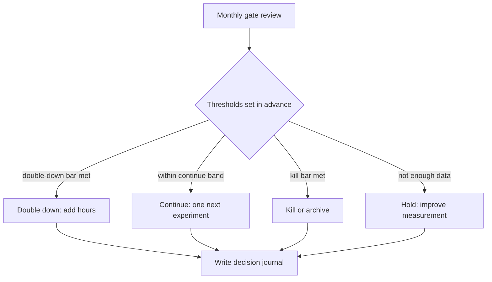

# Measurement and Portfolio Decisions

> **Learning goal**: Pick stage-appropriate metrics for each product, decide kill, continue or double down against thresholds set in advance, and compare products with different revenue models by value per hour.

Where document 02 gave the theory that "products are bets", this document is **the operating procedure for re-evaluating those bets every week and month**. Without measurement, a portfolio is managed by mood.

As of: 2026-09-29.

## Key Concepts

### Leading and Lagging Indicators

- **Lagging indicators**: outcomes. Revenue, MRR, net profit. Certain, but late.
- **Leading indicators**: signals that move before the outcome. Waitlist sign-up rate, activation rate, wishlist growth pace. Fast, but their link to outcomes must be verified.
- Early products have zero lagging indicators, so **decide with leading indicators and verify the leading indicators with lagging ones**.

### Metrics by Stage

Trimming Dave McClure's AARRR (2007: Acquisition, Activation, Retention, Referral, Revenue) to a solo studio's stages gives the following.

| Stage | Question | Example metrics | Type |
|---|---|---|---|
| Validation | Does anyone want it | Landing visit to waitlist sign-up rate, pre-sales, fake door click rate | Leading |
| Activation | Do first-time users experience the value | Sign-up to core task completion rate | Leading |
| Retention | Do they come back | Weekly and monthly retention; D1/D7 for games; wishlist pace for Steam | Leading |
| Revenue | Does it make money | Monthly net revenue, MRR, churn, RPM | Lagging |

### Vanity Metrics and Actionable Metrics

Eric Ries called numbers such as cumulative sign-ups and page views, which **feel good but cannot change behavior**, vanity metrics, and numbers with clear cause and effect that change decisions actionable metrics (2009 guest post, *The Lean Startup* 2011).

| Bad example (vanity) | Good example (actionable) |
|---|---|
| 3,000 cumulative sign-ups | 34% of this week's sign-ups completed the core task |
| Total page views | Waitlist sign-up rate by traffic source |
| Total wishlists | Average daily wishlist growth over the last 7 days |
| GitHub stars | Reached checkout page to completed payment rate |

## Principles

### A Gate Is an Investment Decision

Robert G. Cooper's Stage-Gate (proposed 1986, the term in print 1988) chooses one of **Go, Kill, Hold or Recycle** at the gate between stages. In a solo studio, translate these as double down, kill, hold and rework. The gate question is "will this product get the next stage's time?"

### Set Thresholds in Advance

In *Quit* (2022), Annie Duke recommends writing kill criteria in advance as **states and dates**: "If by (date) I have not reached (state), I will quit." Set criteria after seeing the data and sunk cost and attachment will move them.

- An example of a double-down signal: in Sean Ellis's survey, 40% or more answering "very disappointed" if they could no longer use the product is read as a sign of product-market fit.
- Use only **one primary metric** and at most two secondary metrics per gate.



### Comparing Products with Different Revenue Models

An ad site's RPM, a subscription app's MRR and a game's wishlists have different units. The common unit is **one person's time**.

```text
Realized revenue per hour = net revenue in last 30 days ÷ hours invested in last 30 days
Expected value per hour = expected net revenue over 12 months ÷ hours needed over next 12 months
Expected net revenue = Σ (scenario probability × scenario net revenue)
Example studio's required hourly rate = KRW 3.5 million a month ÷ 160 hours = KRW 21,875
```

For reference, Korea's 2026 minimum wage is KRW 10,320 an hour (Ministry of Employment and Labor notice). Use it only as a reminder of the floor of opportunity cost.

## Applied: The Example Studio

A dashboard assumed at day 60 of document 10's 90-day plan. All numbers are assumptions.

| Product | Stage | Primary metric (now) | Net revenue, last 30 days | Hours invested | Realized revenue per hour |
|---|---|---|---|---|---|
| T1 pixel art editor | Paid beta | Trial to payment 11% | KRW 450,000 | 64 hours | KRW 7,031 |
| C2 tech docs site | Ad approval | 6,200 monthly page views | KRW 30,000 | 24 hours | KRW 1,250 |
| GM1 roguelike puzzle | Store page | 7 wishlists a day on average, 600 total | KRW 0 | 32 hours | KRW 0 |
| P1 habit tracker | Launched, maintenance only (shipped before G4, verdict at D90) | 40 weekly active users | KRW 0 | 4 hours | KRW 0 |

C2's KRW 30,000 covers about 30 days of live ads, so its measured Page RPM is 30,000 ÷ 6,200 × 1,000 ≈ KRW 4,839. That is higher than 05's assumed KRW 3,000, so recompute 05's table with this measured value (step 3 of 05's applied section). C2's monthly pageviews grew 24%, from 5,000 at D0 to 6,200.

By realized revenue per hour alone, all fall short of KRW 21,875. These are early products, so look at expected value per hour too.

| Product | 12-month scenarios (assumed) | Expected net revenue | Hours needed | Expected value per hour |
|---|---|---|---|---|
| GM1 | 60%: 2M / 30%: 8M / 10%: 30M | 1.2 + 2.4 + 3.0 = KRW 6.6M | 400 hours | KRW 16,500 |
| T1 | 50%: 0.5M a month × 12 / 30%: 1.5M a month × 12 / 20%: 0 | 3.0 + 5.4 + 0 = KRW 8.4M | 768 hours | KRW 10,938 |
| C2 | 70%: 0.05M a month × 12 / 30%: 0.2M a month × 12 | 0.42 + 0.72 = KRW 1.14M | 288 hours | KRW 3,958 |

- GM1 has the highest expected value per hour, but **high variance, and the money arrives after launch**. If launch is nine months away, not a single won arrives within the 5.1-month runway (document 01).
- T1 has a middling expected value and **earns now**. Its role is to extend the runway.
- C2 has a low expected value but takes little time and is steady. For the basis of ad rates (RPM), see document 05.
- Conclusion (assumed): keep T1 as the main bet, and add hours to GM1 only when its leading indicator, wishlists, crosses the bar. This matches document 02's barbell allocation.

### Pre-Committed Decision Rules (D60 Review, Verdict Date per Row)

| Product | Kill | Hold | Continue | Double down |
|---|---|---|---|---|
| T1 | At day 60, trial to payment under 3% (checked first) → archive | Fewer than 10 payments → sample too small, hold, re-verdict at D90 after the D70 full launch | 3-10%, or 10% or more with net revenue under KRW 400,000 | 10% or more and net revenue KRW 400,000 or more → add 4 hours a week (16 hours a month) |
| C2 | Under 3,000 monthly page views at day 90 | — | 3,000-10,000 | 10,000 or more → double the publishing pace |
| GM1 | Under 500 total wishlists at day 90 | — | 500-1,500 | 1,500 or more → start Next Fest preparation |
| P1 | Under 100 weekly active users and under KRW 100,000 monthly net revenue at day 90 → archive | — | Maintenance only, 1 hour a week, until the verdict | G4 met (100 or more weekly active users, or KRW 100,000 or more monthly net revenue) → reassign operating hours in next quarter's triage |

Verdicts are read in the order kill → hold → continue → double down, and only the first match applies, so T1's four cells neither overlap nor leave gaps. A held T1 is judged again at D90 by the same rule, and if it still has fewer than 10 payments then, it is killed. Hold is the "not enough data → hold: improve measurement" branch in the flowchart above.

P1 launched on 2026-06-15 (assumption), so G4's 60-day window closed on 2026-08-14, but that was before the G4 gate in 02 existed, so it had no criteria set in advance. Its first criteria were written at D0 in 10, using the same numbers as G4, with only the verdict date set to D90 (step 1 of 10's applied section). The criteria do not change before the verdict.

Held against the rules, the day-60 dashboard puts T1 in double down (11%, KRW 450,000, about 12 payments = 450,000 ÷ 37,870), while C2, GM1 and P1 await their day-90 verdict. P1's 40 weekly active users are 40% of the 100 bar, so on the current trend it is heading for the archive.

## Going Deeper

### Review Rituals

| Cadence | Time | Agenda |
|---|---|---|
| Weekly (Monday) | 30 minutes | Record one primary metric per product, check this week's hour allocation, one blocker |
| Monthly (first day of cooldown) | 2 hours | Gate verdicts, reallocate hours, recompute runway, review the decision journal |
| Quarterly (90 days) | Half a day | Re-evaluate the whole portfolio, choose new bets (document 10) |

Hour-logging rules (assumption). Hours are the denominator of realized revenue per hour, so settle them before the review.

- Tool and format: one spreadsheet or a time-tracking app. Each row holds the date, a code, the hours and a one-line note.
- Granularity and codes: log in 30-minute units, using only product codes (T1, C2, GM1, P1, P2) and shared codes (distribution, management).
- What counts: only hours a person actually spent. Work for a single product (building, support, that product's marketing) goes to its product code; work spanning several products goes to a shared code. Time an agent ran alone does not count; time spent instructing and reviewing it does.

### Decision Journal

The decision journal popularized by Farnam Street (Shane Parrish) records the following at the moment of deciding, to compare with the outcome later.

```text
Date and state: 2026-12-04, moderately tired
Decision: add 4 hours a week to T1, P1 maintenance only
Where the hours come from (D60-D90, per month): T1 64 → 80, GM1 32 → 24, P2 4 → 0 (the fake door ended at D28), management and reviews 16 → 12
Numbers behind it: trial to payment 11%, monthly net revenue KRW 450,000
Expected outcome: monthly net revenue KRW 800,000 at day 90, probability 60%
Alternative rejected: pull GM1's demo work forward
Review date: 2027-01-03
```

A bad outcome does not mean a bad decision. The journal **separates luck from judgment** and corrects the probability estimates for the next bet.

## Common Misconceptions

- **"More numbers show more."** With many metrics you end up picking only the good ones. One primary metric per product is the default.
- **"Zero revenue means failure."** Products in validation are judged by leading indicators. But always check that the leading indicators lead to revenue.
- **"Wait a little longer and it will rise."** Change the criteria after the fact and every product stays forever. Write dates and states in advance.
- **"Bet everything on the highest expected value."** Also check whether money arrives within the runway and whether you can survive the variance.

## Self-Check Questions

1. Write one leading and one lagging indicator for one of your products, and explain how you would verify the link between them.
2. What is the realized revenue per hour of a product with KRW 300,000 net revenue and 20 hours invested in the last 30 days? Compare it with the required KRW 21,875.
3. A product has a 40% chance of KRW 10 million and a 60% chance of KRW 1 million and needs 200 hours. What is its expected value per hour?
4. Give each of T1, C2, GM1 and P1 on the day-60 dashboard one of double down, kill, hold or rework (Go, Kill, Hold, Recycle), and write the number behind each. When would the decisions this dashboard does not use be the right call?
5. Write your own product's kill criterion as one sentence in the "states and dates" form.

## References

- [Tim Ferriss blog - Vanity Metrics vs. Actionable Metrics (guest post by Eric Ries, 2009)](https://tim.blog/2009/05/19/vanity-metrics-vs-actionable-metrics/) (accessed 2026-09-29)
- [Wikipedia - Dave McClure (Startup Metrics for Pirates, 2007)](https://en.wikipedia.org/wiki/Dave_McClure) (accessed 2026-09-29)
- [Stage-Gate International - The Stage-Gate Model: An Overview](https://www.stage-gate.com/blog/the-stage-gate-model-an-overview/) (accessed 2026-09-29)
- [Behavioral Scientist - Annie Duke, Mental Models to Help You Cut Your Losses](https://behavioralscientist.org/annie-duke-quit-mental-models-to-help-you-cut-your-losses/) (accessed 2026-09-29)
- [Wikipedia - Product-market fit](https://en.wikipedia.org/wiki/Product-market_fit) (accessed 2026-09-29)
- [Farnam Street - Decision Journal](https://fs.blog/decision-journal/) (accessed 2026-09-29)
- [Ministry of Employment and Labor - 2026 minimum wage KRW 10,320 an hour (in Korean)](https://www.moel.go.kr/news/enews/report/enewsView.do?news_seq=18144) (accessed 2026-09-29)
