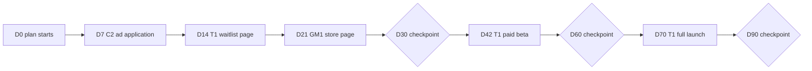

# A 90-Day Plan, Worked Through

> **Learning goal**: Apply the tools of documents 01-09 to the example studio all at once, and be able to write your own 90-day plan that triages twelve prototypes and sets hours, experiments, launch dates, revenue scenarios, runway and checkpoints.

This document adds no new theory. It is practice in using the earlier documents' tools **in order, in one pass**. All numbers are illustrative assumptions; sources for fees and benchmarks are in the relevant documents.

As of: 2026-09-29.

## Key Concepts

Starting point (assumption, the example studio from document 01):

| Item | Value |
|---|---|
| People | 1 person + AI agents |
| Available working hours per month | 160 hours |
| Money needed per month | Living costs KRW 3.0M + fixed costs KRW 0.5M = KRW 3.5M |
| Operating funds | KRW 18M |
| Runway | 1,800 ÷ 350 = 5.14 → about 5.1 months |
| Prototypes | 12 (including the launched P1): 3 games, 4 creative tools, 3 productivity apps, 2 content sites |
| Current revenue | 1 launched (P1, a productivity app, launched 2026-06-15 by assumption), KRW 0 a month |
| C2 traffic | 5,000 pageviews a month at D0 (05) |

The 90-day plan runs in seven steps: (1) triage the 12 (02, 03) (2) choose 2-3 bets (02) (3) allocate hours totaling 160 (01, 08) (4) validation experiments and thresholds (03, 09) (5) launch schedule (08) (6) revenue scenarios and runway (01, 04-07) (7) day 30, 60 and 90 checkpoints (09).

## Principles

- **Why 90 days**: spending 90 days of a 5.1-month runway still leaves about two months to change direction if the plan is wrong. It fits one of document 08's 8-week cycles and part of the next.
- **Scoring criteria** (1-5 points each, 25 total):
  - D demand signal: evidence by document 03's standards (conversations, waitlist, pre-sales)
  - M money path: is the way to get paid clear and attachable right away (04-07)
  - S closeness to launch: higher when less work remains
  - R reach: is there already a channel to bring the first 100 users (08)
  - F fit: skills, interest, existing assets
- **Tie-break rule**: on equal scores, pick **the one that adds more model diversity to the portfolio** (document 02's barbell).
- **WIP limit**: following document 02's recommended starting point, at most two in building (T1, C2) and two in validation (GM1's store page, P2's fake door). The operating P1 comes on top (02's operating slot).

## Applied: The Example Studio

### Step 1: Triage

| Code | Prototype (assumed) | D | M | S | R | F | Total | Verdict |
|---|---|---|---|---|---|---|---|---|
| T1 | Pixel art editor (web) | 4 | 4 | 4 | 4 | 4 | 20 | Main bet |
| C2 | Tech docs site (preparing AdSense) | 3 | 3 | 5 | 4 | 5 | 20 | Low-cost bet |
| GM1 | Roguelike puzzle (PC) | 3 | 4 | 2 | 3 | 5 | 17 | Small bet (wishlists) |
| P2 | Freelancer quote generator | 4 | 4 | 3 | 3 | 3 | 17 | Validate: one fake door |
| T3 | Font pairing tool | 2 | 2 | 5 | 3 | 2 | 14 | Archive |
| P1 | Habit tracker (launched) | 2 | 2 | 5 | 2 | 3 | 14 | Maintenance only, verdict at D90 |
| T2 | Music sketch tool | 3 | 3 | 2 | 2 | 3 | 13 | Archive |
| T4 | Video subtitle editor | 3 | 3 | 2 | 2 | 3 | 13 | Archive |
| GM3 | Narrative adventure (PC) | 2 | 3 | 1 | 2 | 4 | 12 | Archive |
| C1 | Recipe curation site | 2 | 2 | 4 | 2 | 2 | 12 | Archive |
| GM2 | Hyper-casual (mobile) | 2 | 2 | 4 | 1 | 2 | 11 | Archive |
| P3 | Budgeting app | 2 | 2 | 3 | 2 | 2 | 11 | Archive |

- GM1 and P2 tie at 17. P2 uses the same "sell a tool on the web" model as T1, while GM1 adds a different model, a premium game. By the tie-break rule, GM1 gets 32 hours a month and is validated through a Steam store page, while P2 gets only a 4-hour-a-month fake door validation.
- **P1 and the G4 gate**: P1 launched on 2026-06-15 (assumption), so G4's 60-day window (2026-08-14) had already passed before D0, but P1 shipped before G4 in 02 (60 days after launch: monthly net revenue of KRW 100,000 or more, or 100 weekly active users) existed, so it had no criteria set in advance. With KRW 0 revenue it already misses G4's revenue bar, but inventing criteria after seeing the result and ruling at once would also be judging after the fact. So at D0 the first date and state are written with **the same numbers** as G4: "At D90 (2027-01-03), if P1 has fewer than 100 weekly active users and under KRW 100,000 monthly net revenue, archive it and move its 4 maintenance hours to the bet that passed 09's gate (P2 if T1 was archived)." Until then it gets only 4 hours of maintenance, and the criterion does not change again (the decision-rule table in 09).
- **How P2 is validated**: 02 and 03 validate a productivity app candidate with interviews first (G1). P2 passed G1 last quarter when 4 of 5 interviewees said they had faced the problem recently (the basis of its D score of 4, assumption), so this quarter measures G2 with a fake door waitlist page. The method did not change; the gate moved one step forward.
- The 7 archived prototypes (games GM2 and GM3, creative tools T2, T3 and T4, productivity app P3, content site C1) match 02's archive. 1 operating + 2 building + 2 validating + 7 archived = 12.
- **Archive** is not deletion. The repository stays; only the time allocation goes to zero. It re-enters next quarter's triage.

### Steps 2-3: Bets and Hour Allocation

| Item | Per week | Per month (× 4 weeks) | Share |
|---|---|---|---|
| T1 pixel art editor | 16 hours | 64 hours | 40% |
| GM1 roguelike puzzle (store page, demo core loop) | 8 hours | 32 hours | 20% |
| C2 tech docs site (articles, ad application) | 6 hours | 24 hours | 15% |
| Shared distribution (communities, newsletter, waitlists) | 4 hours | 16 hours | 10% |
| Management and reviews (bookkeeping, weekly and monthly reviews) | 4 hours | 16 hours | 10% |
| P2 fake door | 1 hour | 4 hours | 2.5% |
| P1 maintenance | 1 hour | 4 hours | 2.5% |
| Total | 40 hours | 160 hours | 100% |

**Deviations from 02's default allocation** (02's table is the default)

| 02 area | 02 default | This plan | Difference | Reason |
|---|---|---|---|---|
| Operate | 32 | 20 (shared distribution 16 + P1 4) | −12 | P1 is on maintenance only until its D90 verdict. What the 16 hours of shared distribution contain is in the table in 02's Going Deeper |
| Build | 80 | 88 (T1 64 + C2 24) | +8 | T1 is the main bet, so 16 hours a week (08's 60-hour appetite in about 4 weeks) |
| Validate | 24 | 36 (GM1 32 + P2 4) | +12 | By the tie-break rule, 32 hours go to GM1's store page and demo. P2 passed G1, so only 4 hours of fake door |
| Manage | 24 | 16 (management and reviews) | −8 | Only bookkeeping and the weekly and monthly reviews (09) remain; learning time is zero this quarter |
| Total | 160 | 160 | 0 | |

### Step 4: Validation Experiments and Thresholds

| Product | Experiment | Window | Double down or pass | Kill or rework |
|---|---|---|---|---|
| T1 | Waitlist page + Van Westendorp survey + early-bird pre-sale (03, 06) | D14-D42 | 10% or more of 300 visitors sign up, or 5 early-bird payments (document 02's G2 gate) | Under 5% sign-up and zero payments → revise the message once and remeasure |
| T1 | Paid beta trial to payment | D42-D60 | 10% or more (document 09 rule) | Under 3% |
| C2 | AdSense application, two articles a week | D7-D90 | 10,000 or more monthly page views at D90 | Under 3,000 |
| GM1 | Steam store page goes live | D21-D90 | 1,500 or more total wishlists at D90 | Under 500 |
| P2 | Fake door landing via community posts | D14-D28 | 10% or more of 300 visitors sign up (document 02's G2 gate) → building candidate for next quarter | Below the bar → archive |

### Step 5: Launch Schedule (D0 = Monday 2026-10-05)

| Date | Day | Work |
|---|---|---|
| 2026-10-12 | D7 | C2 AdSense application |
| 2026-10-19 | D14 | T1 waitlist page live, P2 fake door posted |
| 2026-10-26 | D21 | GM1 Steam store page live |
| 2026-11-04 | D30 | Checkpoint 1 |
| 2026-11-16 | D42 | T1 paid beta launch (early bird) |
| 2026-12-04 | D60 | Checkpoint 2 (document 09's dashboard) |
| 2026-12-14 | D70 | T1 full launch |
| 2027-01-03 | D90 | Checkpoint 3, next quarter's triage |

### Step 6: Revenue Scenarios and Runway (assumed)

Monthly net revenue (after fees) is assumed in units of KRW 10,000, and from month 4 onward the month-3 level is assumed to hold. A one-off cost of KRW 200,000 (Steam Direct $100 ≈ KRW 140,000 + domain and tools KRW 60,000) is included.

| Scenario | Month 1 | Month 2 | Month 3 | Balance after 90 days | Monthly net burn after | Months left | Total runway |
|---|---|---|---|---|---|---|---|
| No revenue (baseline) | 0 | 0 | 0 | 1,800 − 1,050 = 750 | 350 | 2.1 | 5.1 months |
| Pessimistic | 0 | 0 | 10 | 1,800 − 1,050 + 10 − 20 = 740 | 350 − 10 = 340 | 740 ÷ 340 = 2.2 | 5.2 months |
| Base | 0 | 30 | 80 | 1,800 − 1,050 + 110 − 20 = 840 | 350 − 80 = 270 | 840 ÷ 270 = 3.1 | 6.1 months |
| Optimistic | 0 | 60 | 180 | 1,800 − 1,050 + 240 − 20 = 970 | 350 − 180 = 170 | 970 ÷ 170 = 5.7 | 8.7 months |

- The baseline row is for comparison, so it leaves out the one-off cost. 750 ÷ 350 = 2.14 → 3 + 2.1 = 5.1 months.
- No scenario reaches KRW 3.5M a month (default alive, document 01) within 90 days. The goal of the 90 days is not survival but **extending the runway while finding the product to double down on next quarter**.
- Document 09's day-60 dashboard (T1 KRW 450,000 + C2 KRW 30,000 = KRW 480,000) sits between base (300,000) and optimistic (600,000).

### Step 7: Checkpoints

| When | Question | Pass bar | If it fails |
|---|---|---|---|
| D30 (11-04) | Is T1's waitlist filling, and what did P2's fake door show | T1 sign-up 10% or more, or 5 or more early-bird payments | Rework T1's message and price; the paid beta may slip one week (the date moves only once) |
| D60 (12-04) | Are people paying | T1 trial to payment 10% or more, 30-day net revenue KRW 400,000 or more | 3-10% means continue; under 3% means archive T1 (09's rule) and make P2 the next bet candidate. 10% or more adds 16 hours a month to T1 (below) |
| D90 (01-03) | Which scenario are we in | Base or better (month-3 net revenue KRW 800,000 or more) | Net revenue of KRW 300,000-800,000 keeps the default allocation, with R1 rechecked on the first of next month. If rule R1 in Going Deeper fires (balance under KRW 7M or net revenue under KRW 300,000), shift 80 hours a month to contract work and keep only one bet that passed 09's gate (if T1 was stopped at D60, no building and only one validation slot, P2) |

- If GM1 has 1,500 or more wishlists at D90, decide on joining the February 2027 Next Fest before its registration deadline (2027-01-10) (document 07). If it misses the bar, archive GM1.
- If T1 is judged double down at D60, the monthly allocation for D60-D90 becomes T1 64 → 80, GM1 32 → 24, P2 4 → 0 (the fake door ended at D28), management and reviews 16 → 12. The total stays at 160 hours (09's decision journal).
- At D90, P1 is judged by the rule written in step 1 (fewer than 100 weekly active users and under KRW 100,000 monthly net revenue → archive, its 4 hours go to the bet that passed 09's gate).
- Record every verdict in document 09's decision journal.

Bad example:

> Decided to move all twelve forward "a little each". After 90 days: zero launches and KRW 7.5M left.

Good example:

> Gave time only to two building and two validation slots, kept P1 on maintenance, and wrote the other seven on the archive list with dates. At D60, T1's payment rate passed the bar, so its hours went up.

## Going Deeper

### When the Plan Is Wrong

- **The pessimistic scenario** is a default-dead signal. **Cutting burn is faster than raising revenue**. Reducing monthly net burn with certain income such as contract work or teaching extends the runway again.
- **When numbers hover ambiguously near a bar**: follow the pre-set rule and "continue", running only the one experiment most likely to move the primary metric before the next gate.
- **When a new idea appears**: write it on the archive list and let it compete on the same scoring table in next quarter's triage. Do not raise WIP mid-quarter.

### Rules for Switching to Contract Work or a Job

Write the studio-wide stop lines in advance too, in 09's "states and dates" form. All numbers are assumptions and taxes are left out (contract income is pre-tax).

| Rule | When checked | State | Action |
|---|---|---|---|
| R1 switch to contract work | D90 (2027-01-03), then the first of every month | Balance < KRW 7M (two months of burn) or previous month's net revenue < KRW 300,000 | From the next month, 80 hours a month of contract work (assumed KRW 50,000 an hour = KRW 4M a month, the same rate as 04's service model). Product hours drop to 80, and only one bet that passed 09's gate continues (if T1 was stopped at D60, no building and only one validation slot, P2) |
| R2 switch to full-time | Every Monday review (09) | Balance < KRW 3.5M (one month of burn) | Full-time contract or a job. Products are archived or kept on 4 hours a week of maintenance |
| Scale contract work down | The first of every month | Product net revenue of KRW 1.75M (half the burn) or more for two months in a row | Cut contract work to 40 hours a month |

Applying R1 to the scenarios in step 6 (KRW 10,000 units, contract rate KRW 50,000 an hour, product net revenue assumed to stay at the month-3 level during contract work):

| Scenario | Balance at D90 | Month-3 net revenue | R1 | Monthly net burn after | Result |
|---|---|---|---|---|---|
| No revenue | 750 | 0 | Fires (revenue) | 350 − 0 − 400 = −50 | 50 surplus a month, no burn. T1 already archived at D60 |
| Pessimistic | 740 | 10 | Fires (revenue) | 350 − 10 − 400 = −60 | 60 surplus a month, no burn. T1 already archived at D60 |
| Base | 840 | 80 | Does not fire | 270 | Balance 570 < 700 at the start of month 5 → fires then (if revenue does not grow) |
| Optimistic | 970 | 180 | Does not fire | 170 | Balance 630 < 700 at the start of month 6 → fires then (if revenue does not grow) |

In the no-revenue and pessimistic rows, T1 has already been archived by the D60 rule, so the remaining 80 hours go only to P2's validation and running C2.

If the contract rate is lower than assumed (no-revenue scenario, balance KRW 7.5M at D90):

| Contract rate | Monthly contract income | Monthly net burn | Runway |
|---|---|---|---|
| KRW 50,000 | KRW 4.0M | −KRW 0.5M | No burn |
| KRW 40,000 | KRW 3.2M | KRW 0.3M | 750 ÷ 30 = 25 months |
| KRW 30,000 | KRW 2.4M | KRW 1.1M | 750 ÷ 110 ≈ 6.8 months |

- If the first payment arrives a month late (common with contract work), month 4 brings no income and month 5 starts at 750 − 350 = KRW 4M. That is only KRW 0.5M above the R2 line (KRW 3.5M), so if D60 already shows a miss on the base scenario, start looking for contract work early.
- With no contract work and still no revenue, the balance reaches about KRW 3.3M (750 − 36 days × 350 ÷ 30) at D126 (2027-02-08, a Monday review), and R2 fires.
- Contract work halves the product hours. This rule is not giving up on the studio; it rebuilds the safe end of 02's barbell.

## Common Misconceptions

- **"The scoring table gives the right answer."** The table is a tool for recording and comparing judgment. Leave one line of reasoning per score so it can be corrected next quarter.
- **"Archiving means throwing away."** Archiving is only a decision not to give time. When new signals appear, it returns at the next triage.
- **"Plan on the optimistic scenario."** Plan on the base scenario and write the response to the pessimistic scenario in advance.
- **"Success means earning living costs within 90 days."** In this example, success means extending the runway and finding one product to double down on.

## Self-Check Questions

1. Score your own prototype list on D, M, S, R and F, and pick the top three by total. How do you break ties?
2. If the main bet gets 40% of a 40-hour week, how many hours is that a month? Allocate the rest so the total is 160 hours.
3. If month-3 net revenue is KRW 500,000 and holds after that, what is the total runway including the KRW 200,000 one-off cost? (Months 1 and 2 net revenue are 0 and KRW 200,000.)
4. If T1's payment rate is 5% at the D60 checkpoint, what is the verdict under document 09's rules?
5. Use the runway formula to explain why, in the pessimistic scenario, you cut burn before raising revenue.

## References

- [Paul Graham - Default Alive or Default Dead? (2015)](https://paulgraham.com/aord.html) (accessed 2026-09-29)
- [Basecamp - Shape Up](https://basecamp.com/shapeup) (accessed 2026-09-29)
- [Behavioral Scientist - Annie Duke, Mental Models to Help You Cut Your Losses](https://behavioralscientist.org/annie-duke-quit-mental-models-to-help-you-cut-your-losses/) (accessed 2026-09-29)
- [Steamworks - Steam Direct Fee](https://partner.steamgames.com/doc/gettingstarted/appfee) (accessed 2026-09-29)
- [Steamworks - Steam Next Fest: February 2027](https://partner.steamgames.com/doc/marketing/upcoming_events/nextfest/feb_2027) (accessed 2026-09-29)
