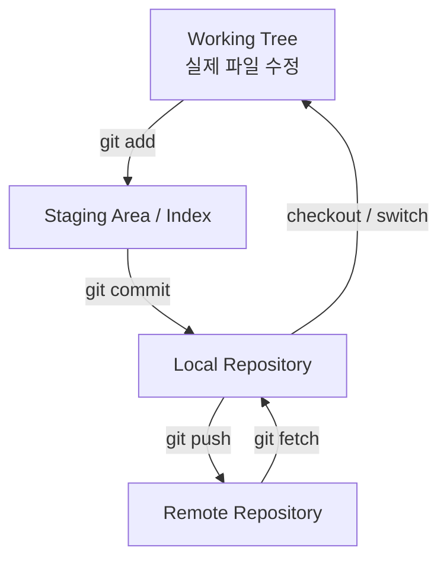

# Git 전체 구조 한 번에 보기

Git을 어렵게 만드는 이유는 “파일”, “Commit”, “Branch”, “Remote”가 서로 다른 층에 있기 때문이다.

먼저 전체 구조를 하나의 그림으로 잡는다.



## 네 개의 핵심 층

| 층 | 의미 |
|---|---|
| Working Tree | 실제로 편집하는 파일 |
| Staging Area | 다음 Commit에 넣을 변경 |
| Local Repository | 내 PC의 Git History |
| Remote Repository | GitHub/GitLab 등의 공유 저장소 |

## 기본 흐름

```text
파일 수정
↓
git add
↓
Staging
↓
git commit
↓
Local Repository
↓
git push
↓
Remote Repository
```

## 반대 방향

```text
Remote Repository
↓ git fetch
Local Repository의 remote-tracking refs 갱신
↓ merge / rebase
Local Branch 갱신
↓ checkout 결과
Working Tree
```

## 가장 중요한 구분

### `stable`

Local Branch다.

### `origin/stable`

Remote Branch 그 자체가 아니라 **내 Local Repository가 기억하고 있는 origin의 stable 위치**, 즉 Remote-Tracking Reference다.

```text
Worktree
  ↓
stable               Local Branch
  ↓ tracks
origin/stable        Remote-Tracking Ref
  ↓ corresponds to
GitHub stable        Remote Branch
```

## Git을 배울 때의 추천 순서

1. Working Tree / Stage / Commit
2. Branch / HEAD
3. Remote / fetch / push
4. Worktree
5. Merge / Rebase / Cherry-pick
6. Restore / Revert / Reset
7. PR / Code Review / Actions

이 순서를 따르면 개별 명령을 외우기보다 “어느 층을 바꾸는 명령인가”로 이해할 수 있다.