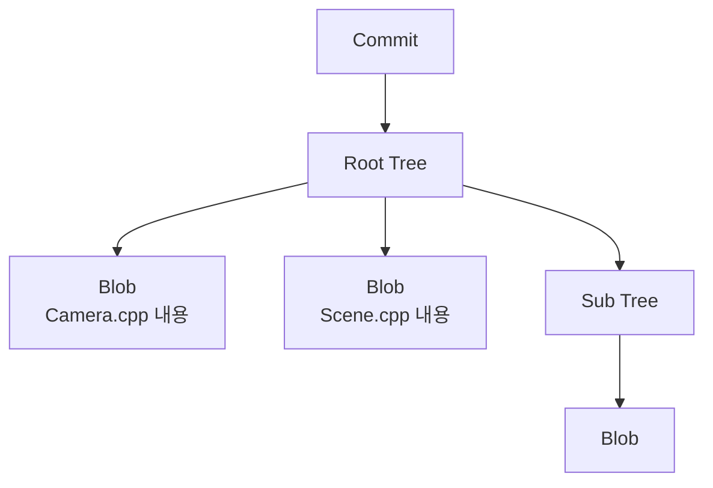

# Repository, Git Object, Branch

## Local Repository와 Remote Repository

```text
Local Repository
= 내 컴퓨터의 Git 저장소

Remote Repository
= GitHub/GitLab/사내 Git 서버의 저장소
```

하나의 Local Repository에는 여러 Remote를 등록할 수 있다.

```text
Local Repository
├─ origin  → GitHub
├─ backup  → GitLab
└─ upstream → 공식 원본 저장소
```

## Git Object란?

Git은 내부적으로 데이터를 Object 단위로 저장한다.

| Object | 역할 |
|---|---|
| Blob | 파일 내용 |
| Tree | 파일명과 폴더 구조 |
| Commit | 특정 시점 Snapshot + 메타데이터 |
| Tag object | 특정 Object에 붙이는 annotated tag |



Commit은 보통 다음 정보를 가진다.

```text
Commit
├─ Tree
├─ Parent Commit
├─ Author
├─ Committer
├─ Message
└─ Time
```

## Branch는 Object가 아니다

Branch는 특정 Commit을 가리키는 **움직이는 Reference**다.

```text
feature/camera
      ↓
   Commit D
```

새 Commit을 만들면 Branch가 새 Commit으로 이동한다.

```text
Before
A ─ B ─ C
        ↑ feature

After commit
A ─ B ─ C ─ D
            ↑ feature
```

## Bare Repository

Bare Repository는 Working Tree 없이 Git 데이터만 가진 저장소다.

일반 Repository:

```text
Project/
├─ Source/
├─ README.md
└─ .git/
```

Bare Repository:

```text
project.git/
├─ objects/
├─ refs/
├─ HEAD
└─ config
```

서버는 파일을 직접 편집할 필요가 없으므로 Bare 형태가 자연스럽다.

## 원격 저장소를 여러 개 두는 이유

- 백업
- GitHub + GitLab 미러
- Fork와 공식 원본 분리
- 회사/외부 배포 분리
- 권한 경계 분리

그러나 **Claude와 Codex가 동시에 개발한다는 이유만으로 Remote Repository를 나눌 필요는 없다.** 그런 경우에는 하나의 Remote + 여러 Branch/Worktree가 더 단순하다.