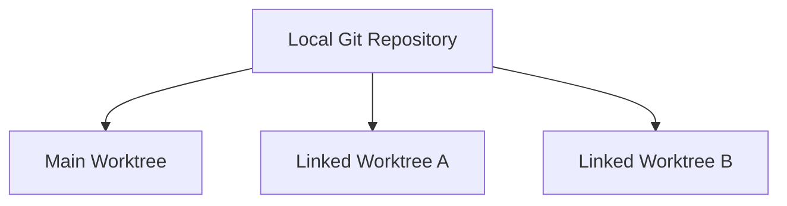

# Worktree 완전 이해

Worktree는 **특정 Commit/Branch의 파일 상태를 실제 폴더로 펼쳐 놓은 작업 공간**이다.

## 왜 필요한가

일반적인 한 Working Tree에서는 한 시점에 하나의 Branch만 checkout한다.

여러 기능을 동시에 개발하려면 Branch를 계속 switch해야 한다.

Worktree를 사용하면:

```text
Local Repository
├─ Main Worktree   → stable
├─ Linked WT A     → feature/a
└─ Linked WT B     → feature/b
```

처럼 동시에 유지할 수 있다.

## Main Worktree란?

`git clone`으로 처음 만들어진 기본 작업 폴더가 Main Worktree다.

```text
C:/Dev/MyProject/
├─ Source/
├─ README.md
└─ .git/
```

추가로 만든 Worktree는 Linked Worktree다.

Main이 Linked Worktree의 부모라는 뜻은 아니다.



## 무엇을 공유하고 무엇을 분리하는가

| 항목 | 공유 여부 |
|---|---|
| Git Object DB / Commit History | 공유 |
| Remote 설정 | 공유 |
| Branch refs | 공유 |
| 실제 작업 파일 | 분리 |
| HEAD | 분리 |
| Index / Staging | 분리 |
| Uncommitted Changes | 분리 |

추가 Worktree의 `.git`은 보통 디렉터리가 아니라 Main Repository의 Git data를 가리키는 파일이다.

## 한 Worktree가 여러 Branch를 동시에 볼 수 있나?

아니다. **1 Worktree = 1 HEAD**다.

Branch를 바꿀 수는 있지만 한 순간에는 하나다.

## Branch가 없는 Worktree가 가능한가?

가능하다. Detached HEAD 상태다.

## 여러 Worktree가 하나의 Branch를 볼 수 있나?

같은 Local Repository에서는 Git이 기본적으로 막는다.

```text
WT A → feature/camera
WT B → feature/camera   X
```

같은 Branch 포인터를 두 폴더가 동시에 움직이는 위험을 막기 위해서다.

서로 다른 개발자의 PC는 Local Repository 자체가 다르므로 같은 Remote Branch를 각각 checkout할 수 있다.

## Remote Repository에도 Worktree가 있는가?

일반적인 GitHub Remote에는 “Claude Worktree A” 같은 작업 공간은 없다.

Remote에는 Commit, refs, tags 같은 Git 데이터가 있다.

Worktree는 Local 작업 공간 개념이다.

## 새 작업 B를 깨끗한 stable에서 시작

Worktree A가 미완성 상태여도 그대로 둔다.

```text
Main WT → stable (clean)
WT A    → feature/a (uncommitted changes)
```

새 작업:

```bash
git fetch origin
git worktree add ../worktrees/b -b feature/b origin/stable
```

결과:

```text
Main WT → stable
WT A    → feature/a  수정 중 그대로
WT B    → feature/b  최신 origin/stable에서 시작
```

A를 stash하거나 commit할 필요가 없다.

## AI Coding Agent와 Worktree

권장:

```text
Session A ↔ Worktree A ↔ feature/a
Session B ↔ Worktree B ↔ feature/b
```

기존 Session이 `git worktree add`를 실행해 B를 생성해도 그 Session 자체가 B로 이동하는 것은 아니다.

새 Session을 B 경로에서 시작한다.