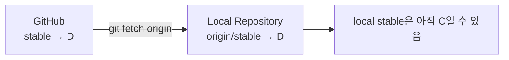

# Remote, Fetch, Pull, Push, Upstream

## origin은 무엇인가

`origin`은 Remote Repository에 붙인 **이름**일 뿐이다.

```text
origin → https://github.com/.../project.git
```

Remote 이름은 여러 개 둘 수 있다.

```bash
git remote add backup ...
git remote add upstream ...
git remote -v
```

## Fetch

Fetch의 본질:

> Remote의 최신 Git Object와 Ref 정보를 Local Repository로 가져온다.



즉:

```text
fetch
= object 다운로드
+ remote-tracking refs 생성/갱신
```

하지만 Local Branch는 자동으로 움직이지 않는다.

## Remote-Tracking Reference

```text
stable
= Local Branch

origin/stable
= 마지막 fetch 시점에 Local이 알고 있는 origin의 stable 위치
```

## Pull

Pull은 개념적으로:

```text
fetch
+
현재 Branch에 통합
```

통합 방식은 설정에 따라 merge 또는 rebase가 될 수 있다.

stable 같은 기준 Branch는 불필요한 merge commit을 피하기 위해:

```bash
git pull --ff-only
```

처럼 Fast-forward only 정책을 둘 수 있다.

## Push

Push는 Local Commit/Ref를 Remote로 보낸다.

첫 Push:

```bash
git push -u origin feature/camera
```

`-u`는 이후 Local Branch가 어떤 Remote Branch를 추적할지 upstream 관계를 설정한다.

## Upstream의 두 의미

### Remote 이름으로서 upstream

Fork Workflow에서 흔하다.

```text
origin   → 내 Fork
upstream → 공식 원본
```

### Branch upstream

Local Branch가 추적하는 대상이다.

```text
local feature/camera
      ↓ tracks
origin/feature/camera
```

두 의미를 혼동하지 않는다.

## Downstream

Downstream은 Git의 핵심 설정 이름이라기보다 관계 설명에 가깝다.

```text
공식 원본 → Fork → Feature Branch
upstream           downstream
```

## 다른 사람이 Push한 Branch를 공동 작업

다른 사람이 Push한 Branch도 `git fetch origin` 후 `git switch --track origin/<branch>`로 받아 함께 작업할 수 있으며, 동시에 Push할 때 생기는 문제와 Branch를 나누는 방법은 「협업 · Push · PR · Code Review」에서 다룬다.