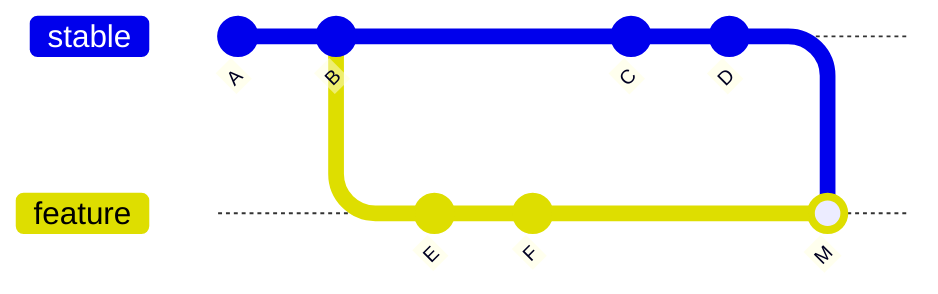

# Merge, Rebase, Cherry-pick

셋 다 “다른 변경을 가져온다”는 점 때문에 헷갈린다.

가장 중요한 것은 **주체와 객체**를 먼저 보는 것이다.

> 대부분의 명령에서 **현재 Checkout된 Branch가 주체**다.

## Merge

현재 Branch가 `feature`일 때:

```bash
git merge stable
```

- 주체: `feature`
- 객체: `stable`
- 의미: stable의 History를 feature에 합친다.



기존 Commit들은 유지되고 분기와 합류가 History에 남는다.

## Rebase

현재 `feature`에서:

```bash
git rebase origin/stable
```

- 주체: `feature`
- 새로운 Base: `origin/stable`
- 의미: feature 고유 Commit을 최신 stable 뒤에 **새 Commit으로 다시 생성**

```text
Before

A ─ B ─ C ─ D   stable
           E ─ F     feature

After rebase

A ─ B ─ C ─ D   stable
                             E' ─ F' feature
```

### 중요한 오해

Rebase한다고 Feature Branch가 삭제되거나 stable에 합쳐지는 것이 아니다.

```text
stable  → D
feature → F'
```

두 Branch는 그대로다.

실제로 stable에 넣는 단계는 이후 PR + Merge다.

### 왜 Push가 문제될 수 있나

Rebase는 Commit Hash를 바꾼다.

이미 Remote에 Push했던 Feature Branch를 Rebase하면 일반 Push가 거절될 수 있고, 팀 정책상 허용되는 경우에만 `--force-with-lease`를 고려한다.

## Cherry-pick

현재 Branch에서:

```bash
git cherry-pick abc123
```

- 주체: 현재 Branch
- 객체: Commit `abc123`
- 의미: 그 Commit의 **변경 내용만 복제한 새 Commit**을 만든다.

```text
feature-A
A ─ B ─ C

feature-B
X ─ Y ─ C'
```

C가 이동한 것이 아니라 C의 Patch가 C'로 다시 적용된 것이다.

## 선택 기준

| 상황 | 선택 |
|---|---|
| 두 Branch History를 그대로 합침 | Merge |
| 내 Feature를 최신 stable 위에 정렬 | Rebase |
| 다른 Branch의 Commit 하나만 필요 | Cherry-pick |

## Conflict 처리

### Merge

```bash
git merge --abort
```

### Rebase

```bash
git add <resolved>
git rebase --continue
git rebase --abort
```

### Cherry-pick

```bash
git add <resolved>
git cherry-pick --continue
git cherry-pick --abort
```

## 초보자 운영 원칙

- 기본 통합: PR + Merge
- 개인 Feature 최신화: Rebase를 고려
- 특정 수정만 가져오기: Cherry-pick
- 공유 Branch Rebase: 매우 신중
- 방향을 모르겠으면 실행 전 **현재 Branch / 대상 / 예상 결과**를 먼저 적어 본다.