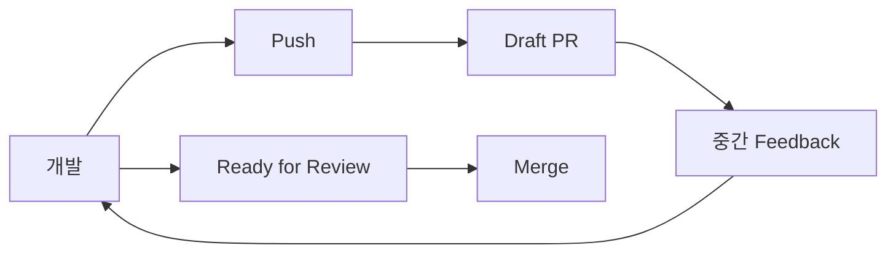

# 협업: Commit, Push, PR, Code Review

## Commit과 Push의 차이

```text
Commit
= 내 Local Repository에 기록

Push
= Remote Repository에 공유
```

Local에서 Commit만 하고 Push하지 않았다면 일반적인 협업자는 그 Commit을 볼 수 없다.

## Local Branch를 만들기만 하면?

Remote에는 아직 없다.

```text
Local
feature/camera

Remote
없음
```

첫 Push:

```bash
git push -u origin feature/camera
```

이제 협업자가 fetch해서 볼 수 있다.

## Push만으로도 리뷰할 수 있나?

가능하다.

```text
Branch Push
→ 협업자가 fetch
→ 직접 branch checkout
→ 확인
```

하지만 체계적인 리뷰는 PR이 편하다.

## Pull Request의 역할

PR은 단순히 Merge 버튼이 아니다.

- 변경 파일 목록
- Line diff
- Commit 목록
- Reviewer 지정
- Line comment
- Discussion
- CI 상태
- Approve / Request Changes
- Merge

즉:

> **Push = 작업 공개**  
> **PR = 공식 리뷰 프로세스 시작**

## Draft PR

작업이 끝나기 전에 중간 피드백을 받고 싶다면 Draft PR이 유용하다.



## PR Merge 전에 Branch를 삭제하면?

### Local Branch만 삭제

Remote Branch가 남아 있다면 PR에는 보통 영향이 없다.

### Remote Head Branch 삭제

GitHub UI에서는 열린 PR의 Head Branch를 삭제할 수 없다. `git push origin --delete <branch>`처럼 `git push`로 삭제하면 그 PR은 닫힌다.

따라서 기본 순서:

```text
개발
→ Push
→ PR
→ Review
→ Merge
→ Branch 삭제
```

## 같은 Branch를 여러 개발자가 공동 작업

기술적으로 가능하다.

하지만 각자 Commit을 만든 뒤 Push하면 자주 non-fast-forward가 발생한다.

```text
Developer A: C ─ A1
Developer B: C ─ B1
```

B는 A1을 먼저 통합해야 Push할 수 있다.

일반적으로는:

```text
Developer A → feature/camera-core
Developer B → feature/camera-ui
                 ↓
                PR
```

처럼 책임을 분리하는 편이 안정적이다.

## Code Review와 Peer Review

- Design Review: 구현 전 설계 확인
- WIP Review: 작업 중간 방향 확인
- Code Review / Peer Review: PR에서 코드 확인
- Integration / Regression Test: Merge 후 전체 영향 확인

좋은 협업은 “완료 후 검수”만 있는 것이 아니라 **설계 → 중간 → 코드 → 통합**의 여러 검증 단계가 있다.