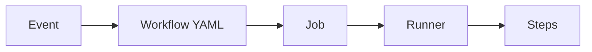

# GitHub Actions, Hook, Cron, YAML

세 개는 자주 같이 등장하지만 서로 다른 개념이다.

## GitHub Actions

GitHub 안에서 이벤트가 발생했을 때 자동 작업을 실행하는 시스템이다.



예:

```yaml
name: PR Check

on:
  pull_request:
    branches: [stable]

jobs:
  build:
    runs-on: windows-latest
    steps:
      - uses: actions/checkout@3d3c42e5aac5ba805825da76410c181273ba90b1 # v7.0.1
      - run: cmake -S . -B build
      - run: cmake --build build
```

`uses:` 뒤의 긴 문자열은 Action을 Tag 대신 Commit SHA로 고정한 것이다. 이유와 방법은 「GitHub Actions 실전」에 있다.

## 가장 흔한 Trigger

| Trigger | 의미 |
|---|---|
| push | Push 후 실행 |
| pull_request | PR 생성/갱신 시 |
| workflow_dispatch | 사람이 버튼으로 실행 |
| schedule | 정해진 시간에 실행 |
| release | Release 이벤트 |
| workflow_call | 다른 Workflow가 호출 |

## Hook

Hook은 특정 Git 행동 전후에 실행되는 **로컬 Script**다.

예: pre-push hook

```text
git push
↓
pre-push hook
↓
Local Build / Test
↓
성공하면 Push
```

Hook은 YAML이 아니다. Shell, Python 등 실행 가능한 Script일 수 있다.

## Cron

Cron은 **시간 예약 표현식**이다.

```text
분 시 일 월 요일
0  3  *  *  *
```

→ 매일 03:00

GitHub Actions의 YAML 안에서 Cron을 사용할 수 있다.

```yaml
on:
  schedule:
    - cron: '0 18 * * *'
```

GitHub Actions의 `schedule`은 UTC 기준으로 실행된다. 그래서 매일 한국 시간(KST) 03:00은 `'0 18 * * *'`이다.

즉:

```text
YAML
└─ schedule
   └─ cron 표현식
```

## Push 전 Build도 쓰는가?

많이 쓴다. 다만 보통 GitHub Actions가 아니라 **Local Build**다.

```text
구현
↓
Local Incremental Build / Test
↓
Commit
↓
Push
↓
GitHub Actions Clean Build / Test
↓
PR Review
```

큰 C++ 프로젝트에서는 매 Push마다 Full Build를 강제하는 것보다:

- Local: 빠른 Incremental Build
- CI: Clean Build
- Nightly: 무거운 Regression

으로 단계화하는 편이 효율적이다.

## 추천 Workflow

```text
.github/workflows/
├─ pr-check.yml
├─ stable-check.yml
├─ manual-build.yml
└─ nightly.yml
```

### PR Check

빠른 Compile/Test

### Stable Check

Merge 후 Integration 확인

### Manual Build

필요할 때만 Full Build

### Nightly

전체 Regression, Import/Export, Performance 등 무거운 검사

Actions는 “기능이 사용자에게 좋은가”를 판단하지 않는다. **기계적으로 검증 가능한 조건을 자동화하는 계층**이다.