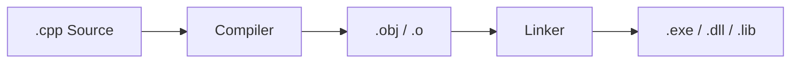
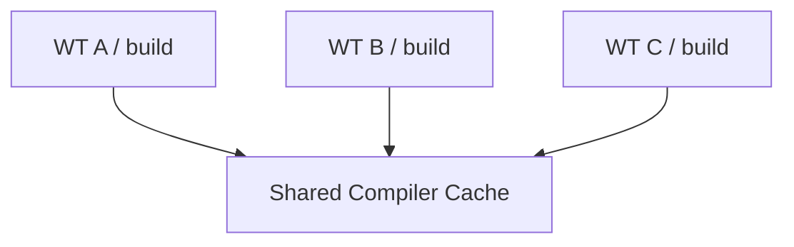

# Build Directory와 Worktree 용량

Build Directory는 Git 개념이 아니라 C/C++ Build System의 작업 공간이다.

## Source와 Build의 차이

```text
Source/
├─ Camera.cpp
├─ Scene.cpp
└─ Main.cpp

build/
├─ *.obj
├─ *.lib
├─ *.dll
├─ *.exe
├─ *.pdb
├─ CMakeCache.txt
└─ generated files
```

## Build 과정



## Incremental Build

첫 Build는 많은 파일을 컴파일한다.

다음 Build에서는 수정된 파일의 결과만 다시 만들 수 있다.

```text
Camera.cpp 수정
↓
Camera.obj 재생성
Scene.obj 재사용
UI.obj 재사용
↓
Link
```

Build Directory를 지우면 보통 다음 Build는 더 비싼 Clean Build가 된다.

## 여러 Worktree에서 용량이 커지는 이유

Git Object DB는 Worktree끼리 공유하지만 Build 결과물은 보통 각 Worktree에 별도로 생긴다.

```text
WT A
├─ Source
└─ build 40 GB

WT B
├─ Source
└─ build 42 GB

WT C
├─ Source
└─ build 38 GB
```

문제의 주범은 주로:

- .obj
- .pdb
- .lib
- generated code
- shader cache
- dependency build outputs

## 해결 전략

### 1. 각 Worktree의 Build Directory는 분리

공유 Build Directory는 위험하다.

```text
WT A → build/A
WT B → build/B
```

### 2. 비활성 Worktree의 Build는 삭제

Source와 Commit에는 영향이 없다. 필요하면 다시 생성한다.

### 3. Merge된 Worktree 제거

```bash
git worktree remove ../worktrees/camera
git branch -d feature/camera
```

### 4. Compiler Cache 공유

`ccache` / `sccache` 같은 캐시를 공유할 수 있다.



Build Directory 자체는 분리하면서 이미 컴파일한 결과를 재사용한다.

### 5. Dependency Cache 공유

vcpkg / Conan 같은 Dependency Manager의 다운로드·binary cache도 공유 가능하다.

## 실용적인 정리 정책

```text
Active Worktree
→ build 유지

Paused Worktree
→ 필요하면 build 삭제

Merged Worktree
→ worktree + build 제거

공유
→ compiler/dependency cache
```

이 방식은 병렬 개발의 안전성을 유지하면서 디스크 사용량과 반복 Build 시간을 줄인다.