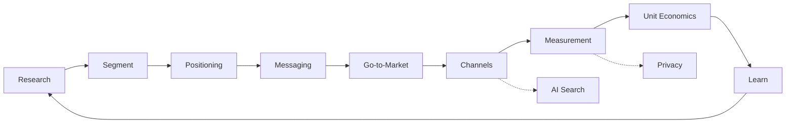

# Marketing 전체 개요

기준일: 2026-09-28

Marketing은 광고를 만드는 일이 아니다.

> **누구에게, 어떤 가치를, 어떤 경로로 전달해서, 어떤 비용으로 고객을 얻고 유지할지를 결정하고 검증하는 일**이다.

이 Track은 개발자·Product Owner가 Marketing 분야 전체를 구조적으로 이해하도록 만든 지도다. 용어 정의보다 **어떤 결정을 어떤 근거로 내리는지**에 집중한다.

## Marketing이 답해야 하는 핵심 질문

1. 누구의 어떤 문제를 겨냥하는가? (Segment, ICP)
2. 대안 대비 우리가 더 나은 이유는 무엇인가? (Positioning)
3. 그것을 어떤 말로 전달하는가? (Messaging)
4. 어떤 방식으로 시장에 들어가는가? (Go-to-Market)
5. 어떤 채널로 도달하고 관계를 유지하는가? (Channels, Lifecycle)
6. 실제로 효과가 있었는가? (Measurement, Incrementality)
7. 돈이 되는 구조인가? (CAC, LTV, Payback)
8. 법과 신뢰의 선을 지키는가? (Consent, 광고 표시)



## 이 Track의 문서 구성

| 문서 | 다루는 질문 |
|---|---|
| 01 시장·고객 리서치 · Segmentation | 누구의 어떤 Job을 겨냥하는가 |
| 02 Positioning · Messaging · Brand | 왜 우리여야 하며, 어떻게 기억되게 하는가 |
| 03 Go-to-Market · Launch · PLG/SLG | 어떤 Motion으로 시장에 들어가는가 |
| 04 채널 전략 | Content/SEO, Paid, Lifecycle, Community, Partnership 중 무엇을 쓰는가 |
| 05 AI 검색 · GEO/AEO | AI Overviews, ChatGPT search 시대에 발견되려면 |
| 06 측정 · Attribution · Privacy | 무엇이 실제로 효과를 냈는지 어떻게 아는가 |
| 07 Marketing Metrics | CAC, LTV, Payback, Retention을 어떻게 읽는가 |
| 08 AI 활용 Workflow · 리스크 | AI를 어디에 쓰고 어디서 멈추는가 |
| 09 법 · 윤리 · 광고 표시 | 동의, 광고 표시, AI 생성물 표시의 기본 |

## 2024–2026년에 바뀐 것 요약

시점이 중요한 변화만 모았다. 세부 근거는 각 문서의 참고 자료에 있다.

| 영역 | 변화 | 시점 |
|---|---|---|
| Browser | Chrome은 3rd-party Cookie 폐지 계획을 철회했고, Privacy Sandbox API 대부분을 은퇴시키기로 발표 | 2025-04, 2025-10 |
| 검색 | Google AI Overviews 200개+ 국가·지역, 40개+ 언어로 확대, AI Mode에 한국어 추가 | 2025-05, 2025-09 |
| 검색 측정 | Search Console에 생성형 AI 기능 노출 보고서 도입 | 2026-06 |
| AI 답변 광고 | OpenAI가 ChatGPT 광고 테스트 발표, 이후 한국 포함 국가로 확대 보도 | 2026-01, 2026-08 |
| Mobile | Apple ATT에 대해 프랑스·이탈리아 경쟁당국 과징금, 독일은 확약(Commitments) 수용 | 2025-03, 2025-12, 2026-08 |
| 측정 도구 | Google Meridian(오픈소스 MMM) 전체 공개 | 2025-01 |
| 규제 | EU AI Act 제50조 투명성 의무 적용 시작, 한국 AI 기본법 시행 | 2026-08, 2026-01 |
| 광고 표시 | 공정위 추천·보증 심사지침에 AI 가상인물 표시 추가 | 2026-06 시행 |

## 공통 원칙

- **Channel보다 Customer가 먼저다.** 채널 선택은 Segment와 Positioning의 결과다.
- **Attribution 숫자는 증거가 아니라 가설이다.** 인과는 실험으로 확인한다.
- **Metric은 Unit Economics로 연결되어야 한다.** 클릭·노출은 중간 지표일 뿐이다.
- **도구와 정책은 빨리 바뀐다.** 날짜 없는 "요즘은 이렇다"는 믿지 않는다.
- **신뢰는 회복이 비싸다.** 동의, 광고 표시, 사실 확인은 비용이 아니라 전제다.

## Marketing 작업을 단순화하면

```text
고객 이해
→ 선택 (누구, 무엇)
→ 약속 (Positioning, Message)
→ 도달 (Channel)
→ 측정 (Incrementality)
→ 경제성 판단 (CAC, LTV)
→ 다시 선택
```

좋은 Marketing은 예산을 많이 쓰는 것이 아니라 **틀린 고객에게 틀린 약속을 할 확률을 줄이는 것**에 가깝다.

## 참고 자료

- [Update on Plans for Privacy Sandbox Technologies — Google Privacy Sandbox](https://privacysandbox.google.com/blog/update-on-plans-for-privacy-sandbox-technologies) (2025-10-17, 접속 2026-09-28)
- [AI Overviews are now available in over 200 countries and territories — Google](https://blog.google/products-and-platforms/products/search/ai-overview-expansion-may-2025-update/) (2025-05, 접속 2026-09-28)
- [Introducing Search Generative AI performance reports in Search Console — Google Search Central](https://developers.google.com/search/blog/2026/06/gen-ai-performance-reports) (2026-06, 접속 2026-09-28)
- [Testing ads in ChatGPT — OpenAI](https://openai.com/index/testing-ads-in-chatgpt/) (2026-01-16, 접속 2026-09-28)
- [Apple changes its rules for personalised advertising in apps — Bundeskartellamt](https://www.bundeskartellamt.de/SharedDocs/Meldung/EN/Pressemitteilungen/2026/08_17_2026_Apple_ATTF.html) (2026-08-17, 접속 2026-09-28)
- [Meridian is now available to everyone — Google](https://blog.google/products/ads-commerce/meridian-marketing-mix-model-open-to-everyone/) (2025-01-29, 접속 2026-09-28)
- [Transparency obligations under Article 50 of the AI Act — European Commission](https://digital-strategy.ec.europa.eu/en/faqs/transparency-obligations-under-article-50-ai-act) (접속 2026-09-28)
