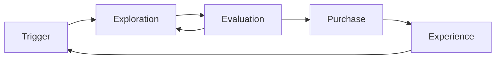

# 시장 · 고객 리서치 · Segmentation

Marketing의 첫 단계는 메시지를 쓰는 것이 아니라 **누구의 어떤 상황을 겨냥할지 고르는 것**이다.

## 리서치가 답해야 하는 질문

- 고객은 어떤 상황에서 어떤 진전(Progress)을 원하는가?
- 지금은 그 문제를 무엇으로 해결하고 있는가? (경쟁 대안, 현상 유지 포함)
- 구매 결정은 누가, 어떤 순서로, 어떤 정보로 내리는가?
- 그 문제에 돈과 시간을 쓸 의지가 있는 집단은 어디인가?

## Jobs to Be Done 관점

Christensen Institute는 JTBD를 **사람이 특정 상황(Circumstance)에서 이루려는 진전**으로 설명한다. 고객은 제품을 사는 것이 아니라 진전을 위해 제품을 "고용(Hire)"한다는 관점이다.

나쁜 예:

> 우리 고객은 25–34세 개발자다.

좋은 예:

> 신규 서비스를 혼자 운영하는 개발자가, 장애가 났을 때 원인을 10분 안에 찾아 팀에 설명해야 하는 상황.

인구통계는 **도달(Targeting)**에는 쓸모 있지만, **구매 이유**를 설명하지는 못한다. JTBD는 기능적·사회적·감정적 차원을 함께 본다.

## 리서치 방법 선택

| 방법 | 알 수 있는 것 | 한계 |
|---|---|---|
| 고객 인터뷰 | 맥락, 이유, 구매 과정 | 표본이 작고 말과 행동이 다를 수 있음 |
| 전환·이탈 인터뷰 | 왜 샀는가 / 왜 떠났는가 | 기억 편향 |
| Survey | 규모, 분포, 우선순위 | 질문 설계가 결과를 좌우 |
| 제품 Analytics | 실제 행동 | 이유는 알 수 없음 |
| 검색어·커뮤니티 관찰 | 고객의 언어, 대안 | 대표성이 불명확 |
| 영업·CS 기록 | 반복되는 반론과 요청 | 목소리 큰 고객 편향 |
| 경쟁사 분석 | 시장의 기준과 빈틈 | 겉모습만 보게 됨 |

원칙: **정성으로 가설을 만들고, 정량으로 크기를 확인한다.**

## Segmentation

Segment는 "같은 메시지와 같은 채널로 다룰 수 있을 만큼 비슷한 고객 묶음"이다.

| 기준 | 예 | 쓰임 |
|---|---|---|
| Firmographic (B2B) | 업종, 규모, 지역 | 영업 범위, 가격 |
| Demographic (B2C) | 연령, 지역 | 매체 Targeting |
| Behavioral | 사용 빈도, 기능 사용, 구매 이력 | Lifecycle, PQL |
| Needs / JTBD | 원하는 진전, 상황 | Positioning, Message |
| Value | 지불 의사, LTV | 예산 배분 |

좋은 Segment 조건:

- 식별 가능하다 (데이터로 구분할 수 있다)
- 도달 가능하다 (채널이 존재한다)
- 충분히 크다 (사업이 된다)
- 반응이 다르다 (다르게 다룰 이유가 있다)

## ICP와 Persona

```text
ICP (Ideal Customer Profile)
= 가장 가치 있고 성공 확률이 높은 "고객 조직/집단"의 조건

Persona
= 그 안에서 구매·사용에 관여하는 "사람"의 역할과 동기
```

B2B에서는 한 건의 구매에 사용자, 결정권자, 예산 승인자, 보안·법무 검토자가 함께 관여하는 경우가 많다. Persona는 이 역할별로 나눠야 쓸모가 있다.

### 예시: 장애 모니터링 도구의 ICP

이 Track의 예시 제품으로 ICP를 적으면 다음과 같다. 조건은 **리서치 전 가설(가정)**이며, 인터뷰와 유료 전환 데이터로 고친다.

| 항목 | 조건 (가정) |
|---|---|
| 업종 | 웹·앱 서비스를 직접 운영하는 SaaS, 스타트업, 에이전시 |
| 규모 | 개발자 1–5인, 전담 SRE·운영팀 없음 |
| 기술 스택 | 퍼블릭 클라우드 배포, Git 기반 CI/CD, 로그를 한곳에 모으고 있음 |
| 트리거 이벤트 | 첫 유료 고객 확보, 장애로 인한 환불·이탈 경험, 배포 빈도 증가, 온콜을 혼자 맡게 됨 |
| 제외 조건 | 전담 운영팀과 대형 Observability 플랫폼 계약이 이미 있는 조직, 온프레미스 설치만 허용하는 조직 (초기 제품이 대응 불가) |

트리거 이벤트는 **언제 연락해야 하는지**, 제외 조건은 **누구에게 예산을 쓰지 말아야 하는지**를 알려 준다. 둘 다 없으면 ICP는 희망 목록이 된다.

## 구매 여정은 직선이 아니다

Think with Google의 "Messy Middle" 연구(2020)는 구매 과정의 중간을 **탐색(Exploration)과 평가(Evaluation)가 반복되는 루프**로 설명했다.



B2B도 비슷하다. Gartner가 2025-08~09월 B2B 구매자 646명을 조사해 2026-03-09 발표한 결과, 67%가 영업 담당자 없는(Rep-free) 구매 경험을 선호한다고 답했다. 즉 **고객은 영업과 만나기 전에 이미 상당 부분 결정한다.**

## 리서치 결과물

- Problem / JTBD Statement
- 우선 Segment 1–2개와 선택 이유
- ICP 정의와 제외 조건
- 역할별 Persona (필요한 경우)
- 고객이 실제로 쓰는 단어 목록
- 경쟁 대안 목록 (현상 유지 포함)

## 흔한 실수

- 모든 사람을 고객으로 정의하기
- 인구통계만으로 Segment 만들기
- 고객 인터뷰에서 "이 기능 있으면 쓰시겠어요?"라고 묻기
- 리서치를 한 번 하고 끝내기
- 이미 정한 결론을 확인하는 용도로만 리서치하기

## 참고 자료

- [Jobs to Be Done Theory — Christensen Institute](https://www.christenseninstitute.org/theory/jobs-to-be-done/) (접속 2026-09-28)
- [The 'messy middle' and purchase behaviour — Think with Google](https://www.thinkwithgoogle.com/intl/en-emea/consumer-insights/consumer-journey/navigating-purchase-behavior-and-decision-making/) (2020, 접속 2026-09-28)
- [Gartner Sales Survey Finds 67% of B2B Buyers Prefer a Rep-Free Experience — Gartner](https://www.gartner.com/en/newsroom/press-releases/2026-03-09-gartner-sales-survey-finds-67-percent-of-b2b-buyers-prefer-a-rep-free-experience) (2026-03-09, 접속 2026-09-28)
- [The B2B Buying Journey — Gartner](https://www.gartner.com/en/sales/insights/b2b-buying-journey) (접속 2026-09-28)
