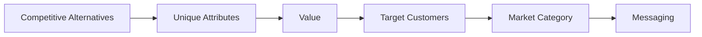

# Positioning · Messaging · Brand

Positioning은 슬로건이 아니다. **어떤 시장에서 누구를 상대로 이기려 하고, 왜 이길 자격이 있는지에 대한 결정**이다.

## Positioning의 구성 요소

실무에서 널리 쓰이는 Positioning 방법론(April Dunford의 공개 가이드)은 다음 요소를 순서대로 정한다.

| 순서 | 요소 | 질문 |
|---|---|---|
| 1 | Competitive Alternatives | 우리가 없다면 고객은 무엇을 쓰는가? (엑셀, 수작업, 아무것도 안 함 포함) |
| 2 | Unique Attributes | 대안에는 없고 우리에게만 있는 것은? |
| 3 | Value | 그 차이가 고객에게 주는 결과는? |
| 4 | Target Customers | 그 가치를 가장 크게 느끼는 고객은? |
| 5 | Market Category | 고객이 우리를 이해하는 틀(카테고리)은? |



핵심은 **기능에서 시작하지 않고 대안에서 시작한다**는 점이다. 고객은 기능이 아니라 대안 대비 차이를 산다.

## 예시: 장애 모니터링 도구의 Positioning

이 Track의 예시 제품에 다섯 요소를 채우면 다음과 같다. 수치는 **예시**이며, 실제로 쓰려면 측정 조건과 함께 검증해야 한다.

| 요소 | 예시 |
|---|---|
| Competitive Alternatives | Slack으로 받는 알림 + 로그 콘솔에서 수동 검색 + Git 기록에서 최근 배포를 따로 확인 |
| Unique Attributes | 알림 시점 전후의 배포 이력과 관련 로그를 자동으로 연결해 한 화면에 보여 줌 |
| Value | 원인 파악 시간 단축 (예시 목표: 알림 후 10분 안에 원인 후보 확인) |
| Target Customers | 전담 운영팀 없이 서비스를 직접 운영하는 1–5인 팀의 개발자 |
| Market Category | 장애 대응(Incident Response) 도구. 대형 Observability 플랫폼이 아니라 작은 팀용 |

한 문장으로 줄이면: **"작은 팀 개발자를 위한 장애 대응 도구로, 알림이 오면 관련 배포와 로그를 자동으로 묶어 Slack과 로그 콘솔을 오가며 찾던 원인을 한 화면에서 보게 한다."**

순서가 중요하다. "배포·로그 자동 연결"이라는 기능은 대안(수동 검색)과 비교될 때 비로소 가치가 된다.

## Category 선택

| 선택 | 장점 | 비용 |
|---|---|---|
| 기존 Category 안에서 차별화 | 고객이 이미 이해하는 틀을 빌림 | 기존 강자와 직접 비교됨 |
| 인접 Category의 하위 영역 | 특정 Segment에서 리더가 되기 쉬움 | 시장 크기 제한 |
| 새 Category 창출 | 비교 대상이 없음 | 교육 비용이 매우 큼 |

대부분의 초기 제품에게 새 Category 창출은 비싼 선택이다.

## Messaging

Messaging은 Positioning을 **고객의 언어로 번역한 것**이다.

나쁜 예:

> AI 기반의 차세대 올인원 협업 플랫폼

좋은 예:

> 장애 알림이 오면, 관련 로그와 최근 배포 내역을 한 화면에 모아 10분 안에 원인을 찾게 해 줍니다.

나쁜 예는 어떤 제품에도 붙일 수 있다. 좋은 예는 **누구의 어떤 상황에서 무엇이 달라지는지**가 드러난다.

### Message Hierarchy

```text
Core Promise (한 문장)
↓
3개 내외의 Value Pillar
↓
각 Pillar를 뒷받침하는 Proof (기능, 사례, 수치)
↓
반론(Objection)과 답변
```

Proof가 없는 Pillar는 주장일 뿐이다. 수치를 쓸 때는 출처와 측정 조건을 함께 관리한다.

#### 예시: 채운 Message Hierarchy

위 Positioning을 4단계로 채우면 다음과 같다. 수치는 예시다.

```text
Core Promise
  장애 알림이 오면, 10분 안에 원인 후보를 찾는다.

Pillar 1  배포와 로그가 자동으로 연결된다
  Proof   알림 시점 전후 30분의 배포·로그를 한 화면에 표시 (기능 화면)
Pillar 2  설정은 한 번, 5분이면 끝난다
  Proof   Git 저장소와 클라우드 로그 연결 3단계 (설치 가이드, 측정한 소요 시간)
Pillar 3  작은 팀이 감당할 수 있는 가격
  Proof   공개 가격표, 1–5인 팀 Plan

Objection  "이미 Slack 알림과 로그 콘솔이 있는데요?"
Answer     알림은 지금처럼 Slack으로 받습니다. 알림의 링크를 누르면
           관련 배포와 로그가 모인 화면이 열립니다. 기존 도구를
           바꾸는 것이 아니라 이어 주는 것입니다.
```

Objection에 대한 답이 **대안을 버리라고 요구하지 않는다**는 점에 주목한다. 전환 비용이 낮다는 것도 Proof의 일부다.

### Message 검증 방법

- 고객 인터뷰에서 문장을 읽어 주고 다시 설명해 보게 하기
- Landing Page A/B Test
- 광고 소재별 반응 비교 (단, 클릭률만으로 판단하지 않기)
- 영업 통화에서 반론이 줄었는지 확인

## Brand와 Performance

Brand와 Performance는 대립이 아니라 **시간축이 다른 투자**다.

| 구분 | Brand Building | Activation / Performance |
|---|---|---|
| 목표 | 기억과 선호 형성 | 지금의 행동 유도 |
| 효과 시점 | 느리고 오래감 | 빠르고 짧음 |
| 측정 | 인지도, 선호도, 검색량 추이 | 클릭, 전환, CPA |
| 대상 | 아직 구매 의사가 없는 다수 | 이미 구매 의사가 있는 소수 |

IPA가 발표한 "The Long and the Short of It"(2013) 연구는 효과 사례 데이터를 분석해 Brand와 Activation 예산의 균형이 효과에 중요하다고 보고했고, 평균적으로 약 60:40이 최적이라는 결과를 제시했다. 이는 **소비재 중심 데이터의 경향**이지 모든 사업에 맞는 공식이 아니다.

### Mental Availability

Ehrenberg-Bass Institute는 성장을 두 가지로 설명한다.

- **Mental Availability**: 구매 상황에서 쉽게 떠오르는가
- **Physical Availability**: 쉽게 살 수 있는가

떠오르게 만드는 단서를 **Category Entry Points(CEP)**라고 부른다. 예를 들어 "배포 직후 오류가 늘었을 때"는 모니터링 도구의 CEP다. Message를 CEP와 연결하면 기억될 확률이 높아진다.

## 흔한 실수

- 모든 Segment에게 같은 Message 쓰기
- 경쟁사 기능표를 그대로 Positioning으로 쓰기
- "최고", "혁신적" 같은 검증 불가능한 형용사 남발
- Performance 숫자만 보고 Brand 투자를 끊기
- Positioning을 한 번 정하고 시장 변화에도 그대로 두기

## 참고 자료

- [A Quickstart Guide to Positioning — April Dunford](https://www.aprildunford.com/post/a-quickstart-guide-to-positioning) (접속 2026-09-28)
- [The Key Works of Les Binet & Peter Field — IPA](https://ipa.co.uk/knowledge/effectiveness-research-analysis/les-binet-peter-field) (접속 2026-09-28)
- [The next chapter for 'The Long and The Short of It' — IPA](https://ipa.co.uk/knowledge/ipa-blog/the-next-chapter-for-the-long-and-the-short-of-it) (접속 2026-09-28)
- [Identifying and Prioritising Category Entry Points — Ehrenberg-Bass Institute](https://marketingscience.info/learn-with-us/commercial-research/identifying-and-prioritising-category-entry-points) (접속 2026-09-28)
- [Easy to Find: Being Where B2B Buying Happens — Ehrenberg-Bass Institute](https://marketingscience.info/news-and-insights/easy-to-find-being-where-b2b-buying-happens) (접속 2026-09-28)
