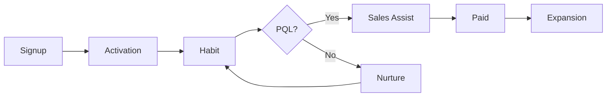

# Go-to-Market · Launch · PLG와 SLG

Go-to-Market(GTM)은 "출시 행사"가 아니라 **제품이 어떤 경로로 고객을 만나고, 구매되고, 확장되는지에 대한 설계**다.

## GTM 계획의 구성 요소

| 요소 | 질문 |
|---|---|
| Target | 어떤 Segment / ICP부터 공략하는가 |
| Value Proposition | 그 Segment에게 무엇을 약속하는가 |
| Pricing & Packaging | 무료/유료 경계, 요금 단위, Plan 구성 |
| Motion | 제품 주도인가, 영업 주도인가, 혼합인가 |
| Channels | 어디서 발견되고 어디서 구매하는가 |
| Enablement | 영업·CS·파트너가 무엇을 알아야 하는가 |
| Metrics | 무엇으로 성공을 판단하는가 |

## GTM Motion 비교

| 구분 | Product-Led (PLG) | Sales-Led (SLG) |
|---|---|---|
| 첫 가치 경험 | 가입 후 스스로 사용 | 데모, PoC, 영업 대화 |
| 구매 결정 | 사용자가 직접 결제 | 조직 구매 절차 |
| 적합한 조건 | 가치가 빨리 드러남, 낮은 단가, 셀프 온보딩 가능 | 높은 단가, 복잡한 도입, 여러 이해관계자 |
| 핵심 지표 | Activation, 무료→유료 전환, 확장 | Pipeline, Win Rate, 영업 주기 |
| 리스크 | 무료 사용자만 늘고 매출은 없음 | 영업 비용이 커서 CAC가 높음 |

Atlassian과 OpenView는 PLG를 **제품 자체가 획득·활성화·유지·확장의 주된 동력이 되는 GTM 전략**으로 설명한다.

### Hybrid: Product-Led Sales

현실에서는 둘을 섞는 경우가 많다. 제품 사용 데이터로 구매 가능성이 높은 계정을 찾아 영업이 개입하는 방식이다.

```text
MQL (Marketing Qualified Lead)
= 마케팅 활동 반응으로 판단 (예: 자료 다운로드)

PQL (Product Qualified Lead)
= 제품 안의 행동으로 판단 (예: 팀원 5명 초대, 핵심 기능 반복 사용)
```

PQL 기준은 추측으로 정하지 말고 **실제로 유료 전환한 계정의 행동 패턴**에서 찾는다.



## B2B 구매자는 혼자 조사하고, AI도 쓴다

Gartner가 2026-05-20 발표한 조사(2025-08~09월, B2B 구매자 645명)에 따르면 구매자는 최근 구매에서 평균 7개의 정보원을 사용했고, 45%가 생성형 AI를 사용했다고 답했다. 같은 조사에서 69%는 AI가 만든 정보를 영업 담당자와 확인하고 싶다고 답했다.

Rep-free 구매 선호 응답은 2025-06-25 발표 조사에서 61%, 2026-03-09 발표 조사에서 67%였다 (01 문서 참고).

의미:

- 웹사이트·문서·가격 정보가 영업 대화보다 먼저 읽힌다
- 사이트와 영업이 말하는 내용이 다르면 신뢰를 잃는다
- AI 답변에 우리 제품이 어떻게 요약되는지도 GTM의 일부가 된다 (05 문서)

## Launch를 등급으로 나누기

모든 출시를 같은 크기로 하면 팀이 지치고 고객도 무감각해진다.

| 등급 | 기준 예 | 활동 예 |
|---|---|---|
| Tier 1 | 새 제품, 새 시장, 가격 변경 | 보도자료, 캠페인, 영업 교육, 이벤트 |
| Tier 2 | 주요 기능, 주요 연동 | 블로그, 이메일, 인앱 공지, 영업 공유 |
| Tier 3 | 개선, 작은 기능 | Changelog, 인앱 Tooltip |

### Launch Checklist

- 누구를 위한 출시이며 무엇이 달라지는가 (한 문장)
- Positioning·Message 문서
- 가격·권한·Plan 영향
- 문서, FAQ, 지원 스크립트
- 영업·CS 브리핑
- 측정 계획 (기준값, 목표, 관찰 기간)
- Rollback 또는 일정 변경 기준

## 나쁜 예 / 좋은 예

나쁜 예:

> 기능이 완성되었으니 다음 주 화요일에 모든 채널로 알립니다.

좋은 예:

> 소규모 팀 관리자 Segment에게 "초대 3분 완료"를 약속한다. Tier 2로 인앱 공지와 이메일을 쓰고, 목표는 신규 워크스페이스의 7일 내 팀원 초대율 개선이다. 2주 후 결과를 보고 확대 여부를 정한다.

## 흔한 실수

- GTM을 출시 직전에 시작하기
- PLG를 "영업 없이 알아서 팔린다"로 오해하기
- 무료 Plan 경계를 한 번 정하고 다시 보지 않기
- 출시 활동량(발송 수, 게시물 수)을 성과로 보고하기

## 참고 자료

- [What is product-led growth? — Atlassian](https://www.atlassian.com/agile/product-management/product-led-growth) (접속 2026-09-28)
- [Product-Led Growth — OpenView](https://openviewpartners.com/product-led-growth/) (접속 2026-09-28)
- [Your Guide to Product Qualified Leads (PQLs) — OpenView](https://openviewpartners.com/blog/your-guide-to-product-qualified-leads-pqls/) (접속 2026-09-28)
- [Gartner Survey Finds 69% of B2B Buyers Turn to Sales Reps to Validate AI-Generated Insights — Gartner](https://www.gartner.com/en/newsroom/press-releases/2026-05-20-gartner-survey-finds-sixty-nine-percent-of-b-two-b-buyers-turn-to-sales-reps-to-validate-ai-generated-insights) (2026-05-20, 접속 2026-09-28)
- [Gartner Sales Survey Finds 61% of B2B Buyers Prefer a Rep-Free Buying Experience — Gartner](https://www.gartner.com/en/newsroom/press-releases/2025-06-25-gartner-sales-survey-finds-61-percent-of-b2b-buyers-prefer-a-rep-free-buying-experience) (2025-06-25, 접속 2026-09-28)
